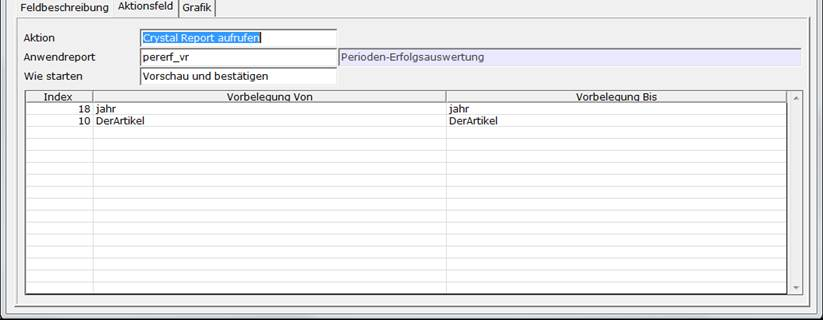

# Aktionsfelder

<!-- source: https://amic.de/hilfe/aktionsfelder.htm -->

Hauptmenü > Administration > Werkzeuge > Informationssystem > Register Aktionsfeld

Direktsprung **[AIS]**

Das Register “Aktionsfeld” erscheint immer dann, wenn der Feldtyp ein Push-Button oder Anwendungsgrid ist. Hier wird dann festgelegt, was geschehen soll, wenn auf den Knopf gedrückt wird.



Als Aktion sind folgende Möglichkeiten vorgesehen:

<p class="just-emphasize">1\. Anwendungsfunktion aufrufen</p>

Es wird eine unter ANWF bzw. PF (Private Funktion) hinterlegte Funktion aufgerufen. Es sind hier nur Menüfunktionen möglich. Der Controlstring, der ausgeführt wird, lautet:

```text
^jpl
aw_funk :ANWFUNKID
```

    
Die ANWFUNKID kann mit **F3** ausgewählt werden.

<p class="just-emphasize">2\. Anwendung aufrufen</p>

Es wird eine Anwendung aufgerufen. Anzugeben ist hier die ANWID. Diese kann per F3 ausgewählt werden. Der Controlstring, der ausgeführt wird, lautet:

```text
^jpl
aw_vert :ANWID
```

<p class="just-emphasize">3\. Anwendungsvariante aufrufen</p>

Es wird eine vorgegebene Variante einer Anwendung aufgerufen. Im obigen Beispiel ist es die Variante „STANDARD“ der Anwendung „KUNDEN“. Der Controlstring sieht also im Beispiel folgendermaßen aus:

```text
^jpl
ais_vert KUNDEN STANDARD Feldname
```

    
Bei Varianten lassen sich die Werte aus dem Auswahlbereich (**F2**) vorbelegen. Welche Felder als VON bzw. BIS-Vorbelegung herangezogen werden können, lässt sich mit **F3** auswählen. Bei Push-Buttons kann man in den Spalten „Vorbelegung Von“ und „Vorbelegung Bis“ einen Festen Wert oder ein Maskenfeld eintragen. Beim Anwendungsgrid sind zusätzlich die Felder aus der Fieldsanweisung als Parameter möglich. Wenn in der Fieldsanweisung also

```text
FIELD
Konto,k.KontoNummer,I4,8
```

steht, so muss in der/ Vorbelegungsspalten „k.KontoNummer“ stehen. Es wird dann der Wert aus der Zeile an den Auswahlbereich übergeben.  
    

<p class="just-emphasize">4\. Crystal Report aufrufen</p>

Ein Report, der über die ANWRPTID identifiziert wir, die über **F3** ausgewählt werden kann, wird geöffnet. Die Art und Weise, wie er gestartet werden soll, lässt sich in dem dann sichtbaren Feld „Wie starten“ angeben. Es stehen die Möglichkeiten

0. Vorschau und bestätigen

1. Sofort drucken

2. Sofort in die Vorschau

zu Verfügung. Der Controlstring lautet

```text
^jpl
ais_list ANWRPTID FeldName (Feldname ist der Name dieses Feldes)
```

Wie bei den Anwendvarianten kann der Auswahlbereich vorbelegt werden.  
    

<p class="just-emphasize">5\. Makro aufrufen</p>

Es kann ein Makro aufgerufen werden. Anzugeben ist hier der Name des Scripts. Der Controlstring lautet:

```text
^jpl pascal
ScriptName
```

<p class="just-emphasize">6\. Controlstring</p>

Man kann einen freien Controlstring eingeben. Zum Aufruf einer weiteren selbstdefinierten Maske mit Übergabe des Wertes des Identfeldes dient die Prozedur:

```text
^jpl
aisload KUI2 Aendern [Ident] [Seite] [Maske IDFeld] [IDFeld2] [Ident2] [IDFeld3]
[Ident3] [IDFeld4] [Ident4]
```

| Parameter | Beschreibung |
| --- | --- |
| KUI2 | ist der Gruppenname. Wenn die Maske (Parameter 5) AESADDONT1-AEZADDONT22 lautet, so muss die Gruppe leer bleiben, wenn man der Maske mehrere Gruppen zuordnen will. Ansonsten wird auch nur diese Gruppe aufgerufen und imemr nur ein Tabreiter dargestellt.  
 |
| Aendern | ist die Art, wie auf diese Gruppe zugegriffen werden soll. Hier kann auch „Ansehen“ oder „Einfuegen“ stehen, je nachdem, welche Aktion man ausführen möchte.  
 |
| Ident | ist der Wert des Identfeldes der aktiven Maske. Wird hier nichts angegeben, so wird entweder der Wert aus h.Ident$ -Identfeld der Maske AEZADDON und AEADDOND – bzw. wenn diese nicht da ist, die erste ID aus der Auswahlliste genommen. |
| Seite | wird nur ausgewertet, wenn die Gruppe KUINOTIZ heißt. Dann wird dort diese Seite angezeigt. |
| Maske und IDFeld | müssen immer gemeinsam angegeben werden. Wir keine Maske angegeben wird automatisch die Maske AEZADDON verwendet und das Feld IDFeld lautet „Ident“. Wie immer ist auf Groß und Kleinschreibung zu achten. |
| IDFeld2 und Ident2 bis IDFeld4 und Ident4 | wie Ident und IDFeld  
 |

Die Controlstrings für die Blätterbuttons bzw. für einen Speicherbutton findet man unter [Tipps und Tricks](../tipps_und_tricks/index.md).
