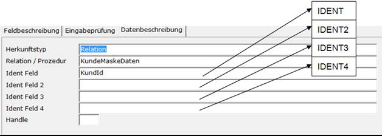
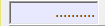
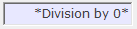
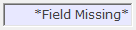

# Datenbeschreibung

<!-- source: https://amic.de/hilfe/datenbeschreibung.htm -->

Hauptmenü > Administration > Werkzeuge > Informationssystem > Register Eingabeprüfung

Direktsprung **[AIS]**

Hier wird festgelegt, woher der Inhalt der Felder kommen soll.



Es gibt vier Möglichkeiten – Relation / Prozedur / SQL / Favoriten - die Felder mit Inhalt zu versorgen. Im Folgenden wird jeweils auf die Felder IDENT [, IDENT2 [, IDENT3 [, IDENT4] ] ] zugegriffen. Die Felder IDENT [, IDENT2 [, IDENT3 [, IDENT4]]] erhalten ihren Inhalt über die in der Maskenzuordnung zugeordneten Masken-Feldnamen und sind ein Synonym für diese. Es müssen in der Maskenzuordnung also immer mindestens genauso viele Identfelder vorhanden sein, wie hier verwendet. Mehr Informationen hierüber unter [Maskenzuordnung](../maskenzuordnung.md) oder im Beispiel weiter unten.

**ACHTUNG:**

*Wird auf der Maske als Datenherkunft Favoriten verwendet, so wird das Feld IDENT von der entsprechenden Ident aus den Favoriten versorgt. Der Wert in der Maskenzuordnung wird ignoriert.*

<p class="just-emphasize">0\. Relation</p>

Das Feld wird mit dem Wert aus der angegeben Relation gefüllt. Existiert das Feld, dass unter Feldbeschreibung angegeben wurde, nicht in der Relation, so wird es angelegt. Existiert die Relation noch nicht, so wird diese angelegt. Dabei wird das unter Identfeld angegebene Feld als Primärschlüssel angelegt.

Man muss zusätzlich zur Relation mindestens ein „**Ident Feld**“ angeben. Der „**Handel“** (Bildschirmhandel) ist optional, sollte aber angegeben werden, wenn man über Makros auf die Felder zugreifen will, da sich die Feldnamen auf der Maske aus dem Handel und dem Feldname zusammensetzen. Der von AIS automatisch vergebene Handel kann sich ggf. ändern. Wurde bereits einmal ein Eintrag mit dieser Relation vorgenommen, so werden „**Ident Feld**“ und „**Handel**“ so vorbelegt.

Da Tabellen von A.eins unter Umständen mehr als einen Schlüssel zur Identifikation besitzen, existieren insgesamt vier **Ident Felder**.

Das **Ident Feld** ist der Name des Datenbankfeldes, das den Primärschlüssel zur eindeutigen Identifikation des Datensatzes darstellt. Intern wird bei der späteren Verarbeitung ein SQL-Statement in folgender Form abgesetzt:

```sql
select *
from Relation where IdentFeld = :IDENT [and IdentFeld2 = :IDENT2
[and IdentFeld3 = :IDENT3 [and IdentFeld4 = :IDENT4 ] ]
]
```

    
Im obigen Beispiel also:

```sql
select *
from Sachkontstammaddon where Kontonummer = :IDENT
```

Der **Handle** wird intern verwendet. Für alle Felder einer Relation wird nur einmal ein Select ausgeführt (s.o.). Danach werden alle Datenbankfelder den Bildschirmfeldern zugeordnet, die diesen Handel haben. Pro Gruppe und Relation darf es nur einen Handel geben; daher wird er auch vorbelegt. Groß und Kleinschreibung muss beachtet werden. Wird kein Handel angegeben, so generiert sich das System automatisch einen Handel.

Hinweis: Wenn beim Feldtyp Grid die Datenherkunft Relation gewählt wird, so ist es möglich im Grid Daten zu erfassen.  
 

<p class="just-emphasize">1\. Prozedur</p>

Es werden die Daten mit einer Prozedur zusammengesucht. Voraussetzung ist, dass der auf dem Register „[Feldbeschreibung](./feldbeschreibung.md)“ angegebene Feldname in der Ergebnismenge der Prozedur vorhanden ist. Diese Prozedur muss eine Ergebnismenge zurückliefern. Das SQL-Statement hat folgende Form:  
    
    

```sql
select *
from Relation (':IDENT' [ ‚‘:IDENT2‘ [ ‚‘:IDENT3‘ [ ‚ ‘:IDENT4‘ ] ] ])
```

<p class="just-emphasize">2\. SQL</p>

Es wird das angegebene SQL-Statement so ausgeführt, wie es in dem dafür vorgesehenen Textfeld erfasst wurde. Für die Zuordnung einer Id stehen die Felder **IDENT, IDENT2, IDENT3** und **IDENT4** sowie jedes andere auf der Erfassungsmaske vorhandene Feld zur Verfügung. In dem SQL Statement ist möglich auf Jvars zuzugreifen. Dazu muss man den owner und den Namen der Jvar kennen.

Beispiel:

```sql
Select *
from Sachkontstamm where KontoNummer=@jvars(7100,’AIS_KONTONUMMER’)
```

Diese JVAR hat den Owner 7100 - also eine in AIS definierte JVAR – und den Namen AIS_KONTONUMMER.

Bei diesem Datentyp wird zusätzlich ein Feld **Refresh** abgefragt. Wird hier **Ja** eingetragen so werden die Daten erneut gelesen, wenn die Maske erneut von einer drüber gelagerten Maske betreten wird. Zusätzlich steht eine Funktion ***dbx_io ("AISREFRESH")*** zur Verfügung, die das Aktualisieren dieser Felder auslöst. Diese kann z.B. auf Pusch-Button als Controlstring eingetragen werden oder in einem Makro verwendet werden.

<p class="just-emphasize">3\. Favoriten</p>

Das System unterstützt z.Zt. zwei Favoritenbereiche, und zwar Kunden und Artikel. Die Vorbelegung der Favoriteninhalte erfolgt im Stammpfleger und im Vorgangsbereich. Der zuletzt in diesem Bereich angewählte Kunde oder Artikel wird an die oberste Stelle der Favoriten gesetzt und steht somit als Datengrundlage für den nächsten Anzeigevorgang zur Verfügung.

 Im Prinzip verläuft dann die Anzeige und Verarbeitung der Daten wie bei der Datenherkunft Relation, nur dass die Versorgung des Feldes **IDENT** jetzt nicht mehr über die Maskenzuordnung geschieht, sondern über die Favoriteninhalte.  
    

Intern wird ein SQL Befehl mit folgender Form ausgeführt:

Für Kundenstamm:

```sql
Select *
from Kundenstamm where KundId = @jvars(7000,’KundId’)
```

Für Artikel:

```sql
Select *
from Artikel where KundId = @jvars(7000,’ArtikelId’)
```

Die angesprochenen JVars mit dem Besitzer 7000 werden vom Programm versorgt und enthalten den Wert des zuletzt aufgerufenen Kunden bzw. Artikels aus der Vorgangserfassung.

Wie schon bei der Datenherkunft Relation muss/ kann auch hier ein Bildschirmhandel angegeben werden (s.o.).

**ACHTUNG:**  
*Bei einer Gruppe, die ein oder mehrere Felder des Typens Favorit enthält, werden alle anderen IDENT-Definitionen ignoriert.*

Dies hat den Nachteil, dass die so definierte Gruppe nur für Favoriten zur Verfügung stehen würde. Man müsste also dieselbe Gruppe noch einmal definieren, wenn man sich z.B. einen Artikelinformationsbildschirm erstellt hat und diesen sowohl in einer Auswahlliste als auch im Bereich Vorgangserfassung als Favorit verwenden will.

 Um dies zu verhindern, gibt es den Feldtypen Gruppe. Dieser Feldtyp ermöglicht es, an eine Gruppe eine bestehende anzuhängen.

Die erste Gruppe enthält zwei Felder, das erste ist der Favorit und das zweite Feld ist vom Typ Gruppe. Dort muss dann nur eine bereits existierende Gruppe eingetragen werden. Diese erhält dann ihren Identwert aus den Favoriten.

**  
4.Vorbelegung**

Felder, die als Datenherkunft **Vorbelegung** eingetragen haben, werden beim ersten Betreten der Maske wieder mit dem letzten verwendeten Wert vorbelegt. Wenn man z.B. eine AIS-Seite vom Typen [Infoblatt/Cockpit](../beispiel_maskenzuordnung.md#MskZuordInfoBlatt) definiert, in der man als erstes immer die Kontonummer abfragt, so ist es eine Arbeitserleichterung, wenn die zuletzt verwendetet Kontonummer wieder vorbelegt wird.

**5.Berechnung**

Hier kann auf einfache Art mit allen Feldinhalten auf der aktiven Maske gerechnet werden. Diese Felder werden nicht aus der Datenbank gelesen oder gespeichert. Um hier zu rechnen gibt man in dem Textfeld einfach die Rechenformel an. In dieser Rechenformel können Feldnamen verwendet werden. Neben den Feldinhalten hängt das Ergebnis der Rechenoperation auch vom Typen des Zielfeldes ab. Ist das Zielfeld z.B. vom Typ Integer, kann es keine Nachkommastellen enthalten.

Ist eines der Felder, die in der Formel verwendet werden, ein Eingabefeld und möchte man direkt nach der Eingabe das geänderte Ergebnis sehen, so muss man dies in der [Validation-Funktion](./eingabepruefung.md#ValidationFunktion), die man unter Eingabeprüfung für das Eingabefeld angeben kann, selber dem System mitteilen. Der zweite Parameter der zu verwendenden Funktion ist dabei das Ergebnisfeld, welches neu berechnet werden soll.

```text
dbx_io ("AISREFRESH", "Ergebnis$")
```

    
Beispiele:

| Formel | Feldinhalt | Ergebnis |
| --- | --- | --- |
| Feld1$ / Feld2$ | Feld1$ = 30<br>Feld2$ = 20 | 1 Wenn das Feld Ergebnis vom Typen Integer oder N0 ist,<br>1,5 bei den anderen numerischen Feldtypen |
| Feld1$ / Feld2$ | Feld1$ oder Feld2$ hat den Wert null.<br> | Ergebnis ist immer null, wenn eines der Felder den Wert Null hat.<br> |
| Isnull(Feld1$,0) + isnull(Feld2$,0) | Ist Feld1$ oder Feld2$ null, so wird stattdessen mit der 0 gerechnet. Es könne hier also auch beliebige Datenbankfunktionen verwendet werden. | Ist eins der Felder null kommt das Ergebnis so heraus, als ob man mit 0 gerechnet hätte. |
| Feld1$ / Feld2$ | Feld1$ = 123<br>Feld2$ = 0 |  |
| Feld1$ \* FELD2$ | FELD2$ ist falsch geschrieben und existiert nicht auf der Maske. | Im Testmodus wird eine Fehlermeldung mit Bezeichnung des falsch geschriebenen Feldes ausgegeben. Das Ergebnisfeld sieht wie folgt aus:<br> |

<p class="just-emphasize">99\. keine</p>

Der Inhalt des Feldes wird nicht aus der Datenbank gelesen sondern steht als Festtext im Feld Beschriftung des Registers „**Feldbeschreibung**“.
