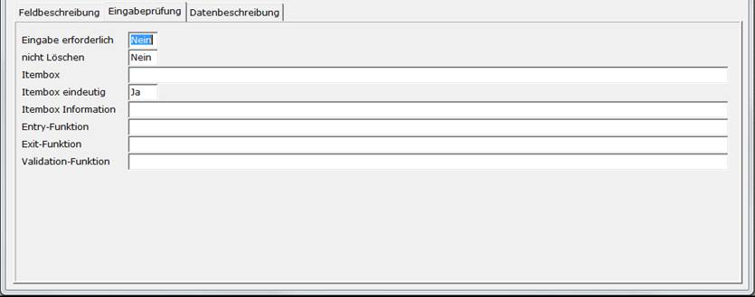

# Eingabeprüfung

<!-- source: https://amic.de/hilfe/eingabeprfung.htm -->

Hauptmenü > Administration > Werkzeuge > Informationssystem > Register Eingabeprüfung

Direktsprung **[AIS]**

<table class="AMIC-Tabelle" style="WIDTH: 100%; BORDER-COLLAPSE: collapse" cellspacing="0" cellpadding="0" width="100%" border="0"><tbody><tr><td style="WIDTH: 11.34%; BACKGROUND: #005d5b; PADDING-BOTTOM: 0pt; PADDING-TOP: 0pt; PADDING-LEFT: 5.4pt; PADDING-RIGHT: 5.4pt" width="11%"></td><td style="WIDTH: 88.66%; BACKGROUND: #005d5b; PADDING-BOTTOM: 0pt; PADDING-TOP: 0pt; PADDING-LEFT: 5.4pt; PADDING-RIGHT: 5.4pt" width="88%">
Beschreibung
</td></tr><tr><td style="BORDER-TOP: medium none; BORDER-RIGHT: white 1.5pt solid; WIDTH: 11.34%; BACKGROUND: #bad9d9; BORDER-BOTTOM: medium none; PADDING-BOTTOM: 0pt; PADDING-TOP: 0pt; PADDING-LEFT: 5.4pt; BORDER-LEFT: medium none; PADDING-RIGHT: 5.4pt" valign="top" width="11%">
Eingabe erforderlich
</td><td style="BORDER-TOP: medium none; BORDER-RIGHT: medium none; WIDTH: 88.66%; BACKGROUND: #bad9d9; BORDER-BOTTOM: medium none; PADDING-BOTTOM: 0pt; PADDING-TOP: 0pt; PADDING-LEFT: 5.4pt; BORDER-LEFT: medium none; PADDING-RIGHT: 5.4pt" valign="top" width="88%">
Wenn erzwungen werden soll, dass in das Feld ein Wert eingetragen werden soll, dann trägt man hier ein <b>Ja</b> ein. Man kann dann dieses Feld nur verlassen, wenn es Daten enthält bzw. es wird vor dem Speichern geprüft, ob es Daten enthält.
</td></tr><tr><td style="BORDER-TOP: medium none; BORDER-RIGHT: white 1.5pt solid; WIDTH: 11.34%; BACKGROUND: #eff7f7; BORDER-BOTTOM: medium none; PADDING-BOTTOM: 0pt; PADDING-TOP: 0pt; PADDING-LEFT: 5.4pt; BORDER-LEFT: medium none; PADDING-RIGHT: 5.4pt" valign="top" width="11%">
nicht Löschen
</td><td style="BORDER-TOP: medium none; BORDER-RIGHT: medium none; WIDTH: 88.66%; BACKGROUND: #eff7f7; BORDER-BOTTOM: medium none; PADDING-BOTTOM: 0pt; PADDING-TOP: 0pt; PADDING-LEFT: 5.4pt; BORDER-LEFT: medium none; PADDING-RIGHT: 5.4pt" valign="top" width="88%">
Dies bedeutet, dass nach dem Speichern dieses Feld nicht gelöscht wird, sondern der vorher eingegebene Inhalt erhalten bleibt. Auch springt der Cursor nicht wieder in dieses Feld, sondern in das erste Feld, in dem bei „nicht Löschen“ ein <b>Nein</b> steht.<b><u></u></b>
</td></tr><tr><td style="BORDER-TOP: medium none; BORDER-RIGHT: white 1.5pt solid; WIDTH: 11.34%; BACKGROUND: #bad9d9; BORDER-BOTTOM: medium none; PADDING-BOTTOM: 0pt; PADDING-TOP: 0pt; PADDING-LEFT: 5.4pt; BORDER-LEFT: medium none; PADDING-RIGHT: 5.4pt" valign="top" width="11%">
Itembox
</td><td style="BORDER-TOP: medium none; BORDER-RIGHT: medium none; WIDTH: 88.66%; BACKGROUND: #bad9d9; BORDER-BOTTOM: medium none; PADDING-BOTTOM: 0pt; PADDING-TOP: 0pt; PADDING-LEFT: 5.4pt; BORDER-LEFT: medium none; PADDING-RIGHT: 5.4pt" valign="top" width="88%">
Will man die Möglichkeit schaffen, dass die Werte, die in dem Feld eingegeben werden können aus einer Liste von Werten auswählt werden können, so hat kann man hier eine Itembox angeben, die auf eine Tabelle verweist. Eine Liste der Itemboxen erhält man mit <b>F3</b>.
</td></tr><tr><td style="BORDER-TOP: medium none; BORDER-RIGHT: white 1.5pt solid; WIDTH: 11.34%; BACKGROUND: #eff7f7; BORDER-BOTTOM: medium none; PADDING-BOTTOM: 0pt; PADDING-TOP: 0pt; PADDING-LEFT: 5.4pt; BORDER-LEFT: medium none; PADDING-RIGHT: 5.4pt" valign="top" width="11%">
Itembox eindeutig
</td><td style="BORDER-TOP: medium none; BORDER-RIGHT: medium none; WIDTH: 88.66%; BACKGROUND: #eff7f7; BORDER-BOTTOM: medium none; PADDING-BOTTOM: 0pt; PADDING-TOP: 0pt; PADDING-LEFT: 5.4pt; BORDER-LEFT: medium none; PADDING-RIGHT: 5.4pt" valign="top" width="88%">
Steht hier ein <b>Ja</b>, so muss der eingegebene Wert in den Daten der Itembox vorhanden sein. Bei <b>Nein</b> dienen die Werte nur als Vorschlag und es können auch Werte erfasst werden, die nicht in der Itembox vorhanden sind.
</td></tr><tr><td style="BORDER-TOP: medium none; BORDER-RIGHT: white 1.5pt solid; WIDTH: 11.34%; BACKGROUND: #bad9d9; BORDER-BOTTOM: medium none; PADDING-BOTTOM: 0pt; PADDING-TOP: 0pt; PADDING-LEFT: 5.4pt; BORDER-LEFT: medium none; PADDING-RIGHT: 5.4pt" valign="top" width="11%">
Itembox Information
</td><td style="BORDER-TOP: medium none; BORDER-RIGHT: medium none; WIDTH: 88.66%; BACKGROUND: #bad9d9; BORDER-BOTTOM: medium none; PADDING-BOTTOM: 0pt; PADDING-TOP: 0pt; PADDING-LEFT: 5.4pt; BORDER-LEFT: medium none; PADDING-RIGHT: 5.4pt" valign="top" width="88%">
Häufig gibt es zusätzliche Informationen zu Feldern, die sich auf andere Relationen beziehen. Eine der häufigsten Informationen, die man sehen will ist die Bezeichnung, die einem bestimmten Wert zugeordnet ist. Diese Information kann man hier erhalten. Dabei muss man das Feld angeben, wie es in der Itembox in der Returnliste steht, gefolgt von „&gt;“ und dem Maskenfeld. Beispiel:

LKW_Bezeich&gt;LKWTEXT

Das Maskenfeld LKWTEXT muss natürlich auch angelegt werden bzw. auf der Maske existieren.

Man könnte auch noch mehr Informationen aus der Itembox herauslesen. Dazu kann man, mit Komma getrennt, weitere Felder in der obigen Syntax angeben. Also:

LKW_Bezeich&gt;LKWTEXT,LKW_MATCH&gt;MATCH,....

Alle Felder, die aus der Relation gelesen werden, müssen in der Returnliste der Itembox stehen. Siehe dazu Dokumentation Itembox.
</td></tr><tr><td style="BORDER-TOP: medium none; BORDER-RIGHT: white 1.5pt solid; WIDTH: 11.34%; BACKGROUND: #eff7f7; BORDER-BOTTOM: medium none; PADDING-BOTTOM: 0pt; PADDING-TOP: 0pt; PADDING-LEFT: 5.4pt; BORDER-LEFT: medium none; PADDING-RIGHT: 5.4pt" valign="top" width="11%">
Entry-Funktion, Exit-Funktion und Validation-Funktion
</td><td style="BORDER-TOP: medium none; BORDER-RIGHT: medium none; WIDTH: 88.66%; BACKGROUND: #eff7f7; BORDER-BOTTOM: medium none; PADDING-BOTTOM: 0pt; PADDING-TOP: 0pt; PADDING-LEFT: 5.4pt; BORDER-LEFT: medium none; PADDING-RIGHT: 5.4pt" valign="top" width="88%">
Diese drei Funktionen dienen zur Steuerung bzw. zur Eingabeprüfung des Feldes. Sie haben alle denselben Aufbau. Es sind Funktionen innerhalb des Makros, das man bei der Einrichtung der Gruppe angegeben hat. Die Funktion muss fünf Parameter mit folgender Bedeutung haben:
<table class="MsoNormalTable" style="BORDER-TOP: medium none; BORDER-RIGHT: medium none; WIDTH: 100%; BORDER-COLLAPSE: collapse; BORDER-BOTTOM: medium none; BORDER-LEFT: medium none" cellspacing="0" cellpadding="0" width="100%" border="1"><tbody><tr><th style="BORDER-TOP: #548dd4 1pt solid; BORDER-RIGHT: medium none; WIDTH: 79.25pt; BORDER-BOTTOM: #4f81bd 2.25pt solid; PADDING-BOTTOM: 0pt; PADDING-TOP: 0pt; PADDING-LEFT: 5.4pt; BORDER-LEFT: #548dd4 1pt solid; PADDING-RIGHT: 5.4pt" valign="top" width="106">Parameter</th><th style="BORDER-TOP: #548dd4 1pt solid; BORDER-RIGHT: #548dd4 1pt solid; WIDTH: 792.45pt; BORDER-BOTTOM: #4f81bd 2.25pt solid; PADDING-BOTTOM: 0pt; PADDING-TOP: 0pt; PADDING-LEFT: 5.4pt; BORDER-LEFT: medium none; PADDING-RIGHT: 5.4pt" valign="top" width="1057">Beschreibung</th></tr><tr><td style="BORDER-TOP: medium none; BORDER-RIGHT: #4f81bd 1pt solid; WIDTH: 79.25pt; BACKGROUND: #c6d9f1; BORDER-BOTTOM: #4f81bd 1pt solid; PADDING-BOTTOM: 0pt; PADDING-TOP: 0pt; PADDING-LEFT: 5.4pt; BORDER-LEFT: #4f81bd 1pt solid; PADDING-RIGHT: 5.4pt" valign="top" width="106">1. string</td><td style="BORDER-TOP: medium none; BORDER-RIGHT: #4f81bd 1pt solid; WIDTH: 792.45pt; BACKGROUND: #c6d9f1; BORDER-BOTTOM: #4f81bd 1pt solid; PADDING-BOTTOM: 0pt; PADDING-TOP: 0pt; PADDING-LEFT: 5.4pt; BORDER-LEFT: medium none; PADDING-RIGHT: 5.4pt" valign="top" width="1057">Maskenname</td></tr><tr><td style="BORDER-TOP: medium none; BORDER-RIGHT: #4f81bd 1pt solid; WIDTH: 79.25pt; BORDER-BOTTOM: #4f81bd 1pt solid; PADDING-BOTTOM: 0pt; PADDING-TOP: 0pt; PADDING-LEFT: 5.4pt; BORDER-LEFT: #4f81bd 1pt solid; PADDING-RIGHT: 5.4pt" valign="top" width="106">2. integer</td><td style="BORDER-TOP: medium none; BORDER-RIGHT: #4f81bd 1pt solid; WIDTH: 792.45pt; BORDER-BOTTOM: #4f81bd 1pt solid; PADDING-BOTTOM: 0pt; PADDING-TOP: 0pt; PADDING-LEFT: 5.4pt; BORDER-LEFT: medium none; PADDING-RIGHT: 5.4pt" valign="top" width="1057">Nummer des Feldes auf der Maske</td></tr><tr><td style="BORDER-TOP: medium none; BORDER-RIGHT: #4f81bd 1pt solid; WIDTH: 79.25pt; BACKGROUND: #c6d9f1; BORDER-BOTTOM: #4f81bd 1pt solid; PADDING-BOTTOM: 0pt; PADDING-TOP: 0pt; PADDING-LEFT: 5.4pt; BORDER-LEFT: #4f81bd 1pt solid; PADDING-RIGHT: 5.4pt" valign="top" width="106">3. string</td><td style="BORDER-TOP: medium none; BORDER-RIGHT: #4f81bd 1pt solid; WIDTH: 792.45pt; BACKGROUND: #c6d9f1; BORDER-BOTTOM: #4f81bd 1pt solid; PADDING-BOTTOM: 0pt; PADDING-TOP: 0pt; PADDING-LEFT: 5.4pt; BORDER-LEFT: medium none; PADDING-RIGHT: 5.4pt" valign="top" width="1057">Feldinhalt</td></tr><tr><td style="BORDER-TOP: medium none; BORDER-RIGHT: #4f81bd 1pt solid; WIDTH: 79.25pt; BORDER-BOTTOM: #4f81bd 1pt solid; PADDING-BOTTOM: 0pt; PADDING-TOP: 0pt; PADDING-LEFT: 5.4pt; BORDER-LEFT: #4f81bd 1pt solid; PADDING-RIGHT: 5.4pt" valign="top" width="106">4. integer</td><td style="BORDER-TOP: medium none; BORDER-RIGHT: #4f81bd 1pt solid; WIDTH: 792.45pt; BORDER-BOTTOM: #4f81bd 1pt solid; PADDING-BOTTOM: 0pt; PADDING-TOP: 0pt; PADDING-LEFT: 5.4pt; BORDER-LEFT: medium none; PADDING-RIGHT: 5.4pt" valign="top" width="1057">Zeile, falls das Feld ein Array ist</td></tr><tr><td style="BORDER-TOP: medium none; BORDER-RIGHT: #4f81bd 1pt solid; WIDTH: 79.25pt; BACKGROUND: #c6d9f1; BORDER-BOTTOM: #4f81bd 1pt solid; PADDING-BOTTOM: 0pt; PADDING-TOP: 0pt; PADDING-LEFT: 5.4pt; BORDER-LEFT: #4f81bd 1pt solid; PADDING-RIGHT: 5.4pt" valign="top" width="106">5. integer</td><td style="BORDER-TOP: medium none; BORDER-RIGHT: #4f81bd 1pt solid; WIDTH: 792.45pt; BACKGROUND: #c6d9f1; BORDER-BOTTOM: #4f81bd 1pt solid; PADDING-BOTTOM: 0pt; PADDING-TOP: 0pt; PADDING-LEFT: 5.4pt; BORDER-LEFT: medium none; PADDING-RIGHT: 5.4pt" valign="top" width="1057">Status. Je nach Art des Aufrufs enthält es verschiedene Werte. Siehe Panther–Dokumentation.</td></tr></tbody></table>
Wenn innerhalb des Makros Funktionen mit diesem Aufbau existieren, so ist es möglich diese mit <b>F3</b> auszuwählen.

function EineEntryFunktion(aa:string ; bb : integer;a:string ; b,c : integer ):integer;

begin

&nbsp;EineEntryFunktion:=0;

end;

Die Validation-Funktion unterscheidet sich dadurch von den anderen, dass der Rückgabewert ausgewertet wird. Ein Wert ungleich 0 bewirkt, dass das Feld nicht verlassen werden kann.

Hinweis:

Wird ein Makro 2.0 (C#) als Ffeldmakro angegeben, so entfällt die Angabe einer Funktion – Der Funktionsname ergibt sich aus dem AISMakro-Interface.
</td></tr></tbody></table>
