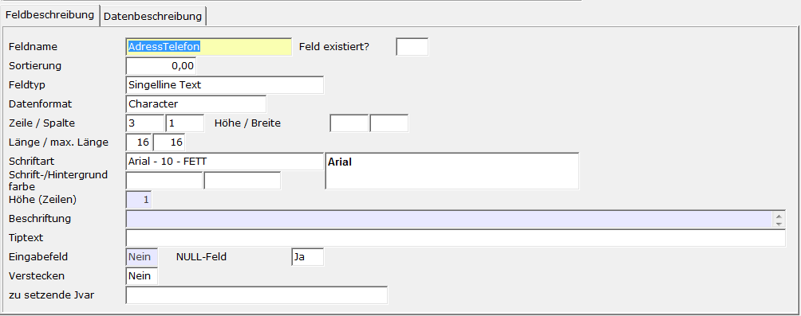
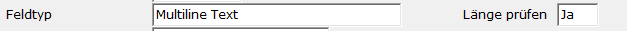
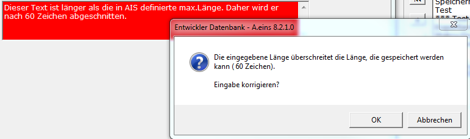
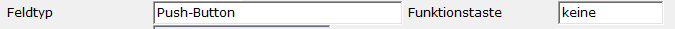
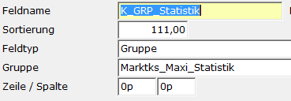
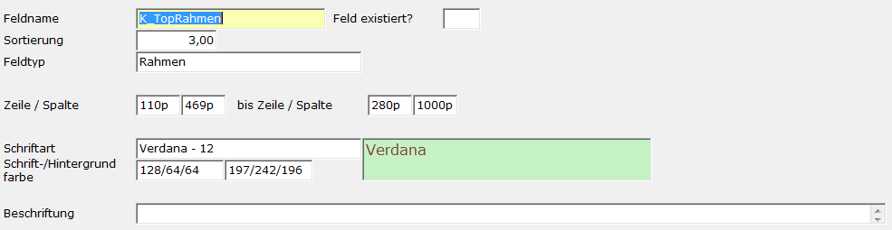
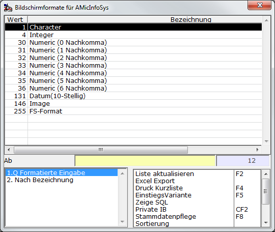
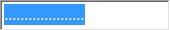

# Feldbeschreibung

<!-- source: https://amic.de/hilfe/feldbeschreibung.htm -->

Hauptmenü > Administration > Werkzeuge > Informationssystem > Register Feldbeschreibung

Direktsprung **[AIS]**

| | Beschreibung |
| --- | --- |
| Feldname  | Der Feldname dient zur Identifikation des Feldes und **muss** angegeben werden. (Gruppe und Feldname bilden die Eindeutige Identifikation des Datensatzes). In diesem Feld sind nur dann die Zeichen „.“ und „$“ erlaubt, wenn der Feldtyp **Label** ist oder es sich um ein **existierendes Feld** handelt. Da das Maskensystem die Länge von Feldname auf 31 Zeichen beschränkt, sind hier nur 25 Zeichen zulässig. Die restlichen 6 Zeichen werden von AIS für interne Zwecke verwendet.  |
| Feld existiert  | Im Normalfall werden Felder neu angelegt. Gibt man hier **Ja** ein, so geht das System davon aus, dass kein neues Feld angelegt werden soll, sondern bestehende Felder modifiziert werden sollen. Das kann z.B. Sinnvoll sein, um das Funktionsmenü anders zu positionieren oder um Felder, die unbedingt ausgefüllt werden sollen, farbig zu hinterlegen. Es stehend dann jedoch nur folgende Einstellungsmöglichkeiten zur Verfügung:   • Datumsprüfung. Die Prüfung auf die im Geschäftsjahrstamm eingestellten Werte kann für Datumsfelder abgeschaltet werden. • Zeile/Spalte • Bis Zeile/Spalte: wird nur für Felder von Typen Push-Button, Label und Box ausgewertet. • Länge: Die Länge kann nur bis zu maximalen Feldlänge erweitert werden. • Schriftart • Schrift-/Hintergrundfarbe • Tipptext • Eingabefeld. Man kann Eingabefelder deaktivieren (=**Nein**), jedoch keine deaktivierten Felder aktivieren. • Verstecken. Man kann Felder verstecken (=**Ja**), jedoch keine versteckten Felder sichtbar machen. • Zu setzende JVar • Auf dem Register Eingabeprüfung die Entry-Funktion, Exit-Funktion und Validation-Funktion Man kann alle Einstellmöglichkeiten bis auf **Datumsprüfung,** **Eingabefeld** und **Verstecken** leer lassen um das Original-Attribut beizubehalten.  |
| Sortierung  | Die Felder werden in Reihenfolge der Sortierung angelegt und mit Daten gefüllt. Haben zwei oder mehr Felder die gleiche Sortierung, so werden ist in der Reihenfolge ihrer Position auf der Maske sortiert. Diese Sortierung ist neben der Reihenfolge in der die Felder angesprungen werden sollen z.B. für den Fall wichtig, wenn sich bei der Inhaltsbestimmung eines Feldes auf den Inhalt eines anderen - bereits gefüllten - Feldes bezogen wird.  |
| Feldtyp  | Der Feldtyp gibt an, wie die Daten dargestellt werden sollen. Folgende Feldtypen stehen zur Verfügung:   • Label • Singleline-Text • Multiline-Text • Push-Button • Radio-Button • Checkbox • Grid • Gruppe • Rahmen • Anwendungsgrid • Aktionsgrid • [Dashboard](../dashboard.md)   Auf **Multiline-Text** Feldern kann mit F3 oder per Doppelklick ein externer Editor aufgerufen werden, um das Bearbeiten größerer Dokumente zu vereinfachen. Außerdem kann es ei diesem Feldtypen vorkommen, dass die erfasste Länge die maximale Länge des Feldes in der Datenbank überschreitet. Man kann daher zur Sicherheit – nur möglich, wenn „Feld existiert“ auf **Nein** steht - angeben, dass bei diesem Feld die eingegebene Länge gegen die maximal zu speichernde Länge (max.Länge auf der AIS-Erfassungsmaske) geprüft wird.  Es erscheint dann ggf. folgender Hinweiß. Der Text, der zu lang ist, wird mit rotem Hintergrund hervorgehoben.      Wird der Feldtyp **Push-Button** gewählt, so erhält man zusätzlich die Möglichkeit, eine Funktionstaste anzugeben.  Bei der Vergabe der Funktionstaste muss selbstständig darauf geachtet werden, dass es zu keinen Konflikten mit bereits von AMIC vergebenen Funktionstasten kommt. Hier sind z.B. die Tasten **F1** für Hilfe bzw. **F3** für die F3-Auswahl auf den einzelnen Feldern zu nennen.   Der Feldtyp **Gruppe** hat eine separate Bedeutung. Es handelt sich hier nicht um ein Erfassungs- oder Anzeigefeld, sondern um einen Verweis auf eine andere AIS-Gruppe. Wählt man diesen Feldtypen, werden alle anderen Informationen ausgeblendet. Man muss dann nur noch den Namen der Gruppe angeben.  Es wird dann bei der Anzeige dieser Gruppe zusätzlich die unter **Gruppe** eingetragene mit verwendet. Die Felder Zeile und Spalte geben die linke oberste Koordinate an, an der die eingebettete Gruppe erscheinen soll. Sie erscheinen nur, wenn die Gruppe bei der Vergabe der Zeilen und Spalten nur eine Einheit – also entweder Pixeleinteilung oder Rastereinteilung – verwendet hat. Es kann dann auch hier nur diese Einheit eingetragen werden.   Auch beim Feldtyp **Rahmen** werden weniger Attribute abgefragt.  Man gibt mit „Zeile / Spalte“ die Linke obere Ecke und mit „bis Zeile / Spalte“ die rechte unterer Wecke an. Bei der Angabe der Hintergrundfarbe wird der Hintergrund dieser Box in der Farbe dargestellt. Zu beachten ist, dass der Hintergrund der Beschriftung auch in dieser Farbe dargestellt wird. Senkrechte bzw. waagerechte Linien lassen sich hiermit auch darstellen, indem man entweder Zeile oder Spalte auf dieselben Koordinaten setzt.   Das **Anwendungsgrid** ist ein Datentabelle zur Anzeige von Daten. Wie und welche Daten dargestellt werden, wird über eine private Anwendungsvariante definiert, die in AIS hinterlegt wird. Man kann somit fast alle Funktionen, die in normalen Auswahllisten zur Verfügung stehen, nutzen. Dazu gehören z.B. das Vergeben von Tipptexten, das Summieren von Spalten sowie die Farbgebung von Spalten bzw. Zellen des Grids. Durch Klicken in die Kopfzeile des so entstandenen Grids gelangt man in den Einrichtungsbildschirm für Farben und Felder, den sogenannten Darstellungsdialog. Man kann die einzelnen Register schützen, indem die Funktionen "Tabelleneinstellung", "Farbeinstellung" und "Spaltensummierung", die in dem Funktionsmenü, das man in der Maskenzuordnung angegeben hat, erscheinen, schützt. Hat man kein Funktionsmenü angegeben oder alle Funktionen geschützt, wird auch der Darstellungsdialog nicht aufgerufen. Die Namen der Spalten im Anwendungsgrid werden automatisch gebildet. Wird mehr als ein Anwendungsgrid auf einer Maske gebildet wird, wird dem Spaltennamen noch der Gridname – also der Nam, den man unter dem Feld **Feldname** angegeben hat - vorangestellt. *Daher darf der Name des Grids nicht länger als 19 Zeichen sein.* Dort existiert auch ein Register „Konfiguration“. Durch Anwahl dieses Registers kann man die Variante direkt bearbeiten. Die hier gemachten Änderungen werden aber erst nach Neustart der Maske sichtbar. Da für die variable Eingrenzung der Daten der Syntax etwas anders ist als bei normalen Varianten, sollten die hier verwendeten Varianten privatisiert werden. Um den Bereich einzugrenzen kann man hier alle Maskenfelder als Parameter verwenden. Hat man z.B. auf der Maske ein Feld **ais1.Lagernummer$** (Groß- und Kleinschreibung beachten), in dem zuvor die Lagenummer eingegeben wurde, so kann man dies direkt in der SQL-Bedingung der Variante verwenden: Wenn man als Feldtypen Anwendungsgrid ausgewählt hat, erscheint zusätzlich noch das Register [Aktionsfelder](./aktionsfelder.md).   Das **Aktionsgrid** wird genau wie das [Grid](./gridbeschreibung.md) eingerichtet. Es unterscheidet sich dadurch, dass in einem Aktionsgrid keine Daten erfasst werden können und die Daten nur beim ersten Betreten der Maske geladen werden. Es dient lediglich dazu, die Controlstrings auszuführen. Es ist mit der aus A.eins bekannten Optionbox(dem Menü) vergleichbar.   Für die Feldtypen **Label, Pushbutton, Radiobutton** und **Checkboxen** kann eine Grafik hinterlegt werden. Ist dieser Feldtyp gewählt, so erscheint im Menü eine weiter Funktion “Bilddatei zuordnen“, über die Bitmap ausgewählt wird. Zurzeit wird nur das Format Bitmap „\*.bmp“ unterstützt. Die ausgewählte Grafik wird auf dem Register „Grafik“ angezeigt.   Beim Feldtypen **Label** kann zusätzlich eine Grafik aus der Tabelle Bitimages zugeordnet werden. In dieser Tabelle werden zum Beispiel die Graphiken aus Artikel (Imageid steht im Feld ArtikelImage) bzw. aus der Anlagenkartei (Tabelle Anlagenkarteiimages und Feld Imageid) hinterlegt. Im [Beispiel](../beispiel_darstellung_eines_bildes.md) wird gezeigt, wie man auf das im Artikel hinterlegte Bild auf einem separaten Register darstellt. **Hinweis:** *Die Graphiken lasen sich durch Doppelklick auf dieses Feld/diese Graphik bearbeiten bzw. auswählen.* *Man hat dadurch auch die Möglichkeit private Tabellen mit Bildern zu versehen ohne sich um das Speichern der Graphiken zu kümmern.*  |
| Datenformat  | Für die Feldtypen **Label**, **Singelline Text** und **Multiline Text** lässt sich auswählen, um was für ein Datenformat es sich handelt. Bei den Feldtypen **Push-Button, Radio-Button, Check-Box** und **Grid** existiert nur eine Möglichkeit und diese wird fest vorbelegt. Es stehen die folgenden Formate zur Verfügung.      Wenn das Format „Datum(10-Stellig)“ gewählt wird, hat man zusätzlich die Möglichkeit, die Prüfung, ob das Datum innerhalb des Geschäftsjahres liegt, abzuschalten. Dazu gibt man in dem eingeblendeten Feld „Datumsprüfung“ **Nein** ein.   Wird ein Feld mit Datenherkunft Relation in AIS angelegt, so wird es – soweit es noch nicht existiert - in der Relation mit dem angegebenem Typen und der angegebenen Länge angelegt. Ändert man im Nachhinein die Länge oder den Feldtypen, wird diese Änderung bewusst **nicht** automatisch in der Datenbank durchgeführt. Man erhält jedoch einen Warnhinweis, dass sich die Definition in AIS von der Definition in der Datenbank unterscheidet.  |
| Zeile und Spalte  | Jedes Objekt das angesprochen wird, muss an eine bestimmte Stelle auf dem Bildschirm positioniert werden. Es kann mit diesem System der gesamte Bildschirm (auch 21“ und mehr) angesprochen werden. Um eine genaue Positionierung zu gewährleisten, ist es möglich, die Position in Bildschirmpixel anzugeben. Um dies zu erreichen, stellt man ein ‚p’ ans Ende der Zahl (z.B. 125p). Diese Angabe ist auf alle Fälle die genauere und wird empfohlen. Wird dem System keine Maßeinheit mitgegeben, wird ein eigenes Raster verwendet. Dieses bezieht sich jedoch nur auf die Standardschriftgröße und berücksichtigt die unter Schriftart angegebenen Werte nicht. Durch ein Doppelklick auf eins dieser Felder werden für beide Felder die Koordinaten von der einen in die andere Maßeinheit umgerechnet. Da die Werte immer ohne Nachkommastellen angegeben werden, kann es nach der Umrechnung zu Verschiebungen der Felder kommen.  |
| Höhe und Breite  | Höhe und Breite wird bei allen Feldtypen bis auf Gruppe abgefragt. Hier kann man die Standardeinstellung ändern. Wird kein Wert eingetragen, wird vom System eine Standardeinstellung gewählt. Gibt man hinter dem Wert ein kleine p an, dann handelt es sich bei der Einheit um Pixel. Durch ein Doppelklick auf eins dieser Felder werden für beide Felder die Koordinaten von der einen in die andere Maßeinheit umgerechnet. Da die Werte immer ohne Nachkommastellen angegeben werden, kann es nach der Umrechnung zu Verschiebungen der Felder kommen. Für die Feldtypen **Label, Pushbutton** ist besonders dann sinnvoll, wenn man für Grafiken immer nur einen bestimmten Platz vorsehen will. Die Grafik wird dann immer mit den hier angegebenen Abmessungen angezeigt. Ohne diese Angabe wird die Grafik immer in Originalgröße dargestellt.  |
| Länge  | Viele Felder benötigen keine Längenangabe, z.B. wird bei Texten die Länge des Textes berechnet und dann ein entsprechend großer Bereich reserviert. In so einem Fall kann dieses Feld leer gelassen werden. Bei anderen Elementen steuert diese Zahl die Anzahl der Spalten in einem oder mehrerer Felder.   |
| Maximale Länge  | Bei einigen Feldern reicht der Platz auf der Maske evtl. nicht aus, um den gesamten Inhalt darzustellen. Mit der maximalen Länge lässt sich angeben, wie viel Zeichen maximal erfasst werden können.**  ** |
| Schriftart  | Hier kann eine vom Standard abweichende Schriftart eingegeben werden. Über **F3** erreicht man den Dialog zur Auswahl der Schrift. Hat man sich z.B. einen Mulitline-Text als Feld eingerichtet und möchte erreichen, dass die einzelnen Zeichen untereinander stehen, so ist es sinnvoll hier einen „nicht proportionalen Font“ zu verwenden. ACHTUNG, bei Änderung der Schriftart verändert sich auch die Größe des Feldes. Es sollte daher bereits beim Design der Maske eine Schriftart festgelegt werden, da bei nachträglichem Ändern der Schriftart die Feldabstände manuell korrigiert werden müssen.  |
| Schrift-/Hintergrundfarbe  | Man kann hier eine vom Standard abweichende Farbe für Vorder- und Hintergrund eingeben. Über **F3** erreich man den Dialog für die Farbauswahl. Diese Farbgebung wird bei Grids nur für Felder durchgeführt, bei denen man auch Daten eingeben kann. Deaktivierte Felder erhalten als Farbe das Standard Blau  |
| Beschriftung  | Bei den Feldtypen **Label, Push-Button, Radio-Button** und **Check-Box** muss hier eine Beschriftung eingetragen werden. ACHTUNG: **Push-Buttons** ohne Text erscheinen zwar als leere Buttons, reagieren aber nicht. Hat man Feldtypen mit mehreren Zeilen, so kann man dieses Feld mit Strg-Z aufklappen und so den Text für die einzelnen Zeilen erfassen.  |
| Tipptext  | Jedes Feld kann einen 255 Zeichen langen Tipptext erhalten, der angezeigt wird, wenn der Mauscursors über diesem Feld steht. Mit der Zeichenfolgen %N kann man in Tipptexten Zeilenumbrüche definieren.  |
| Eingabefeld  | Hier wird festgelegt, ob man in dem Feld Daten eintragen kann (**Ja**), oder ob es nur zur Anzeige dient(**Nein**). Ist der Feldtyp **Grid**, so ist bei **Nein** das gesamte Grid gegen Eingabe gesperrt. Ist der Feldtyp **Push-Button**, dann kann man hiermit steuern, ob der Button in er normalen Feldreihenfolge mit enthalten ist (**Ja**) oder nicht (**Nein**). Die Werte von Eingabefeldern werden nur gespeichert, wenn die [Datenherkunft](./datenbeschreibung.md) **Relation** oder **Favoriten** ist. Label werden nur gespeichert, wenn der das Format „Image“ ist. Siehe auch „**Feld nicht speichern**“  |
| NULL-Feld  | Ist der Feldtyp **Singelline Text** ausgewählt, kann man hier angeben, ob NULL – also keine Angabe eines Wertes – ein gültiger Wert ist. Dies ist die Standardeinstellung. Bei dieser Einstellung ist das Feld mit Punkten gefüllt und es muss nicht unbedingt ein Wert eingetragen werden. Dies kann z.B. bei Datumsfeldern wichtig sein. Ein Null Feld kann z.B. wie folgt aussehen:    |
| Feld nicht speichern | Bei der Feldtypen **Radio-Button**, **Check-Box**, **Singelline Text** und **Multiline Text** kann man angeben, ob die Felder gespeichert werden sollen oder nicht. Standard ist, dass die Felder gespeichert werden. Felder auf „nicht Speichern“ zu setzen kann dann sinnvoll sein, wenn man z.B. autoincrement-Felder verwenden will. Oder wenn man Daten aus einer View oder Prozedur nur zur Anzeige von Daten liest und diese Felder nicht gespeichert werden können.  |
| Dashboard-Id | Für den Feldtyp **Dashboard** kann hier mithilfe der F3-Auswahl das anzuzeigende Dashboard ausgewählt werden. Alternativ kann hier statt einer Dashboard-Id auch der Name eines Feldes angegeben werden, aus dem die Dashboard-Id ausgelesen wird.  |
| Verstecken  | Wenn man hier ein **Ja** einträgt, wird das Feld zwar auf der Maske angelegt und steht somit auch für die SQL-Abfragen zur Verfügung, ist jedoch nicht sichtbar. Dies dient dazu, interne Idents für den Endanwender nicht sichtbar zu machen.  |
| Zu setzende Jvar  | Name einer Jvar, die dem Besitzer 7100 zugeordnet wird. Der Wert dieses Feldes wird jedes Mal beim Laden/Speichern und beim Aufruf einer weiteren Maske in diese Jvar geschrieben. Diese Jvar steht dann überall zur Verfügung. Auf diese Jvar kann dann z.B. in nachgelagerten Masken über die Datenherkunft „SQL“ zugegriffen werden. Der Syntax für den Zugriff lautet    Die Namen AIS_V_KUNDNUMMER und AIS_V_LAGERNUMMER haben bereits vordefinierte Bedeutung. Sind sie gesetzt, wird in der Vorgangserfassung der Kunde mit dem Inhalt von AIS_V_KUNDNUMMER vorbelegt bzw. das Lager mit dem Inhalt von AIS_V_LAGERNUMMER.  |
