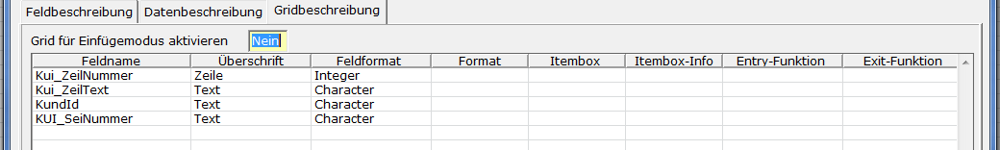
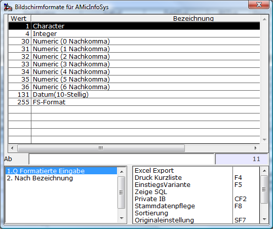

# Gridbeschreibung

<!-- source: https://amic.de/hilfe/gridbeschreibung.htm -->

Hauptmenü > Administration > Werkzeuge > Informationssystem > Register Gridbeschreibung

Direktsprung **[AIS]**

Wenn auf dem Register “Feldbeschreibung” als Feldtyp “Grid“ eingestellt wurde, erscheint das Register „Gridbeschreibung“. Was ist ein Grid? Bei einem Grid handelt es sich um ein Anzeigeformat, das Werte in Listenform anzeigt. In der Abbildung unten ist ein Grid zu sehen. Es wird zwischen Grids mit und ohne Neuerfassung unterschieden. In Grids, bei denen die Datenherkunft auf Relation steht und die Relation den unten angezeigten Kriterien entspricht, können die Daten geändert werden. Grids mit anderer Datenherkunft sind nicht änderbar und dienen lediglich zur Darstellung von Informationen.

  
    

<p class="just-emphasize">Grid für Einfügemodus aktivieren</p>

Dies ist ein Kompatibilitäts-Schalter. In früheren Versionen wurden im Einfüge-Fall die Daten des Grids nicht gespeichert. Damit nun nicht dafür geschriebene Lösungen mit der Behebung dieses Problems kollidieren, wurde dieser Schalter geschaffen. Wenn er auf Ja steht, werden die Griddaten auch im Einfügen-Fall gespeichert, ansonsten verhält sich das System wie zuvor.

<p class="just-emphasize">Feldname</p>

Innerhalb des Grids werden Daten spaltenorientiert dargestellt. Im Feldnamen gibt man den Namen aus der Tabelle an, der in der Spalte angezeigt werden soll. Auf der Maske setzt sich der Feldname dann aus dem Namen des Grids und dem Feldnamen in der Datenbank zusammen (&lt;GridName>.&lt;Datenbankname>$). Die daraus entstehende Länge darf 31 Zeichen nicht überschreiten.

<p class="just-emphasize">Überschrift</p>

Hier hinterlegt man die Spaltenüberschrift.

<p class="just-emphasize">Feldformat</p>

Das Feldformat ist bereits aus der Feldbeschreibung bekannt. Es existiert auch hier eine Itembox(**F3**) mit einer Auswahl der möglichen Formate:



<p class="just-emphasize">Format</p>

Wenn im Feldformat das FS-Format ausgewählt wurde, so kann man dieses Feld betreten und muss hier das Format eintragen oder es über **F3** auswählen.

<p class="just-emphasize">Itembox</p>

Wenn in einem Feld nur Werte angegeben werden dürfen, die auch in einer anderen Tabelle vorhanden sind, so kann man hier eine Itembox angeben, die auf diese Tabelle verweist. Eine Liste der Itemboxen erhält man mit **F3**.

<p class="just-emphasize">Itembox-Info</p>

Häufig gibt es zusätzliche Informationen zu Feldern, die sich auf andere Relationen beziehen. Eine der häufigsten Informationen, die man sehen will ist die Bezeichnung, die einem bestimmten Wert zugeordnet ist. Diese Information kann man hier erhalten. Dabei muss man das Feld angeben, wie es in der Itembox in der Returnliste steht, gefolgt von „>“ und dem Maskenfeld.

**Achtung:**

*Der Name des Maskenfeldes muss exakt stimmen. Bei Feldern in Grids wird der Name aus dem Namen des Grids und dem eigentlichen Feldnamen zusammengesetzt.*

Beispiel:

```text
LKW_Bezeich>LKWGrid.LKWTEXT$
```

Das Maskenfeld LKWTEXT muss natürlich auch angelegt werden bzw. auf der Maske existieren.

Man könnte auch noch mehr Informationen aus der Itembox herauslesen. Dazu kann man, mit Komma getrennt, weitere Felder in der obigen Syntax angeben. Also:

```text
LKW_Bezeich>
LKWGrid.LKWTEXT$,LKW_MATCH> LKWGrid.MATCH$,....
```

Alle Felder, die aus der Relation gelesen werden, müssen in der Returnliste der Itembox stehen. Siehe dazu Dokumentation Itembox.

<p class="just-emphasize">Entry-, Exit- bzw. Valid-Funktion</p>

Diese drei Funktionen dienen zur Steuerung bzw. zur Eingabeprüfung des Feldes. Sie haben alle denselben Aufbau. Es sind Funktionen innerhalb des Makros, das man bei der Einrichtung der Gruppe angegeben hat. Die Funktion muss fünf Parameter mit folgender Bedeutung haben:

| Parameter | Beschreibung |
| --- | --- |
| 1\. string | Maskenname |
| 2\. integer | Nummer des Feldes auf der Maske |
| 3\. string | Feldinhalt |
| 4\. integer | Zeile, falls das Feld ein Array ist |
| 5\. integer | Status. Je nach Art des Aufrufs enthält es verschiedene Werte. Siehe Panther–Dokumentation. |

Wenn innerhalb des Makros Funktionen mit diesem Aufbau existieren, so ist es möglich diese mit **F3** auszuwählen.

```text
function
EineEntryFunktion(aa:string ; bb : integer;a:string ; b,c : integer
):integer;
begin
 EineEntryFunktion:=0;
end;
```

Die Validation-Funktion unterscheidet sich dadurch von den anderen, dass der Rückgabewert ausgewertet wird. Ein Wert ungleich 0 bewirkt, dass das Feld nicht verlassen werden kann.

<p class="just-emphasize">Feldlänge</p>

Breite in der die Spalte dargestellt wird.

<p class="just-emphasize">Sortierung</p>

In dieser Reihenfolge werden die Spalten dargestellt.

<p class="just-emphasize">Bearbeitung</p>

Mit Bearbeitung wird festgelegt, wie ob und wie Felder vom Endanwender zu bearbeiten sind:

| | Beschreibung |
| --- | --- |
| Eingabefeld | Die Daten werden angezeigt und können geändert werden.<br> |
| Versteckt | Die Daten werden gelesen und stehen auch als wert zur Verfügung, werden jedoch nicht angezeigt. Dadurch ist es möglich Interne Idents zwar zu laden und somit für SQL bzw. Makros zur Verfügung zu stellen, jedoch für den Endanwender unsichtbar zu machen<br> |
| Anzeigefeld | Die Daten werden nur angezeigt, können jedoch **NICHT** geändert werden. Ist ein Control (s.u.) hinterlegt, kann das Feld mit der Maus ausgewählt bzw. ein Doppelklick auf diesem Feld ausgeführt werden.<br><br><br>**Achtung:** *Ist die* [*Datenherkunft*](./datenbeschreibung.md) ***Relation**, so wird das Feld trotzdem mit gespeichert.*<br> |

<p class="just-emphasize">Control</p>

Wenn beim Mausklick in diese Spalte irgendwie reagiert werden soll, muss hier einer der folgenden Controlstrings eingetragen werden:

| Controlstring | Beschreibung |
| --- | --- |
| ^jpl ais_list | ruft einen Report auf. Parameter sind die ReportId und der Name des Buttons(also dieses Feldes). |
| ^jpl ais_aisload | Lädt ein AIS im Ändernmode. Parameter sind Gruppe, [Seite] und [IDFeld]. Seite wird nur ausgewertet, wenn die Gruppe KUINOTIZ lautet, IDFeld gibt das Feld an, aus dem die Id der zu ladenden Daten steht. Ist hier nichts angegeben, dann wird die ID aus dem Feld versorgt, bei dem in der Gridbeschreibung unter ID ein **Ja** eingetragen ist. |
| ^jpl ais_makro | Startet ein Makro. Parameter sind Makro, [IDFeld, [p2, [p3, [p4]]]]. IDFeld gibt das Feld an, aus dem die Id der zu ladenden Daten steht. Ist hier nichts angegeben, dann wird die ID aus dem Feld versorgt, bei dem in der Gridbeschreibung unter ID ein **Ja** eingetragen ist. Dem Makro wird als erster Parameter die ID übergeben gefolgt von den optionalen Parametern p2 bis p4 |
| ^jpl ais_vba | Startet ein unter VBA angelegtes VBA-Script. Parameter sind wie beim Makro, [IDFeld, [p2, [p3, [p4]]]]. IDFeld gibt das Feld an, aus dem die Id der zu ladenden Daten steht. Ist hier nichts angegeben, dann wird die ID aus dem Feld versorgt, bei dem in der Gridbeschreibung unter ID ein **Ja** eingetragen ist. Dem Script wird als erster Parameter die ID übergeben gefolgt von den optionalen Parametern p2 bis p4 |
| ^jpl ais_show_warenbeleg | Ohne Parameter. Das Grid muss in der Gridbeschreibung in der Spalte ID bei der V_ID das **Ja** eingetragen haben |

Die Funktionen ais_aisload, ais_makro und ais_vba setzen die JVAR AIS_V_GRIDZEILE (owner=7100). In dieser steht die jeweils ausgewählte Zeile des Grids. Damit ist gewährleistet, dass man auch im VBA bzw. im Makro weiß, welche Zeile aktiv ist.

<p class="just-emphasize">ID</p>

Hier markiert man das Feld, welches die eindeutige ID enthält. Es kann immer nur ein Feld als Identfeld markiert sein.

Änderbare Griddaten

Bei Daten, die änderbar sind, sind folgende Felder (**MaxC, NumC, FixValue**) von Bedeutung. Die Relation, die hier bearbeitet werden kann, muss folgende Kriterien erfüllen:

- Es muss ein Identfeld existieren, welches für jeden Datensatz gleich ist. Siehe Fixvalue
- Es muss ein Zählfeld existieren, welches die Daten durchnummeriert. Siehe NumC
- Der eindeutige Schlüssel muss sich aus diesen beiden Feldern zusammensetzen.

Wenn Maxc, Numc oder Fixvalue nicht gesetzt sind, so ist eine Dateneingabe nicht möglich.

<p class="just-emphasize">MaxC</p>

Handelt es sich um Daten, die man ändern möchte, so gibt man für das Feld, welches gefüllt sein muss, um die letzte Datenzeile zu markieren, ein **Ja** ein. Es kann nur ein Feld markiert werden.

<p class="just-emphasize">NumC</p>

Handelt es sich um Daten, die man ändern möchte, so gibt man für das Feld, welches den Zähler enthält, ein **Ja** ein. Dieses Feld wird nicht auf der Maske/im Grid dargestellt.

<p class="just-emphasize">Fixvalue</p>

Man kann hier Werte hinterlegen, die für alle Zeilen gleich sein sollen. Entweder trägt man hier einen festen Wert ein, ein Feld von der Maske mit einem vorangestellten Doppelpunkt oder :IDENT, also den Verweis auf die eindeutige ID des Datensatzes, der bearbeitet wird. Auf jeden Fall muss ein Identfeld hier hinterlegt sein. Dieses Feld wird nicht auf der Maske/im Grid dargestellt. Achtung: Wenn hierfür keine Zeile ein Wert gesetzt wurde, dann wird versucht alle Daten dieser Relation einzulesen.
