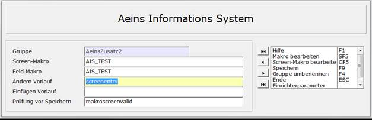

# AIS-Einrichtung

<!-- source: https://amic.de/hilfe/aiseinrichtung.htm -->

Hauptmenü > Administration > Werkzeuge > Informationssystem

Direktsprung **[AIS]**

Alle Felder des AIS werden in sogenannten Gruppen zusammengefasst. Über diese Gruppen werden sie später den Erfassungsmasken bzw. den Registern zugeordnet. Die Länge ist auf 30 Zeichen beschränkt, da das Maskenwerkzeug für die Namensvergabe von Maskenfeldern eine maximale Länge von 31 Zeichen zulässt. Die externe Bezeichnung des Registers wird in der Maskenzuordnung unter „Bezeichnung/Register“ angegeben.

Jeder dieser Gruppen kann ein Screen-Makro bzw. ein Feld-Makro zugeordnet werden. Das Feld-Makro übernimmt die [Eingabeprüfung](./eingabepruefung.md) auf Feldebene. Das Screen-Makro kann für den Ändern- bzw. im Neu-Fall Vorlauffunktionen enthalten sowie eine Funktion „Prüfung vor speichern“, die aufgerufen wird bevor die Daten gespeichert werden und in der man den Speichervorgang noch abbrechen kann. Diese werden in „***Ändern Vorlauf***“, „***Einfügen Vorlauf***“ bzw. in „***Prüf. Vor Speichern***“ festgelegt. Ist kein Screen-Makro angegeben werden diese Funktionen aus kompatibilitätsgründen aus dem Feld-Makro gelesen.

<strong>ACHTUNG:</strong> <em>Wird die Refresh-Funktionalität verwendet, so müssen die Funktionen für „**Ändern Vorlauf**“ und „**Einfügen Vorlauf**“ immer im Screen-Makro enthalten sein.</em>

<p class="just-emphasize">Hinweis:</p>

Wird ein Makro 2.0 (C#) als Screenmakro angegeben, so entfällt die Angabe der Funktionsnamen („Ändern Vorlauf“, „Einfügen Vorlauf“, „Prüf. Vor Speichern“).

Die Methoden ergeben sich aus dem AISMakro-Interface

<p class="just-emphasize">Ändern Vorlauf:</p>

Die hier angegebene Funktion wird im Ändern-Modus immer dann aufgerufen, nachdem der nächste Datensatz auf dem Bildschirm dargestellt wurde. Man kann dann diese Funktion nutzen, um z.B. um eigenständige Werte zu errechnen. Die Funktion muss folgenden Aufbau haben. Der übergebene Parameter ist der Maskenname:

```text
function OnUpdateEntry
(Maskenname:string ):integer;
begin
 MessageBox ( "Nach dem laden der Daten", "Ändern
Vorlauf", 1 );
 OnUpdateEntry:=0;
end;
```

<p class="just-emphasize">Einfügen Vorlauf:</p>

Diese Funktion wird immer im Neu-Modus vor jedem neuen Datensatz einmal aufgerufen. Man kann dort dann Vorbelegungen der in AIS definierten Felder vornehmen.

**ACHTUNG:** *Diese Funktionalität steht noch nicht in allen Masken zur Verfügung.*

Die Funktion muss folgenden Aufbau haben. Der übergebene Parameter ist der Maskenname:

```text
function OnInsertEntry
(Maskenname:string, ):integer;
begin
 MessageBox ( "Nach dem laden der Daten",
"Einfügen Vorlauf", 1 );
 OnInsertEntry:=0;
end;
```

<p class="just-emphasize">Prüfung vor Speichern:</p>

Die Funktion „***Prüfung vor Speichern***“ wird nur bei den Masken AEZADDON, AEZADDOND und AEZADDONTnn aufgerufen, da es sich dann um eigenständige Pfleger handelt. In dieser Funktion kann man Prüfungen vornehmen, die die Integrität der Daten gewährleisten. Bei fehlerhaften Daten kann man das Speichern verhindern, indem man als Ergebnis den Wert **1** zurückliefert. Wird eine Gruppe mit einer Funktion zur Prüfung in der Maskenzuordnung einer anderen Maske zugeordnet erscheint ein Warnhinweis.

Die Funktion unterscheidet sich im Aufbau von den Funktionen für ***Ändern Vorlauf***“ und „***Einfügen Vorlauf***“ dadurch, dass sie einen weiteren Parameter hat, der angibt in welchem Modus man sich gerade befindet. Er hat folgende Ausprägungen:

- Aendern
- Einfuegen
- Loeschen

Der Aufbau der Funktion sieht dann wie folgt aus:

```text
function OnSaveValid
(Maskenname:string; Editmodus:string ):integer;
begin

  …

  GetLDB("MaskenFeld", buffer);
  if (
StrCmp(buffer, "Erwarteter Wert") !=0 ) then begin
    MessageBox("Falsche Eingabe",
"Prüfung vor Speichern", 1)
    OnSaveValid:=1;

end
  OnSaveValid:=0;
end;
```

Ist die Gruppe, das Register bzw. das Makro einmal festgelegt, kann man bei Feldern, die auch dieser Gruppe zugeordnet werden sollen, auf dem Feld Gruppe mit **F3** diese auswählen. Geändert werden kann im Nachhinein - im Ändern fall steht dafür die Funktion „***Register/Makro ändern* F8**“ zu Verfügung - der Name des Registers, das Makro bzw. die Vorlauffunktion. Diese Änderung gilt immer für die gesamte Gruppe.



Die Funktion „***Gruppe umbenennen***“ schaltet das Feld in dem der Name der Gruppen steht frei, so dass man dort den neuen Gruppenamen eingeben kann. Diese Gruppe darf noch nicht existieren. Es werden immer **alle** Felder der alten Gruppe der neuen Gruppe zugeordnet.

Hat man ein Screen- bzw. Feld-Makro angegeben, steht hier die Funktionen ***„Screen Makro bearbeiten* SF5**“ bzw. „***Makro bearbeiten* CF5**“ zur Verfügung, um das Makro direkt zu bearbeiten, so dass man nicht extra die Anwendung zur Makrobearbeitung aufrufen muss.

<p class="siehe-auch">Siehe auch:</p>

- [Feldbeschreibung](./feldbeschreibung.md)
- [Eingabeprüfung](./eingabepruefung.md)
- [Datenbeschreibung](./datenbeschreibung.md)
- [Aktionsfelder](./aktionsfelder.md)
- [Gridbeschreibung](./gridbeschreibung.md)
