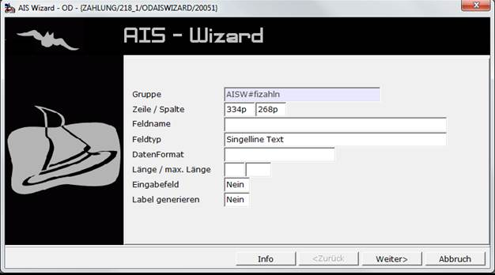
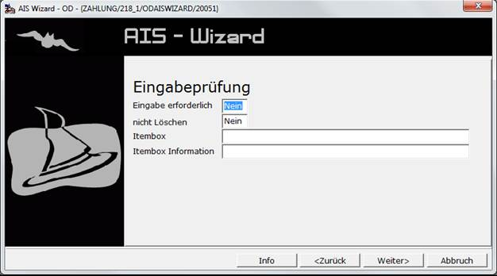
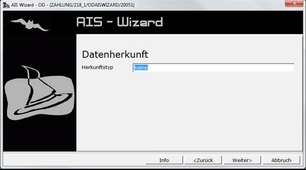
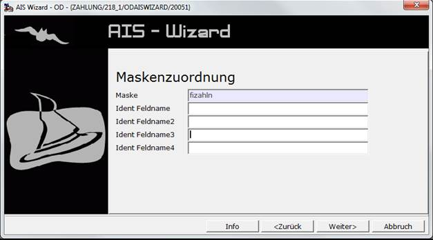
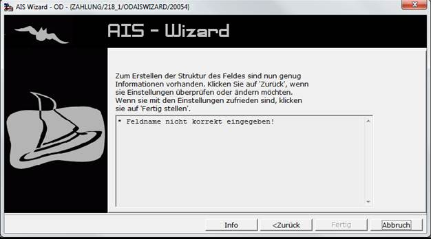

# AIS-Wizard

<!-- source: https://amic.de/hilfe/aiswizard.htm -->

Um die Arbeit mit AIS zu erleichtern und schnell Informationen auf dem Bildschirm darzustellen bzw. zu bestehenden AIS-Gruppen Felder hinzuzufügen oder zu ändern, existiert ein Werkzeug, dass schnell alle benötigten Daten abfragt. Um diesen Wizard zu erreichen, positioniert man die Maus an die Stelle, an der man das neue Feld haben will. Wenn man dann mit gedrückter Strg-Taste die rechte Maustaste drückt, erscheint folgende Maske.



Hinweis: Steht man mit der Maus auf einem bereits existierenden AIS-Feld, so geht die bekannte [Einrichtungsmaske](./ais_einrichtung/feldbeschreibung.md) auf und man kann dort sämtliche Einstellungen vornehmen.

In dem Wizard werden nacheinander die benötigten Daten angezeigt. Welche Daten abgefragt werden, hängt auch unter anderem von den gemachten Eingaben ab:

<p class="just-emphasize">Gruppe</p>

Die Gruppe wird vorbelegt und ist nicht änderbar. Ist der Maske bzw. dem Register bereits eine Gruppe zugeordnet, so wird diese genommen. Ansonsten wird automatisch ein Name generiert.

<p class="just-emphasize">Zeile / Spalte</p>

Jedes Objekt das angesprochen wird, muss an eine bestimmte Stelle auf dem Bildschirm positioniert werden. Es kann mit diesem System der gesamte Bildschirm (auch 19“ und mehr) angesprochen werden.

Um eine genaue Positionierung zu gewährleisten, ist es möglich, die Position in Bildschirmpixel anzugeben. Um dies zu erreichen, stellt man ein ‚p’ ans Ende der Zahl (z.B. 125p). Diese Angabe ist auf alle Fälle die genauere und wird empfohlen. Wird dem System keine Maßeinheit mitgegeben, wird ein eigenes Raster verwendet. Dieses bezieht sich jedoch nur auf die Standardschriftgröße und berücksichtigt die unter Schriftart angegebenen Werte nicht.

Es werden hier die Werte vorbelegt, an denen die Maus stand.

<p class="just-emphasize">Feldname</p>

Der Feldname dient zur Identifikation des Feldes und **muss** angegeben werden. (Gruppe und Feldname bilden die Eindeutige Identifikation des Datensatzes). In diesem Feld sind nur dann die Zeichen „.“ und „$“ erlaubt, wenn der Feldtyp Label ist. Da das Maskensystem die Länge von Feldname auf 31 Zeichen beschränkt, sind hier nur 25 Zeichen zulässig. Die restlichen 6 Zeichen werden von AIS für interne Zwecke verwendet.

<p class="just-emphasize">Feldtyp</p>

Es stehen hier nur die Feldtypen **Label** und **Singelline Text** zur Verfügung.

<p class="just-emphasize">Datenformat</p>

Hier lässt sich auswählen, um was für ein Datenformat es sich handelt. Es stehen die folgenden Formate zur Verfügung.

• Character

• Integer

• Numeric (0 Nachkommastellen)

• Numeric (1 Nachkommastellen)

• Numeric (2 Nachkommastellen)

• Numeric (3 Nachkommastellen)

• Numeric (4 Nachkommastellen)

• Numeric (5 Nachkommastellen)

• Numeric (6 Nachkommastellen)

• Datum(10-Stellig)

• FS-Format

Diese Formate lassen sich mit **F3** auswählen.

<p class="just-emphasize">Länge / max. Länge</p>

Viele Felder benötigen keine Längenangabe, z.B. wird bei Texten die Länge des Textes berechnet und dann ein entsprechend großer Bereich reserviert. In so einem Fall kann dieses Feld leer gelassen werden. Bei anderen Elementen steuert diese Zahl die Anzahl der Spalten in einem oder mehrerer Felder.

Bei einigen Feldern reicht der Platz auf der Maske evtl. nicht aus, um den gesamten Inhalt darzustellen. Mit der **maximalen Länge** lässt sich angeben, wie viel Zeichen maximal erfasst werden können.

<p class="just-emphasize">Eingabefeld</p>

Hier wird festgelegt, ob man in dem Feld Daten eintragen kann, oder ob es nur zur Anzeige dient. Wird dieses Feld auf **Ja** gesetzt, wird zusätzlich noch eine weitere Seite mit Eingabeprüfungen abgefragt.

<p class="just-emphasize">Label generieren</p>

Label generieren erscheint beim Feldtypen „Singleline Text“ und ist eine Besonderheit des AIS-Wizards. Stellt man dieses Feld auf **Ja**, so kann man in der nächsten Zeile die Beschriftung erfassen. Am Ende wir zusätzlich zu diesem Feld ein Eintrag für einen Label generiert. Der Name des Label-Feldes lautet wie der angegebene mit „ft.“ vorangestellt.

Alle weiteren Informationen, die der [Feldbeschreibung](./ais_einrichtung/feldbeschreibung.md) dienen, müssen dann im Stammdatenpfleger ggf. geändert werden.



Diese Seite erscheint nur, wenn vorher das Feld „**Eingabeprüfung**“ auf **Ja** gesetzt wurde.

<p class="just-emphasize">Eingabe erforderlich</p>

Wenn erzwungen werden soll, dass in das Feld ein Wert eingetragen werden soll, dann trägt man hier ein **Ja** ein. Man kann dann dieses Feld nur verlassen, wenn es Daten enthält bzw. es wird vor dem Speichern geprüft, ob es Daten enthält.

<p class="just-emphasize">nicht Löschen</p>

Dies bedeutet, dass nach dem Speichern dieses Feld nicht gelöscht wird, sondern der vorher eingegebene Inhalt erhalten bleibt. Auch springt der Cursor nicht wieder in dieses Feld, sondern in das erste Feld, in dem bei „nicht Löschen“ ein **Nein** steht.

<p class="just-emphasize">Itembox</p>

Wenn in einem Feld nur Werte angegeben werden dürfen, die auch in einer anderen Tabelle vorhanden sind, so kann man hier eine Itembox angeben, die auf diese Tabelle verweist. Eine Liste der Itemboxen erhält man mit **F3**.

<p class="just-emphasize">Itembox Information</p>

Häufig gibt es zusätzliche Informationen zu Feldern, die sich auf andere Relationen beziehen. Eine der häufigsten Informationen, die man sehen will ist die Bezeichnung, die einem bestimmten Wert zugeordnet ist. Diese Information kann man hier erhalten. Dabei muss man das Feld angeben, wie es in der Itembox in der Returnliste steht, gefolgt von „>“ und dem Maskenfeld. Beispiel:

```text
LKW_Bezeich>LKWTEXT
```

Das Maskenfeld LKWTEXT muss natürlich auch angelegt werden bzw. auf der Maske existieren.

Man könnte auch noch mehr Informationen aus der Itembox herauslesen. Dazu kann man, mit Komma getrennt, weitere Felder in der obigen Syntax angeben. Also:

```text
LKW_Bezeich>LKWTEXT,LKW_MATCH>MATCH,....
```

Alle Felder, die aus der Relation gelesen werden, müssen in der Returnliste der Itembox stehen. Siehe dazu Dokumentation Itembox.



Die [Datenbeschreibung](./ais_einrichtung/datenbeschreibung.md) muss genau wie bei der Einrichtung über den Stammdatenpfleger erfasst werden.



Die Maskenzuordnung wird nur dann abgefragt, wenn keine Gruppe gefunden wurde und vorbelegt wurde. Die Maske, die ja bekannt ist, wird vorbelegt. Die Feldname, die zur eindeutigen Bestimmung des Datensatzes benötigt werden, müssen hier eingegeben werden. Mindestens ein Identfeldname ist notwendig. Alle weiteren Informationen müssen dann nachträglich in dem Stammdatenpfleger zur [Maskenzuordnung](./maskenzuordnung.md) gepflegt werden.



Am Ende werden ggf. Fehler aufgelistet und man muss dann zurückblättern. Es ist dann auch nicht möglich den **„Fertig“-Knopf** zu drücken.

Bevor das neue Feld dann zu sehen ist, muss man die Maske, der man das Feld zugeordnet hat, einmal verlassen.
