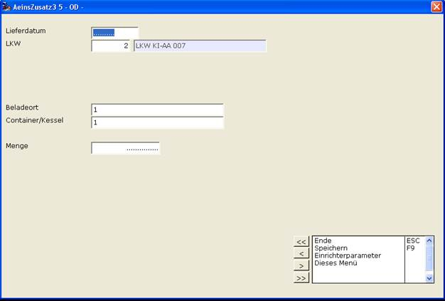
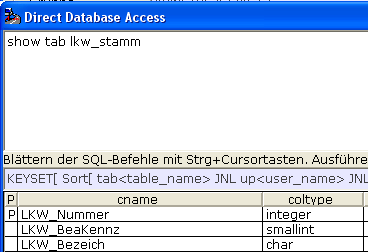
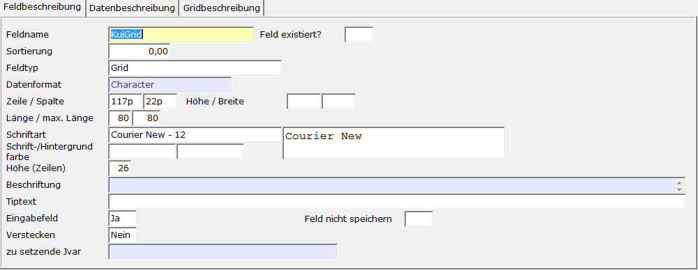
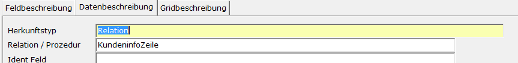
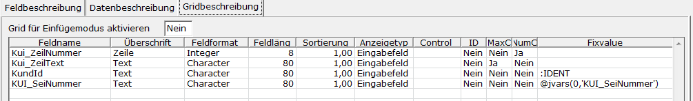

# Beispiel eines eigenständigen Pflegers

<!-- source: https://amic.de/hilfe/beispieleineseigenstndigenpfle.htm -->

Hauptmenü > Administration > Werkzeuge > Informationssystem

Direktsprung **[AIS]**

Es soll diese einfache Maske zur Erfassung von Beladeort, Container und Menge erstellt werden.

Anlegen des Labels

Im A.eins Informationssystem legt man sich einen neuen Eintrag (**F8**) an. Zuerst muss die Gruppe angegeben werden, in diesem Beispiel soll sie „Aeinszusatz3“ heißen. Hat man bereits ein oder mehrere Felder zu einer Gruppe erfasst, kann man die Gruppe hier mit **F3** auswählen. Die Felder „***Makro***“, „***Ändern Vorlauf***“ und „***Einfügen Vorlauf***“ werden dann vorbelegt. Sie können in diesem Fall leer bleiben.

**Register Feldbeschreibung:**

| | Beschreibung |
| --- | --- |
| Feldname  | Auch für Label, die nicht aus der Datenbank gefüllt werden, müssen Feldnamen vergeben werden. Sie sollten so gewählt werden, dass man schon am Namen die Bedeutung erkennen kann. In diesem Beispiel soll der Name des ersten Labels „lbl.Lieferdatum“ heißen. Das Kürzel „lbl“ gefolgt von einem Punkt soll uns zeigen, dass es sich um einen Label handelt.  |
| Sortierung  | Die Sortierung ist bei Labeln, die nicht aus der DB gefüllt werden, nicht wichtig und kann auf 0 stehen gelassen werden.  |
| Feldtyp  | Der Feldtyp für die Beschriftungsfelder muss natürlich **Label** sein.  |
| Datenformat  | Wenn der Label aus der Datenbank gefüllt wird, kann es nötig sein, ein anderes Format als „Character“ einzugeben. In unserem Beispiel reicht CHARACTER.  |
| Zeile und Spalte  | Die Position kann entweder über ein Raster oder pixelgenau angegeben werden. Sollen es Pixel sein, so ist ein kleines p an die Zahl anzuhängen (z.B.: 125p). In unserem Beispiel sollen die Felder sich am Raster orientieren, also Spalte 1 und Zeile 1.  |
| Länge  | Wie viel Zeichen darf der Label lang sein. Soll der Text „Lieferdatum“ erscheinen, so muss hier mindestens eine 11 eingetragen werden.   |
| Beschriftung  | Lieferdatum  |
| Tipptext  | Ist ein Hinweistext, der erscheint, wenn der Mauszeiger über diesem Feld steht. Bleibt hier leer. Mit der Zeichenfolgen %N kann man in Tipptexten Zeilenumbrüche definieren.  |

**Register Datenbeschreibung:**

Da es sich um einen Festtext handeln soll, wird der Herkunftstyp auf „keine“ stehen gelassen.

Hier eine kurze Aufstellung der variablen Werte für die anderen Label .  
    

| Feldname | Zeile | Spalte | Länge | Beschriftung |
| --- | --- | --- | --- | --- |
| Lbl.Lieferdatum | 1 | 1 | 15 | Lieferdatum |
| Lbl.LKW | 2 | 1 | 15 | LKW |
| Lbl.Beladeort | 7 | 1 | 15 | Beladeort |
| Lbl.Container | 8 | 1 | 16 | Container/Kessel |
| Lbl.Menge | 10 | 1 | 15 | Menge |

Anlegen von Eingabefeldern (Singelline Text) vom Typ Datum

**Register Feldbeschreibung:**

| | Beschreibung |
| --- | --- |
| Feldname  | Hier muss der Feldname so eingetragen werden, wie er in der Datenbank steht. Also: Lieferdatum  |
| Sortierung  | In diesem Beispiel sollen die Daten alle aus derselben Relation kommen. Daher ist die Reihenfolge hier nicht wichtig.  |
| Feldtyp  | Der Feldtyp für das Eingabefeld soll **Singelline-Text** sein.  |
| Datenformat  | Hier muss das benötigte Format hinterlegt werden. Bei Datum ist es „Datum(10-Stellig)“. Auswahl der möglichen Formate mit **F3**. Nach Eingabe dieses Formates verschwindet das Register „Eingabeprüfung“, da eine Eingabeprüfung schon durch dieses Format vorgegeben ist.  |
| Zeile und Spalte  | Analog zu den Labeln, soll die Positionierung am Raster erfolgen. Für das Lieferdatum also Zeile 1 und Spalte 21.  |
| Länge  | Die Länge ist bei Feldern vom Typen Datum fest auf 10 eingestellt und kann nicht geändert werden.  |
| Tipptext  | Bleibt leer.  |
| Eingabefeld  | Wir wollen hier Daten erfassen, also **Ja**. Es steht dann das Register Eingabefeld zur Verfügung.  |

**Register Eingabeprüfung:**

In diesem Beispiel sind nur zwei Felder wichtig:

| | Beschreibung |
| --- | --- |
| Eingabe erforderlich  | Wenn für jeden Datensatz, den man erfassen will, in diesem Feld ein Wert stehen muss, so muss hier ein **Ja** stehen. Das Lieferdatum ist ein Pflichtfeld, also **Ja**  |
| Nicht Löschen  | Dies bedeutet, dass nach dem Speichern dieses Feld nicht gelöscht wird, sondern der vorher eingegebene Inhalt erhalten bleibt. Auch springt der Cursor nicht wieder in dieses Feld, sondern in das erste Feld, in dem bei „nicht Löschen“ ein **Nein** steht. Da das Lieferdatum meist das Tagesdatum ist, soll es die einmal eingegebene Information behalten  |

**Register Datenbeschreibung:**

| | Beschreibung |
| --- | --- |
| Herkunftstyp  | Um Daten zu erfassen bzw. zu ändern, ist nur der Herkunftstyp „Relation“ möglich.  |
| RelationR  | Sämtliche Werte sollen in der Relation **Aeinszusatz3** gespeichert werden. Existiert dieses Feld noch nicht in der Relation, so wird es automatisch angelegt.  |
| Ident Feld  | Hier muss der Name des eindeutigen Schlüssels der Relation hinterlegt werden. Bei den Relationen Aeinszusatz1 bis Aeinszusatz5 heißt dieses Feld Ident.  |
| Refresh | Bei Herkunftstyp **SQL** kann man einstellen, dass beim Wiedereinstieg in die Maske aus einer überlagernden Maske die Daten erneut geladen werden. Diese Funktion kann auch direkt z.B. vom Makro aus angestoßen werden. Der Aufruf lautet: dbx_io („AISREFRESH“) und es werden dann alle Daten zu den Feldern, die mit Refresh = **Ja** belegt sind neu geladen. Wird ein Refresh ausgeführt, so wird auch die Pascalfunktion, die nach dem Laden der Daten aufgerufen wird, erneut ausgeführt.  |

Anlegen von Eingabefeldern (Singelline Text) mit Itembox

Das Feld **LKW** soll nur mit den Daten aus der Relation LKW_STAMM gefüllt werden dürfen. Dafür sind dann auf dem Register „Eingabeprüfung“ einige Einstellungen vorzunehmen.

**Register Feldbeschreibung:**

| | Beschreibung |
| --- | --- |
| Feldname  | Hier muss der Feldname so eingetragen werden, wie er in der Datenbank steht. Also: **LKW**  |
| Sortierung  | In diesem Beispiel sollen die Daten alle aus derselben Relation kommen. Daher ist die Reihenfolge hier nicht wichtig.  |
| Feldtyp  | Der Feldtyp für die Eingabefelder muss natürlich **Singelline-Text** sein.  |
| Datenformat  | Hier muss das benötigte Format hinterlegt werden. Der LKW wird in der Relation durch eine Nummer eindeutig identifiziert. Das Datenformat muss also analog der Nummer im LKW_Stamm gewählt werden. Herausfinden kann man die Formate von existierenden Feldern über Relationsinfo (RLF) oder über OSQL mit „show tab Relationsname“.      Der Feldtyp ist also Integer!  |
| Zeile und Spalte  | Analog zu den Labeln, soll die Positionierung am Raster erfolgen. Für das Lieferdatum also Zeile 2 und Spalte 21.  |
| Länge  | Die Länge bei Integerfeldern sollte zwischen 1 und 9 liegen.  |
| Maximale länge  | Ist auf der Maske zu wenig Platz, so kann durch Angabe einer maximalen Länge dieses Problem gelöst werden. Tritt eher bei Textfeldern auf.  |
| Tipptext  | Beschreibender Hinweistext. Kann leer bleiben. |
| Eingabefeld  | Wir wollen hier Daten erfassen, also **Ja**. Es steht dann das Register Eingabefeld zur Verfügung.  |

**Register Eingabeprüfung:**

| | Beschreibung |
| --- | --- |
| Eingabe erforderlich  | Wenn für jeden Datensatz, den man erfassen will, in diesem Feld ein Wert stehen soll, so muss hier ein **Ja** stehen. Auch LKW sich ist ein Pflichtfeld, also **Ja**.  |
| Nicht Löschen  | Dies bedeutet, dass nach dem Speichern dieses Feld nicht gelöscht wird, sondern der vorher eingegebene Inhalt erhalten bleibt. Auch springt der Cursor nicht wieder in dieses Feld, sondern in das erste Feld, in dem bei „nicht Löschen“ ein **Nein** steht. Der LKW ändert sich normalerweise pro Eingabe, deswegen soll dieses Feld jedes Mal gelöscht werden und der Cursor in dieses Feld springen: „**Nein**“  |
| Itembox  | Da hier nur LKW’s eingegeben werden sollen, die auch im LKW_Stamm vorhanden sind, können wir eine Itembox hinterlegen, die auf die Daten im LKW_Stamm zugreift. Eine Liste der Itemboxen erhält man mit **F3**. Die Itembox muss hier **IB_LKW** heißen.  |
| Itembox Information  | Häufig gibt es zusätzliche Informationen zu Feldern, die sich auf andere Relationen beziehen. In diesem Beispiel ist es die Bezeichnung des LKW’s, die uns interessiert, da man mit der Nummer nicht unbedingt immer viel anfangen kann. Diese Information kann man hier erhalten. Dabei muss man das Feld in der Relation LKW_Stamm angeben gefolgt von „>“ und dem Maskenfeld. Also:   <code>LKW_Bezeich&gt;LKWTEXT</code>   Das Maskenfeld LKWTEXT muss natürlich auch angelegt werden(s.u.). Man könnte auch noch mehr Informationen aus der Itembox herauslesen. Dazu kann man, mit Komma getrennt, weitere Felder in der obigen Syntax angeben. Also:   <code>LKW_Bezeich&gt;LKWTEXT,LKW_MATCH&gt;MATCH,....</code>   Alle Felder, die aus der Relation gelesen werden, müssen in der Returnliste stehen. Siehe dazu Dokumentation Itembox.  |

**Register Datenbeschreibung:**

| | Beschreibung |
| --- | --- |
| Herkunftstyp  | Um Daten zu erfassen bzw. zu ändern, ist nur der Herkunftstyp **Relation** möglich.  |
| RelationR  | **R**Sämtliche Werte sollen in der Relation **Aeinszusatz3** gespeichert werden. Existiert dieses Feld noch nicht in der Relation, so wird es angelegt.  |
| Ident Feld  | Hier muss der Name des eindeutigen Schlüssels der Relation hinterlegt werden. Bei den Relationen Aeinszusatz1 bis Aeinszusatz5 heißt dieses Feld **Ident**.   |

Hier eine kurze Aufstellung der variablen Werte für die anderen Singelline-Text Felder.

| Feldname | Feldformat | Zeile | Spalte | Länge | Eingabefeld | Datenbeschreibung |
| --- | --- | --- | --- | --- | --- | --- |
| Lieferdatum | Datum(10-Stellig) | 1 | 21 | 10 | Ja | Relation AeinsZusatz3 Identfeld Ident |
| LKW | Integer | 2 | 21 | 8 | Ja | Relation AeinsZusatz3 Identfeld Ident |
| LKWTEXT | Character | 2 | 31 | 30 | Nein | \-- |
| Beladeort | Character | 7 | 21 | 30 | Ja | Relation AeinsZusatz3 Identfeld Ident |
| Container | Character | 8 | 21 | 30 | Ja | Relation AeinsZusatz3 Identfeld Ident |
| Menge | Numeric (2 Nachkomma) | 10 | 21 | 15 | Ja | Relation AeinsZusatz3 Identfeld Ident |

Zugriff auf die Notizbücher aus KUI

Bei den Notizbüchern aus KUI handelt es sich um Textseiten, die gepflegt werden konnten. AIS bietet natürlich auch die Möglichkeit, auf diese Daten weiterhin zuzugreifen.

