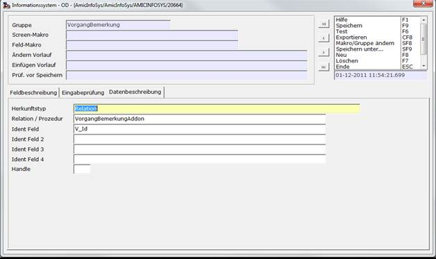

# Beispiel eines Eingabefeldes in Vorgängen

<!-- source: https://amic.de/hilfe/beispieleineseingabefeldesinvo.htm -->

Hauptmenü > Administration > Werkzeuge > Informationssystem

Direktsprung **[AIS]**

Das Erstellen eines Eingabefeldes in Vorgängen ist in vielen Belangen analog zur Erstellung eines „normalen“ [Informationsfeldes](./beispiel_informationsfeld.md). In diesem Beispiel wird darauf eingegangen, wie man weitere Daten in einer privaten Tabelle speichern kann.

<p class="just-emphasize">Erstellen der Tabelle</p>

Hier wird eine private Tabelle erstellt, die eine zusätzliche Bemerkung zu dem Vorgang speichern soll:

```sql
create table VorgangBemerkungAddon
(
V_Id integer,
Bemerkung char(255),
primary key (V_Id)
)
```

<p class="just-emphasize">Erstellen des Feldes</p>

Der Großteil der Einrichtung des Feldes ist analog zu „Beispiel Informationsfeld“. Der einzige Unterschied besteht in der Datenbeschreibung:



Der Herkunftstyp ist jetzt eine Relation, zu der man den Namen und das Ident Feld angeben muss.

<p class="just-emphasize">Maskenzuordnung</p>

Die Maskenzuordnung ist ebenfalls ähnlich, mit dem Unterschied, dass der Name einer Vorgangsmaske eingegeben wird und das Ident Feld V_ID$ heißt.

<p class="just-emphasize">Gruppenweise Maskenzuordnung</p>

Bis jetzt wurde die neue AIS-Gruppe nur der allgemeinen Vorgangsmaske zugewiesen. Da einzelne Gruppen aber in der Regel nicht in allen Vorgangsklassen angezeigt werden sollen, kann man einzelnen Vorgangsunterklassen bestimmte AIS-Gruppen zuweisen. Dazu geht man in die Formularzuordnung **[FRZ]**, wählt mit ***Ändern*** **F5** die gewünschte Vorgangsklasse aus und kann auf dem Register „AIS“ in der Tabelle „Gruppenzuordnung Vorgangskopf“ die AIS-Gruppen zuordnen.

Um auf der Maske mehr Platz für die AIS-Felder zu haben, kann man hier zusätzlich die Option-Box auf der Maske verschieben, indem man ihr eine neue Position zuweist. An diese Position wird die Option-Box verschoben, sobald mindestens eine AIS-Gruppe angezeigt wird.

<p class="just-emphasize">Vorgang-Backpatch</p>

Um die Daten in der oben erstellten Beispielrelation VorgangBemerkungAddon aktuell zu halten und sie wieder zu löschen, wenn der dazugehörige Vorgang gelöscht wird, muss die Relation noch in die Relation VorgangBackpatch eingetragen werden:

```sql
insert into VorgangBackpatch(VB_Relation,VB_Attribut,VB_Del) values ('VorgangBemerkungAddon', 'V_Id', 1)
```

In dem Feld VB_Relation muss der Name der Relation stehen, in VB_Attribut der Primary Key der Relation und in VB_Del eine 1, damit verwaiste Daten in VorgangBemerkungAddon sofort gelöscht werden.

<p class="just-emphasize">Bemerkungen zur AIS-Verwendung in Vorgängen</p>

Die Verwendung von AIS in Vorgängen unterscheidet sich von der normalen Verwendung insofern, dass die Werte in den Eingabfeldern sofort in der Datenbank gespeichert werden, wenn man von SVMAIN auf einer tieferliegende Maske (z.B. den Positionsteil) geht. Das geschieht, um auch auf diesen Masken auf die Werte der Felder zugreifen zu können. Wird keine tieferliegende Maske geöffnet, hängt das Speichern von der Antwort auf die Speichern-Abfrage ab.

Die folgenden Masken sind AIS-fähig:

- SVMAIN
- SVPOSI
- SVWARE
- SVUMMAIN
- SVUMWARE
