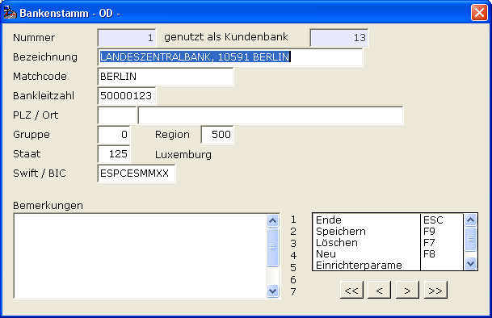

# Beispiel Informationsfeld

<!-- source: https://amic.de/hilfe/beispielinformationsfeld.htm -->

Hauptmenü > Administration > Werkzeuge > Informationssystem

Direktsprung **[AIS]**

Im Bankenstamm (Direktsprung **[BNK]**) soll hinter der Banknummer die Anzahl der Einträge in den Kundenbanken angezeigt werden.

Anlegen des Labels

Im A.eins Informationssystem legt man sich einen neuen Eintrag (**F8**) an. Zuerst muss die Gruppe angegeben werden. Hat man bereits ein oder mehrere Felder zu einer Gruppe erfasst, kann man diese hier mit **F3** auswählen. Die Felder „**Makro**“, „**Ändern Vorlauf**“ und „**Einfügen Vorlauf**“ werden dann vorbelegt.  
    

**Register Feldbeschreibung:**

| | Beschreibung |
| --- | --- |
| Feldname  | Auch für Label, die nicht aus der Datenbank gefüllt werden, müssen Feldnamen vergeben werden. Sie sollten so gewählt werden, dass man schon am Namen die Bedeutung erkennen kann. In diesem Beispiel soll der Name des Labels „**lbl.verwendet**“ heißen. Das Kürzel „lbl“ gefolgt von einem Punkt soll zeigen, dass es sich um ein Feld vom Typ Label handelt.  |
| Sortierung  | Die Sortierung ist bei Labeln, die nicht aus der DB gefüllt werden, nicht wichtig und kann auf **0** stehen gelassen werden.  |
| Feldtyp  | Der Feldtyp für die Beschriftungsfelder muss natürlich **Label** sein.  |
| Datenformat  | Wenn der Label aus der Datenbank gefüllt wird, kann es nötig sein, ein anderes Format als „Character“ einzugeben. In unserem Beispiel reicht **CHARACTER**.  |
| Zeile und Spalte | Die Position kann entweder über ein Raster oder pixelgenau angegeben werden. Sollen es Pixel sein, so ist ein kleines p an die Zahl anzuhängen (z.B.: 125p). Um die Felder genau zu positionieren, so dass sie auf gleicher Höhe wie die Originalfelder sind, muss in diesem Beispiel das Verfahren mit Pixeln gewählt werden. Für die oben dargestellte Maske trägt man bei Zeile **9p** und bei Spalte **200p** ein. Hinweis: AMIC kann nicht gewährleisten, dass die Positionen der Felder auf einer Maske nach einem Update noch gleichgeblieben sind. Es müssen also gegebenenfalls Anpassungen vorgenommen werden.  |
| Länge | Wie viel Zeichen darf das Label lang sein? Soll der Text „genutzt als Kundenbank“ erscheinen, so muss hier mindestens eine **22** eingetragen werden.   |
| Beschriftung | „**genutzt als Kundenbank**“  |
| Tipptext | Ist ein Hinweistext, der erscheint, wenn der Mauszeiger über diesem Feld steht. Kann hier leer bleiben. Mit der Zeichenfolgen %N kann man in Tipptexten Zeilenumbrüche definieren.  |

**Register Datenbeschreibung:**

Da es sich um einen Festtext handeln soll, wird der Herkunftstyp auf „keine“ stehen gelassen.

Anlegen eines Anzeigefeldes

**Register Feldbeschreibung:**

| | Beschreibung |
| --- | --- |
| Feldname  | Hier muss der Feldname so eingetragen werden, wie er in der Datenbank steht bzw. wie er aus der Datenbank gelesen wird. Beim Lesen der Anzahl wird der Alias „**Anzahl**“ vergeben (s.u.).  |
| Sortierung  | In diesem Beispiel wird nur ein Feld gefüllt und daher ist die Reihenfolge hier nicht wichtig.  |
| Feldtyp  | Als Feldtyp für dieses Anzeigefeld verwenden wir in diesem Beispiel **Singelline-Text**. Man könnte genauso gut auch den Typen Label wählen.  |
| Datenformat  | Hier muss das benötigte Format hinterlegt werden. Die Datenbankfunktion count(\*) liefert als Typen **Integer**. Auswahl der möglichen Formate mit **F3**.  |
| Zeile und Spalte | Analog zu den Labeln soll die Positionierung sich an den Pixeln orientieren. Da ein Singelline-Text ein wenig höher ist als ein Label, muss die Zeile 3 Pixel kleiner sein, damit Label und Singelline-Text auf gleicher Höhe erscheinen. Also Zeile **6p** und Spalte **380p**.  |
| Länge | Die Länge soll in diesem Beispiel **8** sein.  |
| Tipptext | Kann leer bleiben.  |
| Eingabefeld  | Es soll sich um ein Anzeigefeld handeln, also **Nein**. Bevor man auf dem Register Datenbeschreibung die Herkunft angibt, ist dieses Feld auch änderbar, wird aber automatisch auf **Nein** und nicht änderbar gesetzt, wenn man als Herkunft SQL auswählt. SQL dient nur zur Anzeige.  |

**Register Datenbeschreibung:**

| | Beschreibung |
| --- | --- |
| Herkunftstyp  | Die Daten werden über ein hier formuliertes Statement zusammengesucht, also **SQL**.  |
| SQL-Text  | Wir wollen aus der Kundenbank die Anzahl der Datensätze bestimmen, die die Bank verwenden, die gerade im Pfleger angezeigt wird:     IDENT enthält den Wert des Feldes, das in der Maskenzuordnung als Ident-Feldname festgelegt wird.  |

Maskenzuordnung

| | Beschreibung |
| --- | --- |
| Maske | Die Maske heißt **BANKSTAM**. Man kann den Maskennamen u bestimmen, indem man, wenn man auf der Maske steht, **Shift+Strg+F5** drückt.  |
| Breite / Höhe | Kann hier nicht geändert werden.  |
| Gruppe | Die Gruppe, die gerade erstellt wurde: **KUNDENKBANKZAEHLER**  |
| Bedienerklasse | Wenn diese Anzeige nur für eine bestimmte Bedienerklasse gültig sein soll, dann hier die Nummer der Bedienerklasse eintragen.  |
| Ident Feldname  | Der Name des Feldes auf der Maske, auf den man sich mit IDENT beziehen will. Bei der Eingabe ist unbedingt Groß- und Kleinschreibung zu beachten! Zu bestimmen, indem man, wenn man auf der Maske steht, **Shift+Strg+F5** drückt. Hier: **h.BankNummer$**  |
| Ident Testwert  | Es steht im Ändernmodus bei der Maskenzuordnung die Funktion Test zur Verfügung. Diese Funktion benötigt einen Wert für das Ident Feld. Diese muss hier eingetragen werden. Bei der Testfunktion wird dann die Maske aufgerufen und die bisher eingerichteten AIS-Felder mit angezeigt.  |
| Optionbox Feldname  | Ist dann wichtig, wenn man das Funktionsmenü ausblenden will, um z.B. mehr Platz für eigene Felder zu haben.  |
| Optionbox Darstellung  | Soll die Funktionsmenü ausgeblendet werden? In unserem Fall nicht, da genug Platz vorhanden ist. Die Optionbox ist dann nur nicht zu sehen, es stehen trotzdem alle Funktionen zur Verfügung. Außerdem erreicht man sie weiterhin mit der rechten Maustaste.  |
| Darstellung  | Ist entweder Maske oder Register. Ist kein Register auf der Maske vorhanden, wird diese Einstellung ignoriert. Also „**auf der Maske**“.  |
| Bezeichnung/Register | Können hier ignoriert werden.  |
