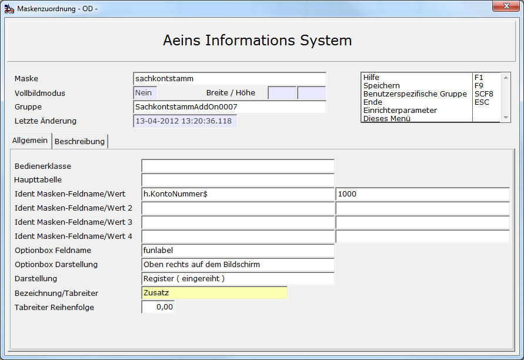
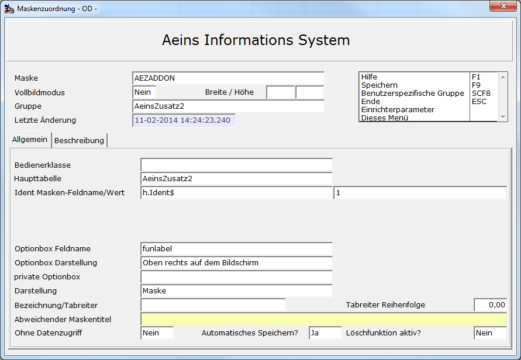
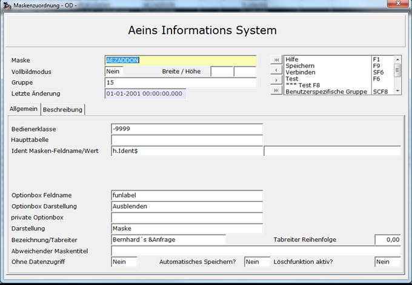
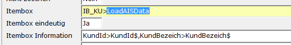

# Beispiel Maskenzuordnung

<!-- source: https://amic.de/hilfe/beispielmaskenzuordnung.htm -->

Hauptmenü > Administration > Werkzeuge > Informationssystem > Variante „Maskenzuordnung“

Direktsprung **[AIS]**

Man kann den Gruppen prinzipiell auf fünf verschiedene Arten Masken zuweisen.

1. Zu bestehenden Masken als zusätzlichen Informationsbereich.

2. Zu bestehenden Stammdatenpflegern zur Neuerfassung/Änderung.

3. Als eigenständiger Stammdatenpfleger mit Zuweisung einer eigenen Ident.

4. Als eigenständiger Pfleger mit Verweis auf eine bestehende Ident.

5. Als eigenständiges Informationsblatt.

Zuordnung einer Gruppe als Informationsbereich.

Bei der Einrichtung eines einfachen Informationsbereiches ist eigentlich nichts weiter zu beachten, als dass die Daten nicht pflegbar sind. Ansonsten kann man zu jeder Maske in A.eins Felder zur Ansicht von Daten hinzudefinieren.

Zuordnung einer Gruppe zu einem bestehenden Pfleger



Dies ist ein Beispiel für die Zuordnung der Gruppe „SachKontStammaddonSach0006“ zum Stammdatenpfleger für Sachkonten (der Maskenname lautet „Sachkontstamm“). Das Feld auf der Maske, das den Wert für den Primärschlüssel der neuen Zusatzrelation liefert, heißt h.KontoNummer$. Der Typ bei bestehenden Feldern ist nicht mehr wie früher auf Integer beschränkt. Es muss auf Groß- und Kleinschreibung geachtet werden.

Es wird hier nicht die Funktion verbinden angezeigt, da es bei bestehenden Pflegern nicht notwendig ist.  
    

Zuordnung einer Gruppe als eigenständiger Pfleger

Zu beachten ist hier, dass die Masken AEZADDON bzw. AEZADDOND sowie die Masken AEZADDONT1 bis AEZADDONT22 als eigenständige Pflegemaske für das A.eins Informationssystem entwickelt wurden. Voraussetzungen sind:

• Die Anwendung, aus der der Pfleger aufgerufen wird, muss heißen wie die zu pflegende Relation

• Die zu pflegende Relation muss ein Identfeld haben, das vom Typ Integer ist und „IDENT“ heißt.  
    



Die Funktion „***Verbinden***“ legt in diesem Fall zwei Funktionen an: ***Ändern*** und ***Ansehen***.

Zuordnung einer Gruppe als Pfleger mit Verweis auf eine bestehende Ident

Der Aufbau der Maske ist ähnlich. Man baut die Auswahlliste so auf, dass sie auf die Relation zugreift, die den Primärschlüssel bildet. Beispiel : Zugriff auf Kundenstamm mit angehängter Relation KundeMaskeDaten.

```sql
// Auswahllistenfunktion :
A.eins Zusatzinformationen
FIELD KundId,KundId,I4,10
FIELD KontoNummer,KontoNummer,I4,10
FIELD Radio,Radio,char,20
SQL
  Select :FIELDS
  from Kundenstamm k left outer join
KundeMaskeDaten m  on k.kundid=m.Kundid
  where KontoNummer between :VON[1] and
:BIS[1]
  order by KontoNummer
IDENT KundId
IDSQL select * from
KundenStamm where KundId = :ID1
```

Das **Ident-Feld** ist hier die KundId. Bei Einrichtung des Funktionsmenüs zu dieser Anwendung **muss** dann die Funktion ***Neu*** weggelassen werden. Es würde sonst eine neue Ident gebildet werden, zu der kein Kunde existiert.



**IDENT** wir also mit der Kundid versorgt und man ändert nur die Daten. Die internen Felder **IDENT2** bis **IDENT4** werden nicht versorgt. Dieses System ist so gebaut, dass alle Zusatzrelationen - wenn vorhanden - eingelesen werden, und die Änderungen gespeichert werden. Beim Speichern wird ein INSERT ausgeführt, wenn zu der Ident keine Daten vorhanden sind, ansonsten ein UPDATE.

Die Funktion „**Verbinden**“ legt in diesem Fall zwei Funktionen an: **Ändern** und **Ansehen**.

Einrichtung einer Gruppe als Informationsblatt/Cockpit

Wenn man eine Infoblatt einrichten möchte, in dem man zuerst einen Wert – z.B. die Kontonummer – abfragt und erst anschließend die Daten zu diesem Konto laden möchte, kann man die Zuordnung so definieren, dass kein Datenzugriff, also werde Laden noch speichern, automatisch geschieht.

Dazu müssen in der Maskenzuordnung folgende Felder gesetzt sein:

**Maske:**

Muss mit AEZADDON beginnen.

**Haupttabelle:**

Wird nicht ausgewertet.

**Ident:**

Hier muss nach wie vor das Feld angegeben werden, auf welches als IDENT zugegriffen werden soll. In diesem Beispiel soll es KundId$ lauten.

**Optionbox:**

Wird in diesem Modus nicht gefüllt und wird automatisch ausgeblendet.

**Ohne Datenzugriff:**

Dies ist das Feld, mit dem dem System mitgeteilt wird, dass beim Aufruf der Seite nicht automatisch Daten geladen werden sollen. Es wird dann auch nicht automatisch gespeichert.

Wenn die Daten nicht automatisch geladen werden, so muss man irgendwie dem System mitteilen, wann die Daten geladen werden sollen. Dies kann man zum einen mit einem eigen Makro erreichen oder indem man der Itembox eines Eingabefeldes mitteilt – Syntax siehe unten -, dass nach erfolgreicher Eingabe eines Wertes eine Funktion aufgerufen wird. Die vom System vorgegebene Funktion lautet LoadAISData (Groß- und Kleinschreibung beachten!). Diese Funktion lädt dann die Daten, so wie sie sonst beim Betreten der Maske geladen werden würden



Die Felder **KundId$** und **KundBezeich$** müssen auch als AIS-Felder definiert werden. **KundId$** sollte – sobald alle Tests beendet sind – als verstecktes Feld gekennzeichnet werden.

Alle anderen Felder können wie bekannt erstellt werden, müssen sich jedoch auf die hier definierte **KundId$** oder besser auf die Variable **IDENT,** der in der Maskenzuordnung ja das Feld KundId$ zugewiesen wurde, verweisen.

Ein kleines Beispiel ist in den Mustervorlagen unter AMIC_BEISPIEL_INFOBLATT zu finden.
