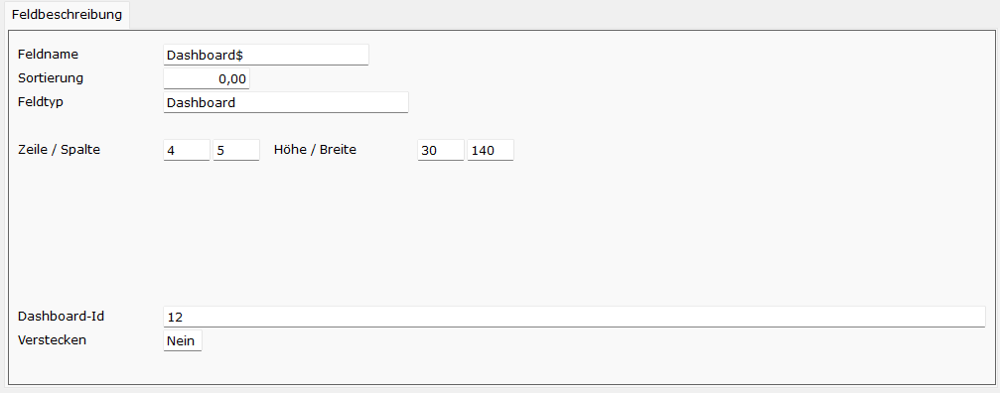
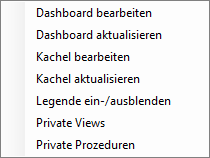

# Dashboard

<!-- source: https://amic.de/hilfe/aisdashboard.htm -->

Hauptmenü > Administration > Werkzeuge > Informationssystem

Direktsprung **[AIS]**

Auf AIS-Masken besteht die Möglichkeit ein oder mehrere [Dashboards](../menue/das_dashboard/index.md) **[DASH]** darzustellen. Dabei können Dashboards ausschließlich auf AEZADDON…-Masken eingerichtet werden.

Voraussetzung:

Es wird eine Dashboard-Lizenz benötigt.

<p class="just-emphasize">Einrichtung</p>



Um ein Dashboard einzurichten, ist ein neues Feld mit dem Feldtyp „Dashboard“ anzulegen. In dem Feld „Dashboard-Id“ wird angegeben, welches Dashboard angezeigt werden soll. Hier kann über eine F3-Auswahl eine Dashboard-Id ausgewählt werden. Alternativ kann hier statt einer Dashboard-Id auch der Name eines Feldes eingetragen werden, aus dem die Dashboard-Id ausgelesen werden soll. Wird in diesem Feld eine Dashboard-Id gesetzt bzw. geändert, so wird direkt das entsprechende Dashboard aktualisiert.

<p class="just-emphasize">Funktionen</p>

Auf den Dashboards der AIS-Masken stehen die gleichen Funktionalitäten wie auf den Dashboards im Hauptmenü zur Verfügung. So öffnet sich beispielsweise beim Rechtsklick auf das Dashboard ein Menü, über das das Dashboard und die Kacheln aktualisiert oder bearbeitet werden können.



<p class="just-emphasize">Automatische Aktualisieren einer Kachel oder eines Dashboards</p>

Das Aktualisieren einer Kachel oder eines Dashboards kann nicht nur über eine Menü-Funktion erfolgen, sondern auch von einem Makro angestoßen werden. Hierzu stehen folgende Funktionen zur Verfügung:

Aktualisieren eines Dashboards:

```text
^dbx_io("AISREFRESH_DASHBOARD", "Dashboardfeldname")
```

Aktualisieren einer Kachel:

```text
^dbx_io("AISREFRESH_KACHEL", "Dashboardfeldname", "KachelId")
```
