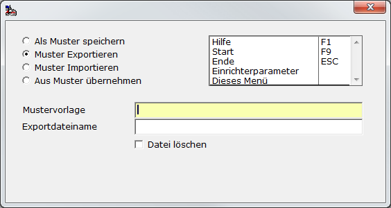
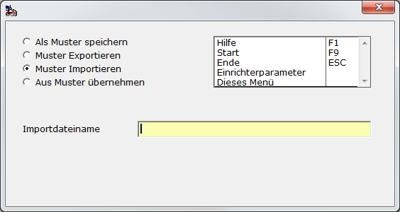

# Export / Import

<!-- source: https://amic.de/hilfe/exportimport.htm -->

Hauptmenü > Administration > Werkzeuge > Informationssystem > Funktion **F9** Muster/Import/Export

Direktsprung **[AIS]**

Grundsätzlich lassen sich nur Mustervorlagen exportieren und importieren. Diese Mustervorlagen können dann anschließend als Gruppe übernommen werden bzw. die zu exportierenden Daten mussten vorher als Mustervorlage vorliegen.

Export

Wenn man „Muster exportieren“ ausgewählt hat, so muss man zuerst die Mustervorlage angeben – eine Auswahl mit **F3** ist möglich – sowie den Dateinamen. Mit **F3** öffnet sich für das Feld Exportdateiname eine Dateiauswahlbox, in der das Verzeichnis und der Dateiname angegeben werden können.

Ist bei „Datei löschen“ kein Haken gesetzt, werden an bestehende Dateien die Daten angehängt.

Hat eine Mustervorlage Untergruppen werden diese automatisch mit exportiert.

Der Export erfolgt im XML-FORMAT (siehe OSQL XMLExport / XMLImport).

Import

Bei der Funktion „Muster importieren“ muss lediglich der Dateiname (Auswahl über eine Dateiauswahlbox mit **F3**) angegeben werden. Diese Datei muss eine im XML-Format vorliegende Datei sein, die zuvor mit dem Exportverfahren erstellt worden ist.

Das in dieser Datei existierende Muster wird dann in die Datenbank übernommen, wobei ein evtl. bereits existierendes Muster mit demselben Namen überschrieben wird.
