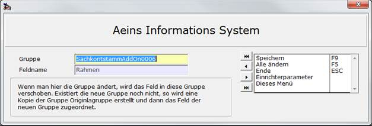

# Funktion Feld verschieben

<!-- source: https://amic.de/hilfe/funktionfeldverschieben.htm -->

Hauptmenü > Administration > Werkzeuge > Informationssystem

Direktsprung **[AIS]**

Die Funktion ist dafür gedacht einzelne Felder aus einer Gruppe herauszulösen und einer anderen Gruppe zuzuordnen. Existiert diese Gruppe noch nicht, wird eine Kopie der Originalgruppe erstellt. Um diese Funktion auszuführen markiert man die Datensätze, die man einer anderen Gruppe zuordnen will und wählt dann die Funktion „Feld verschieben“ **F10**. Es öffnet sich dann folgende Maske:

Um jetzt das Feld zu verschieben, gibt man den Namen der neuen Gruppe an. Dazu kann man entweder mit F3 aus einer Liste bereits vorhandener Gruppen auswählen oder gibt einen neuen Namen für die neu anzulegende Gruppe an.

Dann wählt man entweder Speichern, dann gilt die Änderung jedoch nur für diesen Datensatz oder „Alle ändern“. Dann wird sofort versucht alle Felder der neuen Gruppe zuzuordnen. Existiert in der neuen Gruppe bereits ein Feld mit dem Namen, bricht der Vorgang mit einer entsprechenden Meldung ab.
