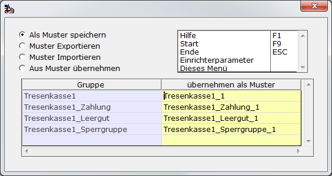
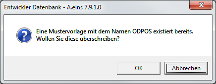
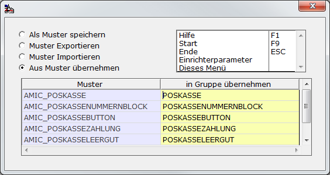
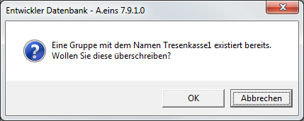
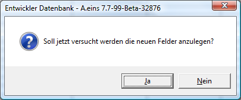
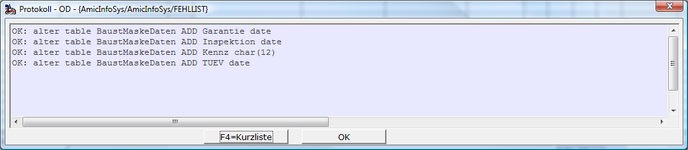

# Mustervorlagen

<!-- source: https://amic.de/hilfe/mustervorlagen.htm -->

Hauptmenü > Administration > Werkzeuge > Informationssystem > Funktion **F9** Muster/Import/Export

Direktsprung **[AIS]**

Mustervorlagen können selber erstellt oder von AMIC vorgegebene Muster können als Vorlage für eigene AIS-Anwendungen verwendet werden. Muster von AMIC beginnen immer mit „**AMIC_**“. Bei den Mustern von AMIC gibt es eine Besonderheit:

*Ruft man mit der JPL-Funktion AISLOAD eine Gruppe auf, die nicht existiert, so wird vom System geprüft, ob es eventuell eine Gruppe in den Mustervorlagen gibt, die mit AMIC_ beginnt und sonst so heißt, wie die angegebene Gruppe. Diese wird dann automatisch übernommen, es sei denn, die Gruppe besitzt Untergruppen und diese existieren bereits. Dieser Fall wird dann im Fehlerprotokoll festgehalten.*

Als Muster speichern

Alle erstellten Gruppen lassen sich als Mustervorlagen speichern.

Dazu gibt man zuerst den Namen der Gruppe an – vorbelegt ist dieses Feld mit der zurzeit in der Auswahlliste aktiven Gruppe. Existieren in der ausgewählten Gruppe verweise auf anderen [Gruppen](./ais_einrichtung/feldbeschreibung.md#GRUPPE), so werden diese in der gleichen Spalte mit angezeigt.

Man muss dem neuen Muster einen Namen geben, der auch vom dem Original abweichen kann. Hier wird der Name der Originalgruppe vorbelegt. Existiert bereits ein Muster mit diesem Namen, so wird am Ende eine Zahl angehängt. Diese Vorbelegung kann man jederzeit ändern.

Gibt man keinen Namen in der Spalte „übernehmen als Muster“ an, so wird auch die Gruppe bzw. Untergruppe nicht mit übernommen. Gibt man den Namen eine existierenden Musters an, so erscheint die folgende Meldung für **jedes** existierende Muster.

Wird diese Sicherheitsabfrage mit **Ja** beantwortet, oder existiert ein Muster mit diesem Namen noch nicht, so wird die Einrichtung als Mustervorlage übernommen.

Aus Muster übernehmen

Will man eine Mustervorlage übernehmen und in die eigene Anwendung einbinden, so muss man die Funktion “Aus Muster übernehmen“ anwählen. Zuerst wählt man eine Mustervorlage aus. Eine Liste der existierenden Vorlagen erhält man mit **F3**. Existieren zu dem Muster Untergruppen, so werden diese in derselben Spalte mit angezeigt. Anschließend gibt man der bzw. den Gruppen Namen. Vorbelegt werden diese mit dem Namen des Musters. Beginnt ein Muster mit „AMIC_“, so wird dies weggelassen. Existiert bereits eine Gruppe mit diesem Namen, so wird am Ende eine Zahl angehängt. Diese Vorbelegung kann man jederzeit ändern. Gruppen ohne Namen werden nicht mit übernommen.

Nach dem Start wird geprüft, ob eine Gruppe dieses Namens evtl. bereits existiert. Ist dieses der Fall, erscheint folgende Sicherheitsabfrage:

Nach erfolgreicher Übernahme des Musters können die zugehörigen Datenbankfelder automatisch angelegt werden.

Beantwortet man diese Frage mit **Ja**, dann werden Tabellen, die nicht existieren neu angelegt und Felder die nicht existieren zu dieser Tabelle hinzugefügt. Der Datenbanktyp eines Feldes oder dessen Länge wird **NICHT** geändert. Am Ende erscheint dann eine Liste der neu angelegten Tabellen und Felder.

Ist beim Anlegen eines Feldes ein Fehler aufgetreten, dann wird dieser auch in der Liste angezeigt.
