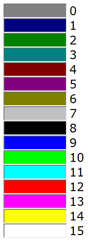

# Farben per Makro setzen

<!-- source: https://amic.de/hilfe/farbenpermakrosetzen.htm -->

Es ist möglich die Farben von Feldern vom Makro aus programmgesteuert zu setzen. Dazu gibt es zwei Funktionen.

1. Setzen der Farbe

```text
dbx_io("SETCOLOR", "Feldname",
"Vordergrundfarbe", "Hintergrundfarbe" )
```

Dabei muss unterschieden werden, ob es sich bei dem Feld um ein einzelnes Eingabefeld oder um eine Zelle in einem Array handelt. Dies wird über den Feldnamen angegeben. Bei einer Zelle muss man die Zeile in eckigen Klammern direkt hinter dem Feldname angeben. Beispiel:

```text
dbx_io("SETCOLOR",
"h.KontoNummer$[5]", "12", "14" )
```

Es wir hier die fünfte Zeile des Feldes h.Kontonummer$ auf die Vordergrundfarbe Rot und Hintergrundfarbe Gelb gesetzt. Die Nummern sind die Nummern der Basisfarben (Siehe Farbtabelle). Für einzelne Eingabefelder kann man – im Gegensatz zu Zellen eines Arrays - die Farbe in dieser Form angeben oder als Kombination der RGB-Werte:

```text
dbx_io("SETCOLOR", "h.KontoNummer$",
"255/0/0", "255/255/128" )
```

2. Zurücksetzen der Farbe

```text
dbx_io("RESETCOLOR", "Feldname", "",
"" )
```

Hier werden die Felder wieder auf die Standardfarben von A.eins gesetzt. Hat man jedoch bei AIS-Felder eigene Farben gewählt, so muss man diese wieder über SETCOLOR restaurieren.

Farbtabelle:


