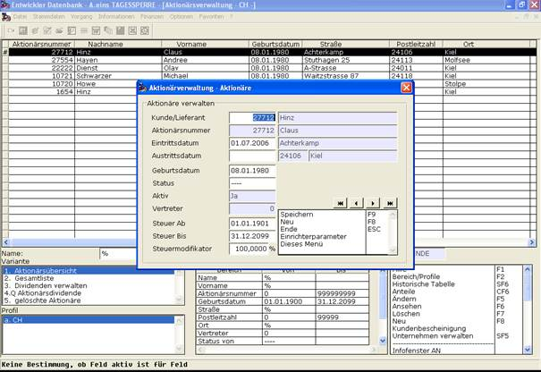

# Aktionäre verwalten

<!-- source: https://amic.de/hilfe/_aktionreverwalten.htm -->

Nachdem die Unternehmensdaten eingerichtet wurden, sollten die Aktionäre eingerichtet werden. Ein Aktionär in A.eins ist ein Kunde mit weiteren Aktionärsspezifischen Daten wie einer Aktionärsnummer, einem Eintrittsdatum, einem Austrittsdatum, einem Geburtsdatum, einem Status, einem Aktivkennzeichen und eventuell Steuerdaten, die bei der Ausschüttung der Dividende für ein Wirtschaftsjahr verwendet werden [siehe Dividenden abrechnen]. Der Status ist das Anwenderformat „AF_AKTIOSTAT“ und kann vom Anwender unter dem Direktsprung [FORMA] gepflegt werden. Ein Aktionär gilt als Aktiv, wenn er Aktien besitzt. Die Steuerdaten bestehen aus einem „Steuer Ab“-Datum, einem „Steuer bis“-Datum und einem Modifikator.

Aktionärsdaten gehören zu den so genannten Stammdaten und können aus den Listen „Aktionärsübersicht“, „Gesamtliste“ und „Aktionärsdividende“ wie in A.eins üblich über die Funktionen Neu, Ändern, Ansehen und Löschen gepflegt werden. Nach Anwahl einer dieser Funktionen öffnet sich die Pflegemaske für die Aktionäre.

In dieser Maske können durch folgende Einrichterparameter Einstellungen vorgenommen werden:

• **Aktionärsnummer ist gleich der Kundennummer**

o JA - Die Aktionärsnummer kann nicht angegeben werden. Sie wird mit der Kundennummer belegt.

o NEIN – Die Aktionärsnummer kann extra eingegeben werden.

• **Verhalten bei doppelter Aktionärsnummer**

o FEHLER – Keine zwei Aktionärs können dieselbe Nummer haben. Es erfolgt eine Fehlermeldung.

o WARNUNG – Es erfolgt eine Warnung, wenn für einen Aktionär eine bereits vorhandene Aktionärsnummer eingegeben wird.

o IGNORIEREN – Es können Aktionäre mit gleicher Aktionärsnummer erfasst werden.

Bei der Erfassung von Aktionärsdaten durch diese Maske ist zuerst ein Kunde auszuwählen, der der Aktionär ist. Falls es durch obigen Einrichterparameter erlaubt ist, dass die Aktionärsnummer von der Kundennummer abweichen kann, darf eine Aktionärsnummer eingegeben werden. Das Eintrittsdatum wird mit dem Erfassungsdatum des Aktionärs vorbelegt. Das Austrittsdatum kann eingegeben werden. Es wird allerdings auch automatisch gesetzt, sobald der Aktionär keine Aktien mehr besitzt. Es wird dann auf den letzten Tag gesetzt, an dem der Aktionär noch für die Dividendenausschüttung berücksichtigt wird. Das Austrittsdatum darf natürlich nicht kleiner als das Eintrittsdatum sein.

Falls ein Aktionär verminderte oder keine Steuern auf Dividenden zahlt, dann kann dies ebenfalls an dieser Stelle eingegeben werden. Durch das „Steuer Ab“- und das „Steuer bis“-Datum wird der Zeitraum festgelegt, in dem die Steuer für den Aktionär modifiziert wird. Außerhalb dieses Zeitraums zahlt der Aktionär die volle Steuer. Innerhalb des Zeitraums zahlt er nur den Anteil an der Steuer, wie er als Modifikator angegeben ist. Bei 100% zahlt der Aktionär die volle Steuer. Bei 0% zahlt er keine Steuer.

Es können nur Aktionäre gelöscht werden, die keine Aktien besitzen und für jeden Tag, an dem der Aktionär Aktien besessen hat, Dividendendaten eingetragen sind und diese Dividenden abgeschlossen sind [siehe Dividenden abrechnen und Dividenden verwalten].

Gelöschte Aktionäre sind in der Liste, „gelöschte Aktionäre“ zu sehen und können dort mit SF7 wieder aktiviert werden.
