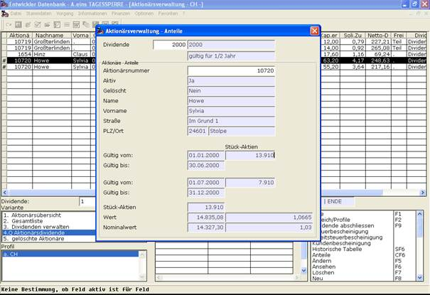

# Anteile

<!-- source: https://amic.de/hilfe/_anteile.htm -->

Für jeden Aktionär kann aus den Listen „Aktionärsübersicht“, „Gesamtliste“ und „Aktionärsdividende“ über die Funktion Anteile CF6 der innerhalb eines Wirtschaftsjahres explizit dargestellt werden. Die Maske wird automatisch mit dem aktuellen Wirtschaftsjahr und dem angewählten Aktionär gestartet. Diese Daten können aber auch noch in der Maske geändert werden, wobei über die Taste F3 eine Auswahlliste für das jeweilige Feld zur Verfügung steht. In der Maske werden weitere relevante Daten des Aktionärs dargestellt. Darunter sind die Aktienanteile des Aktionärs für das Wirtschaftsjahr zu sehen. Entweder ein Anteil für das komplette Wirtschaftsjahr, oder falls eine Veränderung des Bestandes zur Hälfte des Wirtschaftsjahres vorgenommen wurden zwei Anteile jeweils gültig für ein halbes Wirtschaftsjahr [siehe Aktientransaktionen / Die Historische Tabelle]. Nach Anwahl der Anteile werden weitere Detailinformationen dazu im unteren Bereich dargestellt.

