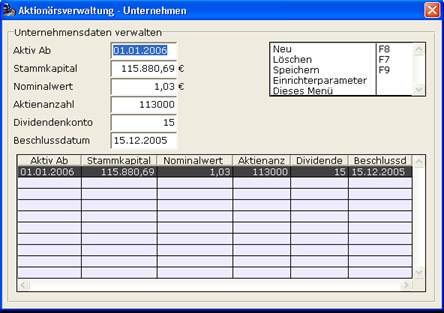

# Die Unternehmensdaten einrichten/verwalten

<!-- source: https://amic.de/hilfe/_dieunternehmensdaten.htm -->

Die Unternehmensdaten bilden die Basis der Aktionärsverwaltung und ohne eingerichtete Daten sollte sie nicht verwendet werden [siehe Globale Einstellungen]. Die Basisdaten eines Aktienunternehmens sind das Stammkapital, die Aktienanzahl und der Nominalwert einer einzelnen Aktie. Als Weiteres gehört zu einem Unternehmensdatensatz ein Datum, ab wann die Daten gelten sollen („Aktiv Ab“), ein Beschlussdatum, wann diese Unternehmensdaten beschlossen wurden und ein Dividendenkonto von dem die Buchungen der Dividenden für die Aktionäre abgehen[siehe Dividenden abrechnen]. Die Unternehmensdaten können in jeder Liste in der Aktionärsverwaltung unter der Funktion Unternehmen verwalten SF5 eingerichtet werden. Nach Aufruf dieser Funktion öffnet sich die Unternehmensdaten-Maske [siehe unten].

In einer Tabelle sind die bisherigen Unternehmensdaten chronologisch dargestellt. Angewählte Datensätze können in den Editierfeldern oberhalb der Tabelle geändert werden. Der erste Datensatz ist automatisch angewählt. Durch Anwahl einer leeren Zeile oder mit der Funktion Neu F8 werden die Editierfelder geleert und es kann ein neuer Unternehmensdatensatz eingetragen werden. Mit der Funktion Speichern F9 werden die eingegebenen oder geänderten Daten gespeichert. Durch die Funktion Löschen F7 wird der gewählte Datensatz gelöscht. Unternehmensdaten, die schon für die Abrechnung einer Dividende für ein Wirtschaftsjahr verwendet wurden, dürfen nicht gelöscht werden. Ebenso darf bei diesen Unternehmensdaten nicht mehr das „Aktiv Ab“-Datum geändert werden. Änderungen an anderen Werten werden bei bereits abgerechneten Dividenden nicht berücksichtigt. Deshalb sollte auch bei jeder Änderung der Unternehmensdaten wie zum Beispiel einer Kapitalerhöhung ein neuer Unternehmensdatensatz angelegt werden.
