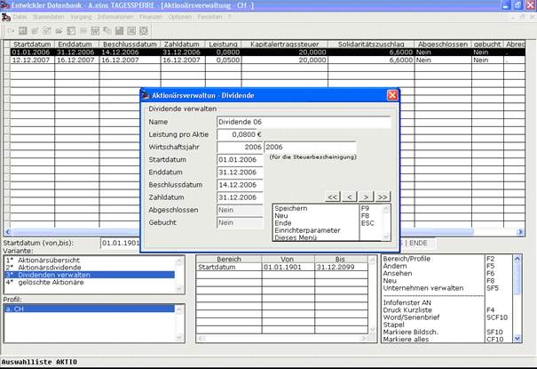

# Dividenden verwalten

<!-- source: https://amic.de/hilfe/_dividendenverwalten1.htm -->

Um eine Dividendenausschüttung am Ende eines Wirtschaftsjahrs vornehmen zu können, müssen vorher die dafür notwendigen Dividendendaten erfasst werden. Dazu gehören ein Startdatum, ein Enddatum, ein Beschlussdatum, ein Zahldatum und eine Leistung je Aktie. Es ist ratsam, dass die Dividendenzeiträume den Wirtschaftsjahren entsprechen.

Die Daten für eine Dividendenausschüttung werden in der Liste „Dividenden verwalten“ gepflegt und gehören zu den Stammdaten. Das heißt, dass wie die Aktionäre die Daten für die Dividenden durch die Funktionen Neu F8, Ändern F5, Ansehen F6 und Löschen F7 gepflegt werden können. Nach Anwahl einer dieser Funktionen öffnet sich die Dividendenverwaltungsmaske.

In dieser Maske können durch Einrichterparameter folgende Einstellungen vorgenommen werden:

• **Verhalten bei fehlender Verbindung zum Wirtschaftsjahr**

o FEHLER(Standard) – Es muss ein Wirtschaftsjahr in A.eins geben, das den Start- und Enddaten der Dividende entspricht.

o WARNUNG – Falls kein Wirtschaftsjahr gefunden wird, das den Daten der Dividende entspricht, dann erfolgt eine Warnmeldung.

o IGNORIEREN – Eine fehlende Verbindung zum Wirtschaftsjahr wird ignoriert.

• **Hinweis bei Überschreitung des Zahltags**

o JA – Es erfolgt eine Meldung, wenn das Zahldatum überschritten wurde und keine Zahlung vorgenommen wurde.

o NEIN – Es erfolgt keine Meldung.

Start- und Enddatum werden durch Anwahl eines Wirtschaftsjahres automatisch belegt. Der Text neben der Wirtschaftsjahrnummer wird für die Steuerbescheinigung für diese Dividende verwendet[siehe Steuerbescheinigung/Zweitsteuerbescheinigung]. Das Zahldatum muss hinter dem Beschlussdatum liegen. Abgeschlossene Dividenden können nicht mehr geändert oder gelöscht werden. Nach Abschluss einer Dividende gilt sie als abgeschlossen. Wenn alle Buchungen in der Finanzbuchhaltung für diese Dividende erstellt wurden, dann gilt sie als gebucht [siehe Dividenden abrechnen].
