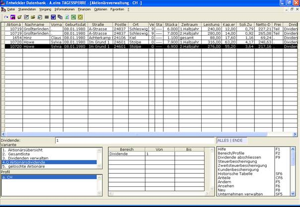

# Aktionärsdividende

<!-- source: https://amic.de/hilfe/_aktionrsdividende.htm -->

In der Ansicht „Aktionärsdividende“ sind die Dividendenausschüttungen, die die Aktionäre für ein Wirtschaftsjahr erhalten aufgelistet. Es können auch Daten für zukünftige Wirtschaftsjahre angesehen werden, sobald Dividendendaten für den gewünschten Zeitraum eingetragen sind. Dadurch, dass die Möglichkeit besteht, dass die ausgeschüttete Dividende für ein Aktienpaket in einem Wirtschaftsjahr zwischen zwei Aktionären geteilt wird [siehe Aktientransaktionen / Die Historische Tabelle], kann ein Aktionär auch mehrfach in dieser Ansicht auftauchen. Es werden folgende Daten für eine Zahlung angezeigt: Aktionärsnummer, Nachname, Vorname, Geburtsdatum, Straße, Postleitzahl, Ort, Vertreter, Status, Stückaktien, Zeitraum, Kapitalertragssteuer, Solidaritätszuschlag, Nettodividende, Freistellung, Dividende, gebucht. Dividende gibt an, welche Dividende für die Berechnung verwendet wurde. Zeitraum gibt an für welche Zeit der Dividende die Zahlung erfolgt (1.Halbjahr, 2.Halbjahr oder gesamt). Stückaktien zeigt die Aktienanzahl an, die für diese Zahlung zugrunde liegt. Daraus zusammen mit der Leistung je Aktie aus den Daten zu dieser Dividende und dem Zeitraum berechnet sich die Leistung. Falls für einen Aktionär eine Steuerfreistellung oder Steuerminderung für den Zeitraum der Dividende eingetragen ist, wird dies in „Freistellung“ angezeigt. Gebucht zeigt an, ob die Zahlung bereits in die Finanzbuchhaltung übertragen wurde. Näheres zu den angezeigten Eigenschaften sind, Aktionäre verwalten zu finden. Von dieser Ansicht aus kann der Abschluss einer Dividende und die Ausschüttung an die Aktionäre vorgenommen werden [siehe Dividenden abrechnen].

Über ***Bereich /Profile*** kann nach folgenden Kriterien eingeschränkt werden: Dividende, Name, Vorname, Aktionärsnummer (von, bis), Geburtsdatum (von, bis), Straße, Postleitzahl (von, bis), Ort, Vertreter (von, bis), Status von, Status bis, Aktienanzahl (von, bis), Zeitraum, Leistung (von, bis), Netto-Dividende (von, bis), Freistellung, Gebucht.

Dem Benutzer stehen in dieser Ansicht folgende Funktionen zur Verfügung:

• ***Dividende abschließen*** [siehe Dividenden abrechnen]

• ***Steuerbescheinigung*** [siehe Steuerbescheinigung/Zweitsteuerbescheinigung]

• ***Zweitsteuerbescheinigung*** [siehe Steuerbescheinigung/Zweitsteuerbescheinigung]

• (Aktionär) ***Neu*** [siehe Aktionäre verwalten]

• (Aktionär) ***Ändern*** [siehe Aktionäre verwalten]

• (Aktionär) ***Ansehen*** [siehe Aktionäre verwalten]

• (Aktionär) ***Löschen*** [siehe Aktionäre verwalten]

• ***Historische Tabelle*** [siehe Aktientransaktionen / Die Historische Tabelle]

• ***Anteile***

• ***Kundenbescheinigung***

• ***Unternehmen verwalten*** [siehe Die Unternehmensdaten einrichten/verwalten]
