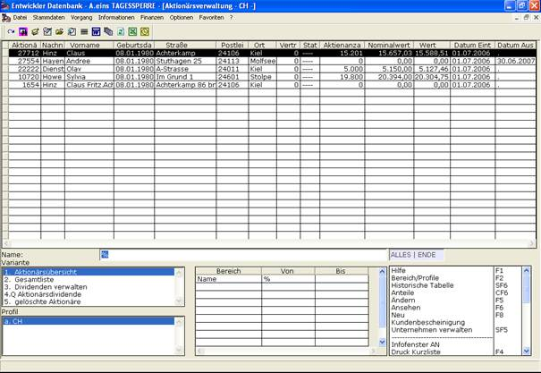

# Aktionärsübersicht

<!-- source: https://amic.de/hilfe/_aktionrsbersicht.htm -->

In der Aktionärsübersicht wird eine Übersicht über alle Aktionäre angezeigt. Für jeden Aktionär wird die Aktionärsnummer, Nachname, Vorname Geburtsdatum, Straße, Postleitzahl, Ort, Vertreter, Status, Aktienanzahl, Nominalwert, Wert, Eintrittsdatum, Austrittsdatum angezeigt. Näheres zu den angezeigten Eigenschaften finden Sie unter Aktionäre verwalten.

Über ***Bereich/Profile*** kann nach folgenden Kriterien eingeschränkt werden: Name, Vorname, Aktionärsnummer (von, bis), Geburtsdatum (von, bis), Straße (von, bis), Postleitzahl (von, bis), Ort, Vertreter, Status von, Status bis, Aktienanzahl (von, bis), Eintrittsdatum (von, bis), Austrittsdatum (von, bis) und Wirtschaftsjahr.

Das Datum, das bei der Berechnung des Bestandes zugrunde liegt ist entweder das Tagesdatum oder falls unter „Bereich/Profile“ ein Wirtschaftsjahr angegeben wird das Enddatum dieses Wirtschaftsjahres. Zur Berechnung des Nominalwertes und des Wertes werden die Unternehmensdaten, die an diesem Datum gelten verwendet.

Dem Benutzer stehen hier folgende Funktionen zur Verfügung:

• (Aktionär) ***Neu*** [siehe Aktionäre verwalten]

• (Aktionär) ***Ändern*** [siehe Aktionäre verwalten]

• (Aktionär) ***Ansehen*** [siehe Aktionäre verwalten]

• (Aktionär) ***Löschen*** [siehe Aktionäre verwalten]

• ***Historische Tabelle*** [siehe Aktientransaktionen / Die Historische Tabelle]

• ***Anteile***

• ***Kundenbescheinigung***

• ***Unternehmen verwalten*** [siehe Die Unternehmensdaten einrichten/verwalten]
