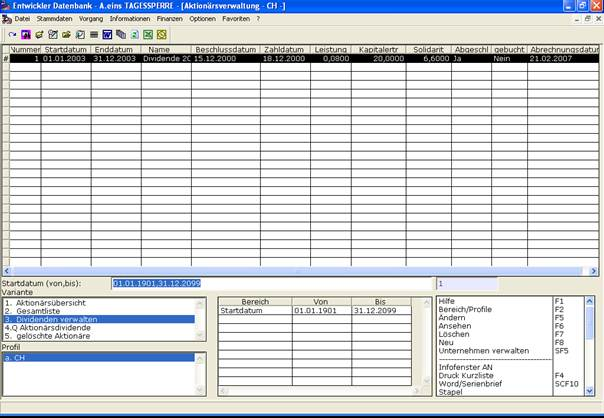

# Dividenden verwalten

<!-- source: https://amic.de/hilfe/_dividendenverwalten.htm -->

In dieser Liste sind die eingetragen Daten für die Dividendenausschüttungen eingetragen. Folgende Daten werden angezeigt: Nummer, Startdatum, Enddatum, Name, Beschlussdatum, Zahldatum, Leistung je Aktie, Kapitalertragssteuer, Solidaritätszuschlag, Abgeschlossen, Gebucht, Abrechnungsdatum.

Die Kapitalertragssteuer und der Solidaritätszuschlag werden aus den Daten, die unter der Anwendung „Zinsabschlag“ **[ZAS]** gepflegt werden berechnet und sind die für den Zeitraum der Dividende geltende Kapitalertragsteuer und Solidaritätszuschlag.

Nähere Angaben zu den anderen Daten sind Dividenden verwalten zu finden.

Über ***Bereich /Profile*** kann nach folgenden Kriterien eingeschränkt werden: Startdatum (von, bis), Enddatum (von, bis), Dividende (von, bis), Beschlussdatum (von, bis), Zahldatum (von, bis), Leistung je Aktie (von, bis), Kapitalertragsteuer (von, bis), Solidaritätszuschlag (von, bis). Bei dem Kriterium Dividende kann über die Nummer der Dividende die Auswahl eingeschränkt werden.

Dem Benutzer stehen in dieser Ansicht folgende Funktionen zur Verfügung:

• (Dividende) ***Neu*** [siehe Dividenden verwalten]

• (Dividende) ***Ändern*** [siehe Dividenden verwalten]

• (Dividende) ***Ansehen*** [siehe Dividenden verwalten]

• (Dividende) ***Löschen*** [siehe Dividenden verwalten]

• ***Unternehmen verwalten*** [siehe Die Unternehmensdaten einrichten/verwalten]
