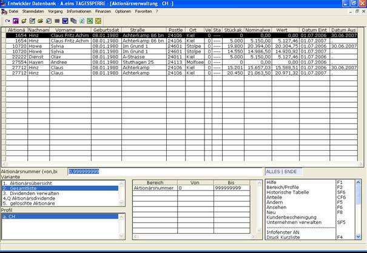

# Gesamtliste

<!-- source: https://amic.de/hilfe/_gesamtliste.htm -->

Die Gesamtliste zeigt die Aktienbestandsentwicklung der Aktionäre in einem Wirtschaftsjahr an. Hier kann man auf einen Blick sehen welcher Aktionär wie viele Aktien über welchen Zeitraum in einem Wirtschaftsjahr besessen hat. Aus diesem Grund können Aktionäre auch mehrfach angezeigt werden. Folgende Daten zur Anzahl werden angezeigt: Aktionärsnummer, Nachname, Vorname, Geburtsort, Straße, Postleitzahl, Ort, Stückaktien(Anzahl), Nominalwert, Wert, Datum Eintritt, Datum Austritt. „Datum Eintritt“ gibt an, ab wann der Aktionär dieses Aktienpaket besessen hat und das „Datum Austritt“ gibt an bis wann der Aktionär dieses Aktienpaket besessen hat. Näheres zu den angezeigten Eigenschaften finden Sie unter Aktionäre verwalten.

Über ***Bereich /Profile*** kann nach folgenden Kriterien eingeschränkt werden: Name, Vorname, Aktionärsnummer (von, bis), Geburtsdatum (von, bis), Straße (von, bis), Postleitzahl (von, bis), Ort, Vertreter, Status von, Status bis, Aktienanzahl (von, bis), Wirtschaftsjahr.

Wird kein Wirtschaftsjahr als Selektionskriterium angegeben, dann wird das aktuelle Wirtschaftsjahr für die Berechnungen verwendet.

Dem Benutzer stehen hier folgende Funktionen zur Verfügung:

• (Aktionär) ***Neu*** [siehe Aktionäre verwalten]

• (Aktionär) ***Ändern*** [siehe Aktionäre verwalten]

• (Aktionär) ***Ansehen*** [siehe Aktionäre verwalten]

• (Aktionär) ***Löschen*** [siehe Aktionäre verwalten]

• ***Historische Tabelle*** [siehe Aktientransaktionen / Die Historische Tabelle]

• ***Anteile***

• ***Kundenbescheinigung***

• ***Unternehmen verwalten*** [siehe Die Unternehmensdaten einrichten/verwalten]
