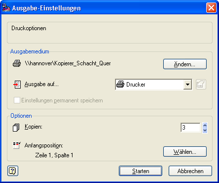

# Definition in A.eins

<!-- source: https://amic.de/hilfe/definitioninaeins.htm -->

Hauptmenü > Administration > Werkzeuge > AMIC Etikettendruck

Direktsprung **[ETIDR]**.

In die Auswahlliste stehen zwei Varianten zur Verfügung:

1. Private AMIC Etikettendruck Reporte  
Hier können sie die Definitionen hinterlegen, die Reporte mit Anwendungen von A.eins verbinden und unter bestimmten Voraussetzungen den Designer vom „AMIC Etikettendruck“ aufrufen.

2. Vorlagen AMIC Etikettendruck Reporte  
Hier stehen einige von AMIC erstellte Vorlagen, die in den privaten Bereich übernommen werden können.

Definition neu erstellen

In der Variante “Private AMIC Etikettendruck Reporte“ kann man mit der Funktion „***Neu* F8**“ die Informationen hinterlegen, die das Programm zur Einbindung und Darstellung benötigt. Es erscheint folgender Bildschirm:

**Besitzer:**

Besitzer kann sein *privat* oder *AMIC*. Reporte mit dem Besitzer AMIC werden bei jedem Update überspielt. Sollten sie vorhaben, einen Report mit dem Besitzer AMIC zu ändern, muss dieser vorher aus der Vorlage übernommen werden.

**Funktionsident:**

Dies ist die eindeutige Kennzeichnung des Reports über die vom Programm auf den Report zugegriffen wird.

**Funktionslabel:**

Beim [Verbinden](./definition_in_a_eins.md#Verbinden) des Reports mit einer Anwendung wird dieser Label in der Optionbox angezeigt. Wird der Report archiviert, dann wird der Label als Belegtyp im Archiv eingetragen.  
    

**Dateityp:**

Der Dateityp kann solange geändert werden, wie noch kein Report definiert wurde. Es werden drei verschiedene Ausgabeformate unterstützt.

Etiketten: Hier stehen nur Variablen im Report zur Verfügung.

Karteikarten: Wie Etiketten, nur dass nach jeder Karteikartei ein Seitenwechsel durchgeführt wird.

Listen: Es stehen Variablen für den Kopf und Fußbereich und Felder für die Tabelle zur Verfügung.  
    

<p class="just-emphasize">Register Allgemein</p>

| Feld | Bedeutung |
| --- | --- |
| Datenherkunft<br> | Die Datenherkunft kann solange geändert werden, wie noch kein Report definiert wurde. Es werden drei Arten der Datenherkunft unterstützt:<br>1. Auswahlliste Der Report bezieht die Daten aus der Auswahlliste, mit der er Verbunden wurde. Es ist daher auch erst möglich, den Report zu bearbeiten, nachdem er mit einer Auswahlliste verbunden wurde.<br>2. View Die Daten werden über ein privates Report-View bestimmt. Dies bedeutet, dass das View vor der Ausführung für den Benutzer neu angelegt wird, wie es bereits aus Crystal-Report bekannt ist. Innerhalb des Views kann auf LDB- bzw. Maskenfelder (mit vorangestelltem Doppelpunkt) verwiesen werden. Oder es kann per JOIN auf Daten, die über die [Vorlauf-Funktion](./spezialfelder.md) bereitgestellt wurden, zugegriffen und somit die Ergebnismenge eingeschränkt werden.<br>3. Prozedur Diese Datenbankprozedur muss eine Ergebnismenge ( Resultset ) zurückgeben. Diese Prozedur kann als Paramater LDB- bzw. Maskenfelder haben (mit vorangestelltem Doppelpunkt). Damit zum Editieren Daten bereitgestellt werden können, muss man in dem Feld „[Aufruf für bearbeiten](./definition_in_a_eins.md#AufrufZumBearbeiten)“ anstelle der LDB- bzw. Maskenfelder den Wert direkt eintragen.<br> |
| View Name / Prozedur Name<br> | Wenn die Datenherkunft Auswahlliste ist, wird hier der Name eines Makros angezeigt. Dieser kann nicht geändert werden. Bei View bzw. Prozeduren muss hier der Name eingetragen werden. Die Prozedur kann Parameter haben, die mit Doppelpunkt eingeleitete LDB- bzw. Maskennamen, JVars oder – bei in Formulare eingebetteten Reporten – die ID’s der Formularpositionen sein können.<br> <br>Beispiel:<br> <br><code>DBProc (:LDB_TRANSFER$I4)</code><br> <br>oder<br> <br><pre><code>DBProc (:!JVARS_5001_BELEGNR) .&#10;//Hier stellt die Zahl (5001) den Owner und BELEGNR&#10; den Namen der JVar dar.</code></pre><br> |
| Aufruf für bearbeiten | Bei der Datenherkunft Prozedur ist es gegebenenfalls notwendig Parameter zu übergeben, die man während der Entwicklungsphase des Reports nicht setzen kann. Also gibt man hier die Prozedur noch einmal an mit dem Wert als Parameter und nicht mit der Variablen. Es wird dann beim Bearbeiten des Reports immer diese Beispieldaten herangezogen.<br> Beispiel: „DBProc (541)“<br> |
| Vorlauf-Funktion<br> | Hier kann, wie schon aus Crystal-Report bekannt, eine [Vorlauf-Funktion](./spezialfelder.md) definiert werden. Diese JPL-Funktion wird aufgerufen, bevor die Daten aus der View bzw. aus der Prozedur gelesen werden. Man also vorher noch Tests durchführen, damit sichergestellt ist, dass die ausgegebenen Daten auch richtig sind. Bei einer „Summen und Saldenliste“ müsste man zum Beispiel prüfen, ob alle Belege in dem Bereich bereits gebucht wurden.<br>**ACHTUNG:** *Liefert die Vorlauffunktion einen Wert ungleich 0, so wird der Ausdruck nicht gestartet.*<br>**HINWEIS:** *Es können alle für Crystal gültigen Vorlauffunktionen verwendet werden.*<br> |
| Update Statement | Nach erfolgreichem Druck wird dieses SQL-Statement ausgeführt. Das Statement kann auch LDB- oder Maskenfelder mit vorangestelltem Doppelpunkt enthalten. Welche Variablen verwendet werden können, hängt immer davon ab, von wo aus man den Report ausruft. In der Auswahlliste stehen **nur** bei Datenherkunft „Auswahlliste“ die Maskenfelder Ident1, Ident2, Ident3 und Ident4 zur Verfügung, die den Werten entsprechen, die unter IDENT und IDSQL (ID1, ID2, ID3, ID4) genutzt werden. Bei der Verwendung unbedingt auf Groß- und Kleinschreibung achten.<br> <br>Beispiel:<br><pre><code>update mahnung set&#10; MahnungDruKennz=1 where mahnungid = :Ident1 and Kontonummer =&#10; :Ident2</code></pre><br> |
| Beschreibung<br> | Dieser Platz ist für eine Kurzbeschreibung vorgesehen. Zum Beispiel sollte hier stehen, welche Auswahlliste/Variante notwendig ist, um einen Report mit Datengrundlage „Auswahlliste“ starten/bearbeiten zu können.<br> |
| Archivieren:<br> | Hier besteht die Möglichkeit, anzugeben, ob der Report archiviert werden soll. Bei **„Ja“** wird bei Datenherkunft View und Prozedur das Register „Archiv“ eingeblendet.<br>Dieses Kennzeichen wird nur bei privaten Reporten exportiert.<br> |
| Druckerprofile<br> | Hier können Druckereinstellungen vorgenommen werden, die gespeichert werden und später über den Kommandozeilenparameter [PrinterProfil](./kommandozeile.md) oder über den dritten Parameter des [Controlstrings](./index.md#Controlstring) wieder verwendet werden können. Dabei ist das **Profil** die eindeutige Bezeichnung. Neben der **Beschreibung**, der ***Druckereinstellung*** **F11** können hier auch noch die Anzahl der Kopien für den Druck festgelegt werden. Ist hier eine Zahl ungleich 0 angegeben, so erscheint dann diese Zahl als Vorschlag im Druckabfragefenster. Sie übersteuert dann ggf. die über [LILAANZAHLKOPIEN](./spezialfelder.md#LILAANZAHLKOPIEN) bzw. [LILAANZAHLVARKOPIEN](./spezialfelder.md#LILAANZAHLVARKOPIEN) angegebenen Werte.<br> |

<p class="just-emphasize">Register Archiv</p>

Die hier vorzunehmenden Einstellungen dienen dazu, einen fortlaufenden Druck in Portionen zu unterteilen oder zusätzliche Informationen an das Archiv zu übergeben. Man kann so dem Archivsystem die zu archivierenden Dokumente so übergeben, dass dort auch Kontonummer, Belegnummer, Belegdatum, Belegreferenz und weitere Informationsfelder übergeben und als Suchkriterien verwendet werden können.

| Feld | Bedeutung |
| --- | --- |
| Select für Kundennummer | **SQL-Statement** für die Schleife. Beispiel:<br> <br><pre><code>select kontonummer,kontobldruckid,kontoblbisdatum&#10; from p_lila_kontoblatt group by&#10; kontonummer,kontobldruckid,kontoblbisdatum</code></pre><br> <br>Zu beachten ist bei der Archivierung von Listen, bei denen das Kriterium öfters in der Liste vorkommen kann, dass man danach die Ergebnismenge gruppiert (group by). Alle verwendeten Archivfelder müssen in der Ergebnismenge vorkommen.<br> |
| **Archivfeld Kundennummer** | Feldname aus dem SQL-Statement, der den Wert für die Kundennummer im Archiv liefert. Dieser kann in der WHERE-Bedingung verwendet werden.<br> |
| **Archivfeld Belegnummer** | Feldname aus dem SQL-Statement, der den Wert für die Belegnummer im Archiv liefert. Dieser kann in der WHERE-Bedingung verwendet werden.<br> |
| **Archivfeld Belegdatum** | Feldname aus dem SQL-Statement, der den Wert für das Belegdatum im Archiv liefert. Dieser kann in der WHERE-Bedingung verwendet werden.<br> |
| Archivfeld Belegreferenz | Feldname aus dem SQL-Statement, in dem die Belegreferenz steht. Wird diese Feld nicht verwendet, so wird hier die Funktionsident eingetragen.<br> |
| Archivfeld Betreff | Feldname aus dem SQL-Statement, in dem der Betreff-Text steht.<br> |
| Archivfeld Kategorie | Feldname aus dem SQL-Statement, in dem der Kategorie-Text steht.<br> |
| Archivfeld Stichwörter | Feldname aus dem SQL-Statement, in dem die Stichwörter stehen.<br> |
| Archivfeld Kommentar<br> | Feldname aus dem SQL-Statement, in dem der Kommentar steht.<br> |
| Archivfeld Titel | Feldname aus dem SQL-Statement, in dem der Titel steht.<br> |
| Archivfeld Autor<br> | Feldname aus dem SQL-Statement, in dem der Autor steht.<br> |
| Where\-Bedingung für die Kundennummer. | Es muss jetzt noch dem Report mitgeteilt werden, dass er nur einen Teil darstellen soll. Dazu muss hier die Eingrenzung eingegeben werden. Der Syntax ist SQL Syntax, wobei die Werte der Felder über Platzhalter (%s) in der Reihenfolge **Kundennummer, Belegnummer, Belegdatum** an die Formel übergeben werden. Handelt es sich um Datumstypen (Belegdatum) oder Stringtypen (Belegnummer), dann muss der Platzhalter mit einfachem Hochkomma eingeschlossen werden. Beispiel:<br> <br><pre><code>where kontonummer=%s and kontobldruckid=‘%s‘ and&#10; kontoblbisdatum=‘%s‘</code></pre><br> <br>**Hinweis:** *In der WHERE-Bedingung werden nur die Felder Kundennummer, Belegdatum und Belegnummer ausgewertet. Der Inhalt der anderen Archivfelder wird nur an das Archiv übermittelt.*<br> |

Es gibt hier noch zwei Besonderheiten:

1. Wenn man eine Liste immer als Ganzes archivieren will und keine Trennung benötigt, kann man das Select für die Kontonummer und die WHERE-Bedingung weglassen. Die Archivfelder müssen dann in der View bzw. in der Prozedur auf dem Register Allgemein enthalten sein. Sie werden mit den Werten des letzten Datensatzes versorgt.

2. Da man die Prozedur/das View überschreiben kann (siehe [Kommandozeile](./kommandozeile.md)), hat man in dem Feld „Select für Kontonummer“ die Möglichkeit, sich auf die View bzw. auf die Prozedur zu beziehen. Der Syntax ist wie folgt:  
    

```sql
Select
kontonummer,kontobldruckid,kontoblbisdatum from :*ProcedureCall group by
kontonummer,kontobldruckid,kontoblbisdatum
```

    
:\*Procedurecall wird dann entweder mit dem Wert auf dem ersten Register oder durch den in der Kommandozeile angegebenen Wert ersetzt.

<p class="just-emphasize">Definition ändern</p>

Ruf man eine Definition erneut zum Ändern auf, so stehen dann weitere Funktionen zur Verfügung:

***View bearbeiten***

Diese Funktion steht nur zur Verfügung, wenn als Datenherkunft View gewählt wurde und bereits ein Viewname eingetragen ist. Es wird die Viewbeschreibung mit einem Editor geöffnet und man kann dann Änderungen vornehmen.

***Report bearbeiten***

Die Funktion „Report bearbeiten“ steht nur für Datenherkunft View und Prozedur zur Verfügung. Es wird dann der interaktive Designer geöffnet und die Daten des ersten Datensatzes werden angezeigt.

***Verbinden***

Hier kann man angeben, in welcher Optionbox bzw. in welcher Anwendung der Aufruf des Reports erscheinen soll. Vor dem Aufruf wird - wenn ein Profil markiert ist - noch gefragt, ob dieses Profil verendet werden soll. Dieses wird dann als zusätzlicher Parameter an diese Funktion übergeben. Die Bezeichnungen er zwei Funktionen setzten sich dann aus dem Funktionslabel und der Funktion zusammen.

- „Funktionslabel“ + drucken:  
Der Controlstring der Funktion lautet „**^crw 102 LILAID**“, wobei LILAID die bei der Erstellung angegebene Funktionsident ist. Der Parameter **102** ist der Befehl, dass das Druckabfragefenster vom AMIC Etikettendruck geöffnet und ggf. der Ausdruck durchgeführt werden soll:  
    
  
    
Die Option Kopien erscheint nur, wenn diese nicht durch [LILAANZAHLVARKOPIEN](./spezialfelder.md#LILAANZAHLVARKOPIEN) bereits festgelegt wurde  
Die Option Anfangsposition erscheint nur bei Etikettendruck.  
    
Wenn man ohne Druckerprofil arbeitet und den Drucker bzw. die Druckereigenschaften ändert, so wird die Option „Einstellungen permanent speichern“ aktiviert und man kann hier einen Haken setzen. Es werden dann die Benutzereinstellungen überschrieben. Bei der Verwendung von Druckerprofilen hat dieser Haken keine Bedeutung.

- „Funktionslabel“ + bearbeiten:  
Der Controlstring der Funktion lautet „**^crw 101 LILAID**“, wobei LILAID die bei der Erstellung angegebene Funktionsident ist. Der Parameter **101** weist das Programm an, den interaktiven Designer vom AMIC Etikettendruck aufzurufen. Für Reporte, deren Datenherkunft Auswahlliste ist, kann dann nur an dieser Stelle der Report bearbeitet werden.

Parameterübersicht für die Controlstrings:

| Aufruf | Bedeutung |
| --- | --- |
| ^crw 101 LILAID | Öffnet den durch LILAID identifizierten Report im interaktiven Designer.<br><br> |
| ^crw 102 LILAID [Prozeduraufruf] [Druckerprofil] | Druckt den durch LILAID identifizierten Report mit vorheriger Abfrage des Druckers, der Anzahl Kopien, ... .<br>Der erste optionale Parameter **Prozeduraufruf** gibt an, was überhaupt gedruckt werden soll. Das Format muss so sein, wie bei Prozeduren der [Aufruf für bearbeiten](./definition_in_a_eins.md#AufrufZumBearbeiten) eingetragen wurde.<br>Mit dem zweiten optionalen Parameter **Druckerprofil** gibt das eingerichtete Profil an. Druckerprofil ist immer der dritte Parameter! Der zweite muss ggf. leer übergeben werden:<br><pre><code>^crw 102 LILAID "" "Kyocera Schacht&#10; 2"</code></pre><br> |
| ^crw 103 LILAID "" [Druckerprofil] | Öffnet das Vorschaufenster für den durch LILAID identifizierten Report.<br>Soll das **Druckerprofil** mit angegeben werden, so muss der zweite Parameter leer übergeben werden. Das Druckerprofil ist immer der dritte Parameter. S.o.<br><br> |
| ^crw 104 LILAID [1] [Druckerprofil] | Exportiert den Report im HTML Format. Das Verzeichnis, auf dem das Ergebnis landet ist ..\\export\\lila.<br>Gibt man als ersten optionalen Parameter eine 1 an, so wird das Ergebnis sofort in dem verknüpften Programm geöffnet.<br>Druckerprofil S.o.<br><br> |
| ^crw 105 | Liefert als Rückgabewert die Versionsnummer, z.B. „11000“ für AMIC Etikettendruck Version 11.<br> |
| ^crw 106 LILAID [Prozeduraufruf] [Druckerprofil] | Wie 102, nur dass vor dem Druck keine Abfrage nach dem Drucker kommt.<br><br> |
| ^crw 111 LILAID [1] [Druckerprofil] | Exportiert den Report im PDF Format. Das Verzeichnis, auf dem das Ergebnis landet ist ..\\export\\lila.<br>Gibt man als optionalen Parameter eine 1 an, so wird das Ergebnis sofort in dem verknüpften Programm geöffnet.<br> |
| ^crw 112 LILAID "" [Druckerprofil] | Exportiert den Report als Bitmap. Das Ergebnis steht im Verzeichnis..\\export\\lila.<br> |
| ^crw 114 LILAID [1] [Druckerprofil] | Exportiert den Report im RTF-Format. Das Ergebnis steht im Verzeichnis ..\\export\\lila.<br>Gibt man als optionalen Parameter eine 1 an, so wird das Ergebnis sofort in dem verknüpften Programm geöffnet.<br> |
| ^crw 116 LILAID [Prozeduraufruf] | Archiviert den Report ohne vorher zu drucken.<br> |

***Exportieren***

Man kann die Reporte aus der Datenbank exportieren und in eine andere Datenbank per OSQL wieder einspielen. Zu beachten ist hier, dass Reporte, die mit der Version 7.1 erstellt wurden, nicht in frühere Versionen von A.eins importiert werden können.
