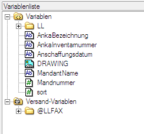
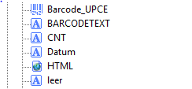

# Spezialfelder

<!-- source: https://amic.de/hilfe/spezialfelder.htm -->

Es existieren einige Feldbezeichnungen, die eine spezielle Bedeutung haben.

**LILAANZAHLKOPIEN**

Der Wert, der im ersten Satz für dieses Feld zurückgeliefert wird, bestimmt die Anzahl der Kopien, die für diesen und alle folgenden Datensätze verwendet wird. Dieses Feld wird ignoriert, wenn in den [Druckerprofilen](./definition_in_a_eins.md#Druckerprofile) der Reportdefinition eine feste Anzahl eingetragen wurde.

**LILAANZAHLVARKOPIEN**

Mit diesem Wert wird festgelegt, wie viele Kopien gedruckt werden sollen, und zwar pro Datensatz. D.h. Es ist möglich zu sagen, dass der erste Datensatz 4-mal, der zweite 3-mal, der dritte 5-mal usw. gedruckt werden soll. Dieses Feld übersteuert LILAANZAHLKOPIEN, wird jedoch ignoriert, wenn in den [Druckerprofilen](./definition_in_a_eins.md#Druckerprofile) der Reportdefinition eine feste Anzahl eingetragen wurde.

**BARCODE**

Wenn als Feldbezeichnung BARCODE gefunden wird, so wird der Wert in allen Barcode-Formaten an den Designer/Listengenerator übergeben. Von A.eins werden dann folgende Variablen erzeugt. Eine vollständige Liste aller Barcodeformate befindet sich in der Online-Hilfe des Designers.

• BARCODE_EAN13

• BARCODE_EAN13P2

• BARCODE_EAN13P5

• BARCODE_EAN128

• BARCODE_CODE128

• BARCODE_Codabar

• BARCODE_UPCA

• BARCODE_UPCE

• BARCODE_3OF9

• BARCODE_25IND

• BARCODE_25IL

• BARCODE_25MAT

• BARCODE_25DL

• BARCODE_POSTNET5

• BARCODE_POSTNET10

• BARCODE_POSTNET12

• BARCODE_FIM

**DRAWING**

Wenn der Name eines Feldes mit **Drawing** beginnt, so wird aus der Grafik-Tabelle BitImages von A.eins versucht die Grafik, die unter diesem Wert (ImagId) gespeichert ist, zu lesen und an den AMIC Etikettendruck übergeben. So kann z.B. je Anlagenetikett eine oder mehrere der dort hinterlegten Grafiken gedruckt werden. Im AMIC Etikettendruck erscheint dann diese Variable/ dieses Feld mit einem Bildsymbol vorneweg unter dem angegebenen Namen.

**HTML**

Wenn als Feldbezeichnung **HTML** angegeben wird, so wird der Text so wie er ist an AMIC Etikettendruck übergeben jedoch mit dem Zusatz, dass es sich um ein HTML-Objekt handelt. Dieses HTML-Objekt unterliegt folgenden Beschränkungen:

1. Aus der Auswahlliste heraus sind maximal 255 Zeichen möglich, so dass diese Art der Datenbereitstellung keinen Sinn ergibt.

2. Bei Datenherkunft Crystal-View oder Prozedur sind maximal 32767 Zeichen möglich.

3. Der Text muss ein gültiger HTML Text sein. Beispiel:  
„&lt;html>&lt;body>&lt;font size=7>Hallo Welt&lt;/font>&lt;/body>&lt;/html>“  
    

Dieses Spezialfeld erscheint im Designer unter den Variablen mit einem HTML-Symbol vorneweg.

