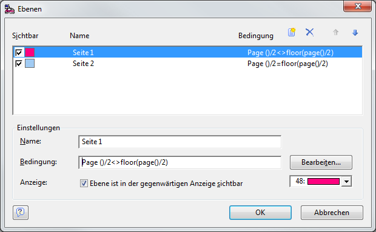
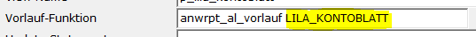

# Tipps und Tricks

<!-- source: https://amic.de/hilfe/tippsundtricks1.htm -->

Hier werden ein paar Tipps zu Lösung von Problemen aus der täglichen Praxis aufgeführt.

<p class="just-emphasize">Mehrseitige Karteikarten</p>

Es ist mit dem Werkzeug AMIC Etikettendruck möglich, auch mehrseitige Karteikarten zu erstellen. Folgendes Beispiel erstellt einen Report mit zwei unterschiedlichen Seiten. Dazu muss man zwei Dinge beachten:

1) Im Editor vom AMIC Etikettendruck im Menü unter **Projekt** muss man den Punkt „***Ebenen bearbeiten***“ aufrufen.  
    
  
    

Bei der Bearbeitung von Reporten mit mehreren Seiten muss man in der Spalte „**Sichtbar**“ immer nur in der Zeile einen Haken setzen, die man bearbeiten will.  
Im obigen Beispiel sind zwei unterschiedliche Seiten definiert und in der Spalte Bedingung wird angegeben, wann welche Ebene zu sehen sein soll.  
    
Die hier abgebildeten Formel „Page()/2&lt;>floor(page()/2“ liefert bei allen ungeraden Seiten true zurück und die Formel „Page()/2&lt;>floor(page()/2“ bei allen geraden Seiten.

2) Die Datenbereitstellung muss jetzt entsprechend angepasst werden. Es wird nämlich immer der erste Datensatz auf Seite 1, der zweite Datensatz auf Seite 2, der dritte auf Seite 3 usw. gedruckt. Wenn man also z.B. für ein Anlagegut eine zweiseitige Karteikarte drucken will, muss man jeden Datensatz zweimal zur Verfügung stellen und dabei auch auf die Sortierung achten, damit die zusammengehörenden Datensätze auch direkt nacheinander geliefert werden. Dazu ist es Sinnvoll, die Daten per privater Datenbankprozedur zusammen zu stellen, weil man dort auch eine Sortierung angeben kann.

<p class="just-emphasize">Spezielle Vorlauf-Funktion</p>

Es gibt von AMIC eine mitausgelieferte Vorlauffunktion. Diese sucht die Daten aus der zugrundeliegenden Auswahlliste zusammen und schreibt die Werte der Felder, die hinter dem Schlüsselwort IDENT angegeben worden sind, in die Tabelle Crystaldaten. Dabei wird ID1 in crw_datestring1, ID2 in crw_datstring2, usw. geschrieben. Es gibt bis zu vier IDENT-Felder. Der Name der Funktion lautet:

```text
Anwrpt_al_vorlauf
```

Sie hat einen String-Parameter, über den die Daten identifiziert werden können. Dieser kann beliebig vergeben werden. Man trägt also z.B. folgendes in das Feld Vorlauf-Funktion ein:



Dabei ist LILA_KONTOBLATT der Parameter. In der View selber muss man dann die Tabelle Crystaldaten mit den anderen Tabellen joinen:

```sql
Create view p_kontoblatt as
select
 …
from KontoBlattStamm ks
join CRYSTALDATEN cd on cd.crw_datstring1 = cast (ks.JahrNummer as
char)
and cd.crw_datstring2 =
ks.KontoBlDruckId
and cd.crw_datanwendung = 'LILA_KONTOBLATT'
and cd.loginid = db_loginid
```

Da Crystaldaten eine Tabelle ist, die von verschiedenen Programmteilen verwendet wird, muss sichergestellt werden, dass man die Daten eindeutig zuweisen kann. Dazu dient das Feld crw_datanwendung, welches den String-Parameter enthält, und die loginid.

<p class="just-emphasize">Tabelle auf einem Etikett darstellen</p>

Etiketten selber haben keine Möglichkeit Tabellen, so wie es sie bei dem Format Listen darzustellen. Aber man kann das [Spezialfeld HTML](./spezialfelder.md#HTML) verwenden um eigene Tabellen an den AMIC Etikettendruck zu übergeben. Folgendes kleines Beispiel erstellt eine einfache Tabelle:

```sql
select XMLELEMENT( Name
html,
XMLELEMENT( Name body,
XMLELEMENT( Name "table",
xmlagg(cast('<tr><td
width=200>'||Bezeichnung||'</td><td>'||trim(amic_fstr(Wert,15,2))||'</td></tr>'  as xml) )
)
)
)
from Daten
```

Ergebnis:

```xml
<html>
<head>
    <table>
<tr>
<td width=200>Eiweiß</td>
<td>0,10</td>
</tr>
<tr>
<td width=200>Fett</td>
<td>0,10</td>
</tr>
<tr>
<td width=200>Kohlenhydrate</td>
<td>5,30</td>
</tr>
    </table>
</head>
</html>
```
