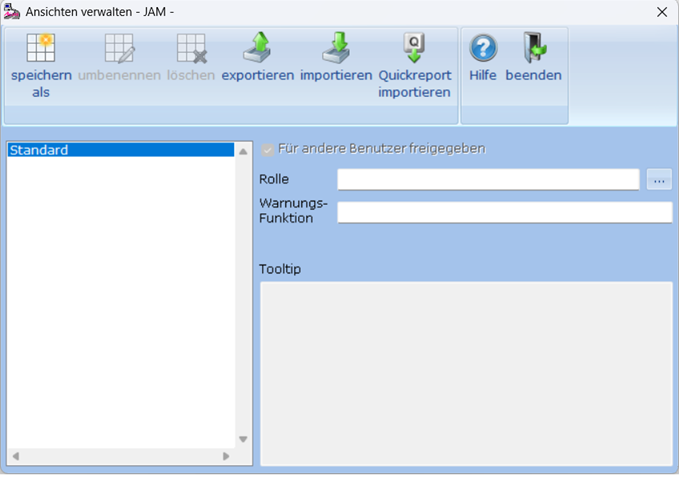
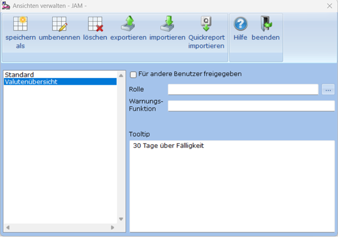
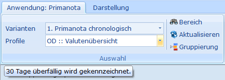

# Ansichten verwalten

<!-- source: https://amic.de/hilfe/ansichtenverwalten.htm -->

Die Funktion „Ansichten verwalten“ dient zum Erstellen von systemweiten individuell angepassten Darstellungen, die für alle Anwender, für die sie freigegeben wurden, gleich sind. Dort werden die Einstellungen der Funktionen „Sortierung“, „Farben“, „Spalten“, „SQL-Variablen“, „Summen“, die Position der Spalten sowie Reporte festgelegt. Nur wer Zugriffsrecht auf die Funktion „Ansicht verwalten“ hat, kann Änderung über die oben genannten Funktionen vornehmen. Die Spaltenposition und Spaltenbreite können für freigegebene Ansichten zwar noch geändert werden, werden aber nicht gespeichert.

Wählt man für eine Variante die Funktion das erste Mal aus, so erscheint der folgende Bildschirm. Die „Standard“-Ansicht ist die von AMIC ausgelieferte Variante und für diese sind die Zusatzfunktionen nicht aktiv.

Um nun eine eingen Ansicht zu generieren, wählt man ***„speichern als***“. Man wird dann nach dem neuen Namen gefragt, unter dem diese Ansicht gespeichert werden soll. Diese neue Ansicht läßt sich dann bearbeiten.

| | **Bedeutung** |
| --- | --- |
| speichern als | Anlegen einer neuen Ansicht. Dabei werden alle Informationen, also auch die ggf. bereits erstellten Reporte, kopiert. Eine neue Ansicht ist am Anfang immer **nicht** für andere Benutzer freigegeben.  
    
 |
| umbenennen | Da der vergebene Name im Profil angezeigt wird, muss man auch die Möglichkeit haben ihn zu ändern. Dies geschieht hier und wird sofort ausgeführt.  
 |
| löschen | Löscht die Ansicht. Da eine Ansicht immer für alle Anwender zugänglich ist, wird sie dann natürlich auch für alle Anwender gelöscht.  
 |
| exportieren | Einmal erstellte Ansichten lassen sich Exportieren m sie in andere Systeme einspielen zu können. Zu einer so exportierten Ansicht gehören:  
• Sortierung  
• Farben  
• Spalten  
• SQL-Variablen  
• Summen  
• Alle für diese Ansicht erstellten Reporte. *Bei der Standardansicht werden nur die Reporte exportiert.*  
   
**Achtung:** *Die so exportierten Ansichten lassen sich nur im Ansichten-Manager über* ***„import“*** *wieder einlesen.*  
 |
| importieren | Beim Importieren wird geprüft, ob die zugehörige Variante vorhanden ist und ob die Ansicht bereits im Zielsystem vorhanden ist und es wird in diesem ggf. ein neuer Name abgefragt. Es ist jedoch auch möglich die „alte“ Ansicht zu überschreiben. Importierte Ansichten sind immer erst einmal **nicht** für andere Benutzer freigegeben.  
 |
| Quickreport importieren | Importiert alle Quickreporte für die Variante als neue Ansichten. Dabei werden **Sortierung, Gruppierung, Feldauswahl** und **Summierung** der Quickreporte für die Ansichten übernommen. Beim Import kann ausgewählt werden, ob die neuen Ansichten für andere Benutzer freigegeben werden.  
Die Funktion kann auch aus der Anwendung **Quickreporte** (Direktsprung **[QR]**) aufgerufen werden.  
   
**Wichtig:** Die Funktion wird nur angezeigt, wenn Quickreporte für die Variante existieren. Ansonsten ist sie nicht sichtbar und kann auch nicht ausgeführt werden.  
 |
| Für andere Benutzer freigegeben | Wird eine neue Ansicht erstellt, so kann diese erstmal nur von dem Bediener bearbeitet und verwendet werden, der diese Ansicht angelegt hat. Für andere Benutzer ist diese Ansicht gesperrt. So kann verhindert werden, dass die Ansicht in der Bearbeitungsphase von anderen Benutzern verwendet wird.  
Wird eine Ansicht für andere Benutzer freigegeben, so kann diese gleichzeitig von niemanden bearbeitet werden. Die entsprechenden Funktionen des Darstellungsregisters sind dann deaktiviert.  
Es besteht die Möglichkeit nachträglich die Freigabe für andere Bediener zu entfernen. Dann ist diese Ansicht nur für den Benutzer freigegeben, der die Freigabe entfernt hat.  
Beim Export wird dieser Schalter immer mit der Einstellung „**NICHT** freigegeben“ ausgegeben.  
 |
| Rolle | Hier wird hinterlegt, für welche Rolle diese Ansicht sichtbar ist. Ist keine Rolle hinterlegt, ist die Ansicht für alle Anwender sichtbar. Die Standardansicht kann auch mithilfe des Rollensystems ausgeblendet werden.  
Rolleneinstellungen werden nicht mit exportiert.  
 |
| Warnungsfunktion | Hier kann die Datenbankfunktion hinterlegt werden, die ein [Warnsymbol](./datentabelle.md#Warnung) im Hintergrund der Anwendung anzeigt.  
 |
| Für diese Ansicht ist ein Report hinterlegt. | Informatorisch. Ist nur zu sehen, wenn bereits ein oder mehrere Reporte zu dieser Ansicht existiert.  
 |
| Tooltip | Der hier eingegebene Text wird angezeigt, wenn man mit der Maus auf dem entsprechenden Profil steht:  
  
Diese Beschreibung kann mithilfe einfacher Html-Tags formatiert werden:  
&lt;b>**fett**&lt;/b>  
&lt;i>*kursiv*&lt;/i>  
&lt;u>unterstrichen&lt;/u>  
  
Diese Tags können auch kombiniert werden.  
 |

**Achtung: *„****Freigabe für andere Benutzer“, „Rolle“ und „Tooltip“ werden erst beim Verlassen des Ansichten-Managers gespeichert. Aktionen, die über einen Button ausgelöst werden, werden sofort durchgeführt.*
