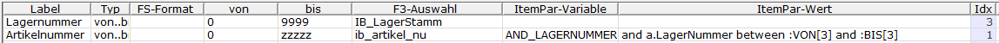

# Einrichtung der Bereichsauswahl

<!-- source: https://amic.de/hilfe/_einrichtungderbereichsauswahl.htm -->

Bei der Einrichtung einer privaten Variante wird auch der Bereich privatisiert. Man erreicht die Bearbeitung des Bereichs über das Darstellungsregister

***Private Variante*** **Strg+F2** \> ***Bearbeiten*** **F5** > ***Zugehöriger Bereich*** **F5**

Es öffnet sich folgende Maske:

<table class="AMIC-Tabelle" style="WIDTH: 100%; BORDER-COLLAPSE: collapse" cellspacing="0" cellpadding="0" width="100%" border="0"><tbody><tr><td style="WIDTH: 19.16%; BACKGROUND: #005d5b; PADDING-BOTTOM: 0pt; PADDING-TOP: 0pt; PADDING-LEFT: 5.4pt; PADDING-RIGHT: 5.4pt" width="19%">
Spalte
</td><td style="WIDTH: 80.84%; BACKGROUND: #005d5b; PADDING-BOTTOM: 0pt; PADDING-TOP: 0pt; PADDING-LEFT: 5.4pt; PADDING-RIGHT: 5.4pt" width="80%">
Bedeutung
</td></tr><tr><td style="BORDER-TOP: medium none; BORDER-RIGHT: white 1.5pt solid; WIDTH: 19.16%; BACKGROUND: #bad9d9; BORDER-BOTTOM: medium none; PADDING-BOTTOM: 0pt; PADDING-TOP: 0pt; PADDING-LEFT: 5.4pt; BORDER-LEFT: medium none; PADDING-RIGHT: 5.4pt" valign="top" width="19%">
Label
</td><td style="BORDER-TOP: medium none; BORDER-RIGHT: medium none; WIDTH: 80.84%; BACKGROUND: #bad9d9; BORDER-BOTTOM: medium none; PADDING-BOTTOM: 0pt; PADDING-TOP: 0pt; PADDING-LEFT: 5.4pt; BORDER-LEFT: medium none; PADDING-RIGHT: 5.4pt" valign="top" width="80%">
Der in dieser Spalte eingegebene Text erscheint in der Bereichsauswahl als Beschreibung der Zeile.
</td></tr><tr><td style="BORDER-TOP: medium none; BORDER-RIGHT: white 1.5pt solid; WIDTH: 19.16%; BACKGROUND: #eff7f7; BORDER-BOTTOM: medium none; PADDING-BOTTOM: 0pt; PADDING-TOP: 0pt; PADDING-LEFT: 5.4pt; BORDER-LEFT: medium none; PADDING-RIGHT: 5.4pt" valign="top" width="19%">
Typ
</td><td style="BORDER-TOP: medium none; BORDER-RIGHT: medium none; WIDTH: 80.84%; BACKGROUND: #eff7f7; BORDER-BOTTOM: medium none; PADDING-BOTTOM: 0pt; PADDING-TOP: 0pt; PADDING-LEFT: 5.4pt; BORDER-LEFT: medium none; PADDING-RIGHT: 5.4pt" valign="top" width="80%">
Wie erfolgt die Abfrage. Dabei können folgende Werte mit F3 ausgewählt werden:  
<table class="AMIC-Tabelle" style="WIDTH: 100%; BORDER-COLLAPSE: collapse" cellspacing="0" cellpadding="0" width="100%" border="0"><tbody><tr style="HEIGHT: 15pt"><th style="HEIGHT: 15pt; WIDTH: 134.65pt; BACKGROUND: #005d5b; PADDING-BOTTOM: 0pt; PADDING-TOP: 0pt; PADDING-LEFT: 5.4pt; PADDING-RIGHT: 5.4pt" width="180" nowrap="">Typ</th><th style="HEIGHT: 15pt; WIDTH: 759.75pt; BACKGROUND: #005d5b; PADDING-BOTTOM: 0pt; PADDING-TOP: 0pt; PADDING-LEFT: 5.4pt; PADDING-RIGHT: 5.4pt" width="1013">&nbsp;</th></tr><tr style="HEIGHT: 15pt"><td style="BORDER-TOP: medium none; HEIGHT: 15pt; BORDER-RIGHT: white 1.5pt solid; WIDTH: 134.65pt; BACKGROUND: #bad9d9; BORDER-BOTTOM: medium none; PADDING-BOTTOM: 0pt; PADDING-TOP: 0pt; PADDING-LEFT: 5.4pt; BORDER-LEFT: medium none; PADDING-RIGHT: 5.4pt" valign="top" width="180" nowrap="">von..bis..</td><td style="BORDER-TOP: medium none; HEIGHT: 15pt; BORDER-RIGHT: medium none; WIDTH: 759.75pt; BACKGROUND: #bad9d9; BORDER-BOTTOM: medium none; PADDING-BOTTOM: 0pt; PADDING-TOP: 0pt; PADDING-LEFT: 5.4pt; BORDER-LEFT: medium none; PADDING-RIGHT: 5.4pt" valign="top" width="1013">Rechts vom Label werden zwei Werte abgefragt, die im SQL-Ausdruck (siehe unten) als PAR1 und PAR2 verwendet werden können. &nbsp;</td></tr><tr style="HEIGHT: 15pt"><td style="BORDER-TOP: medium none; HEIGHT: 15pt; BORDER-RIGHT: white 1.5pt solid; WIDTH: 134.65pt; BACKGROUND: #eff7f7; BORDER-BOTTOM: medium none; PADDING-BOTTOM: 0pt; PADDING-TOP: 0pt; PADDING-LEFT: 5.4pt; BORDER-LEFT: medium none; PADDING-RIGHT: 5.4pt" valign="top" width="180" nowrap="">gleich</td><td style="BORDER-TOP: medium none; HEIGHT: 15pt; BORDER-RIGHT: medium none; WIDTH: 759.75pt; BACKGROUND: #eff7f7; BORDER-BOTTOM: medium none; PADDING-BOTTOM: 0pt; PADDING-TOP: 0pt; PADDING-LEFT: 5.4pt; BORDER-LEFT: medium none; PADDING-RIGHT: 5.4pt" valign="top" width="1013">Es wird nur ein Wert abgefragt</td></tr><tr style="HEIGHT: 15pt"><td style="BORDER-TOP: medium none; HEIGHT: 15pt; BORDER-RIGHT: white 1.5pt solid; WIDTH: 134.65pt; BACKGROUND: #bad9d9; BORDER-BOTTOM: medium none; PADDING-BOTTOM: 0pt; PADDING-TOP: 0pt; PADDING-LEFT: 5.4pt; BORDER-LEFT: medium none; PADDING-RIGHT: 5.4pt" valign="top" width="180" nowrap="">ungleich</td><td style="BORDER-TOP: medium none; HEIGHT: 15pt; BORDER-RIGHT: medium none; WIDTH: 759.75pt; BACKGROUND: #bad9d9; BORDER-BOTTOM: medium none; PADDING-BOTTOM: 0pt; PADDING-TOP: 0pt; PADDING-LEFT: 5.4pt; BORDER-LEFT: medium none; PADDING-RIGHT: 5.4pt" valign="top" width="1013">s.o.</td></tr><tr style="HEIGHT: 15pt"><td style="BORDER-TOP: medium none; HEIGHT: 15pt; BORDER-RIGHT: white 1.5pt solid; WIDTH: 134.65pt; BACKGROUND: #eff7f7; BORDER-BOTTOM: medium none; PADDING-BOTTOM: 0pt; PADDING-TOP: 0pt; PADDING-LEFT: 5.4pt; BORDER-LEFT: medium none; PADDING-RIGHT: 5.4pt" valign="top" width="180" nowrap="">like..</td><td style="BORDER-TOP: medium none; HEIGHT: 15pt; BORDER-RIGHT: medium none; WIDTH: 759.75pt; BACKGROUND: #eff7f7; BORDER-BOTTOM: medium none; PADDING-BOTTOM: 0pt; PADDING-TOP: 0pt; PADDING-LEFT: 5.4pt; BORDER-LEFT: medium none; PADDING-RIGHT: 5.4pt" valign="top" width="1013">s.o.</td></tr><tr style="HEIGHT: 15pt"><td style="BORDER-TOP: medium none; HEIGHT: 15pt; BORDER-RIGHT: white 1.5pt solid; WIDTH: 134.65pt; BACKGROUND: #bad9d9; BORDER-BOTTOM: medium none; PADDING-BOTTOM: 0pt; PADDING-TOP: 0pt; PADDING-LEFT: 5.4pt; BORDER-LEFT: medium none; PADDING-RIGHT: 5.4pt" valign="top" width="180" nowrap="">kleiner</td><td style="BORDER-TOP: medium none; HEIGHT: 15pt; BORDER-RIGHT: medium none; WIDTH: 759.75pt; BACKGROUND: #bad9d9; BORDER-BOTTOM: medium none; PADDING-BOTTOM: 0pt; PADDING-TOP: 0pt; PADDING-LEFT: 5.4pt; BORDER-LEFT: medium none; PADDING-RIGHT: 5.4pt" valign="top" width="1013">s.o.</td></tr><tr style="HEIGHT: 15pt"><td style="BORDER-TOP: medium none; HEIGHT: 15pt; BORDER-RIGHT: white 1.5pt solid; WIDTH: 134.65pt; BACKGROUND: #eff7f7; BORDER-BOTTOM: medium none; PADDING-BOTTOM: 0pt; PADDING-TOP: 0pt; PADDING-LEFT: 5.4pt; BORDER-LEFT: medium none; PADDING-RIGHT: 5.4pt" valign="top" width="180" nowrap="">größer</td><td style="BORDER-TOP: medium none; HEIGHT: 15pt; BORDER-RIGHT: medium none; WIDTH: 759.75pt; BACKGROUND: #eff7f7; BORDER-BOTTOM: medium none; PADDING-BOTTOM: 0pt; PADDING-TOP: 0pt; PADDING-LEFT: 5.4pt; BORDER-LEFT: medium none; PADDING-RIGHT: 5.4pt" valign="top" width="1013">s.o.</td></tr><tr style="HEIGHT: 15pt"><td style="BORDER-TOP: medium none; HEIGHT: 15pt; BORDER-RIGHT: white 1.5pt solid; WIDTH: 134.65pt; BACKGROUND: #bad9d9; BORDER-BOTTOM: medium none; PADDING-BOTTOM: 0pt; PADDING-TOP: 0pt; PADDING-LEFT: 5.4pt; BORDER-LEFT: medium none; PADDING-RIGHT: 5.4pt" valign="top" width="180" nowrap="">&lt;=</td><td style="BORDER-TOP: medium none; HEIGHT: 15pt; BORDER-RIGHT: medium none; WIDTH: 759.75pt; BACKGROUND: #bad9d9; BORDER-BOTTOM: medium none; PADDING-BOTTOM: 0pt; PADDING-TOP: 0pt; PADDING-LEFT: 5.4pt; BORDER-LEFT: medium none; PADDING-RIGHT: 5.4pt" valign="top" width="1013">s.o.</td></tr><tr style="HEIGHT: 15pt"><td style="BORDER-TOP: medium none; HEIGHT: 15pt; BORDER-RIGHT: white 1.5pt solid; WIDTH: 134.65pt; BACKGROUND: #eff7f7; BORDER-BOTTOM: medium none; PADDING-BOTTOM: 0pt; PADDING-TOP: 0pt; PADDING-LEFT: 5.4pt; BORDER-LEFT: medium none; PADDING-RIGHT: 5.4pt" valign="top" width="180" nowrap="">&gt;=</td><td style="BORDER-TOP: medium none; HEIGHT: 15pt; BORDER-RIGHT: medium none; WIDTH: 759.75pt; BACKGROUND: #eff7f7; BORDER-BOTTOM: medium none; PADDING-BOTTOM: 0pt; PADDING-TOP: 0pt; PADDING-LEFT: 5.4pt; BORDER-LEFT: medium none; PADDING-RIGHT: 5.4pt" valign="top" width="1013">s.o.</td></tr><tr style="HEIGHT: 15pt"><td style="BORDER-TOP: medium none; HEIGHT: 15pt; BORDER-RIGHT: white 1.5pt solid; WIDTH: 134.65pt; BACKGROUND: #bad9d9; BORDER-BOTTOM: medium none; PADDING-BOTTOM: 0pt; PADDING-TOP: 0pt; PADDING-LEFT: 5.4pt; BORDER-LEFT: medium none; PADDING-RIGHT: 5.4pt" valign="top" width="180" nowrap="">in..</td><td style="BORDER-TOP: medium none; HEIGHT: 15pt; BORDER-RIGHT: medium none; WIDTH: 759.75pt; BACKGROUND: #bad9d9; BORDER-BOTTOM: medium none; PADDING-BOTTOM: 0pt; PADDING-TOP: 0pt; PADDING-LEFT: 5.4pt; BORDER-LEFT: medium none; PADDING-RIGHT: 5.4pt" valign="top" width="1013">s.o.</td></tr><tr style="HEIGHT: 15pt"><td style="BORDER-TOP: medium none; HEIGHT: 15pt; BORDER-RIGHT: white 1.5pt solid; WIDTH: 134.65pt; BACKGROUND: #eff7f7; BORDER-BOTTOM: medium none; PADDING-BOTTOM: 0pt; PADDING-TOP: 0pt; PADDING-LEFT: 5.4pt; BORDER-LEFT: medium none; PADDING-RIGHT: 5.4pt" valign="top" width="180" nowrap="">not in..</td><td style="BORDER-TOP: medium none; HEIGHT: 15pt; BORDER-RIGHT: medium none; WIDTH: 759.75pt; BACKGROUND: #eff7f7; BORDER-BOTTOM: medium none; PADDING-BOTTOM: 0pt; PADDING-TOP: 0pt; PADDING-LEFT: 5.4pt; BORDER-LEFT: medium none; PADDING-RIGHT: 5.4pt" valign="top" width="1013">s.o.</td></tr><tr style="HEIGHT: 15pt"><td style="BORDER-TOP: medium none; HEIGHT: 15pt; BORDER-RIGHT: white 1.5pt solid; WIDTH: 134.65pt; BACKGROUND: #bad9d9; BORDER-BOTTOM: medium none; PADDING-BOTTOM: 0pt; PADDING-TOP: 0pt; PADDING-LEFT: 5.4pt; BORDER-LEFT: medium none; PADDING-RIGHT: 5.4pt" valign="top" width="180" nowrap="">clause</td><td style="BORDER-TOP: medium none; HEIGHT: 15pt; BORDER-RIGHT: medium none; WIDTH: 759.75pt; BACKGROUND: #bad9d9; BORDER-BOTTOM: medium none; PADDING-BOTTOM: 0pt; PADDING-TOP: 0pt; PADDING-LEFT: 5.4pt; BORDER-LEFT: medium none; PADDING-RIGHT: 5.4pt" valign="top" width="1013">s.o.</td></tr><tr style="HEIGHT: 15pt"><td style="BORDER-TOP: medium none; HEIGHT: 15pt; BORDER-RIGHT: white 1.5pt solid; WIDTH: 134.65pt; BACKGROUND: #eff7f7; BORDER-BOTTOM: medium none; PADDING-BOTTOM: 0pt; PADDING-TOP: 0pt; PADDING-LEFT: 5.4pt; BORDER-LEFT: medium none; PADDING-RIGHT: 5.4pt" valign="top" width="180" nowrap="">zwei Parameter</td><td style="BORDER-TOP: medium none; HEIGHT: 15pt; BORDER-RIGHT: medium none; WIDTH: 759.75pt; BACKGROUND: #eff7f7; BORDER-BOTTOM: medium none; PADDING-BOTTOM: 0pt; PADDING-TOP: 0pt; PADDING-LEFT: 5.4pt; BORDER-LEFT: medium none; PADDING-RIGHT: 5.4pt" valign="top" width="1013">Rechts vom Label werden zwei Werte abgefragt. &nbsp;</td></tr><tr style="HEIGHT: 15pt"><td style="BORDER-TOP: medium none; HEIGHT: 15pt; BORDER-RIGHT: white 1.5pt solid; WIDTH: 134.65pt; BACKGROUND: #bad9d9; BORDER-BOTTOM: medium none; PADDING-BOTTOM: 0pt; PADDING-TOP: 0pt; PADDING-LEFT: 5.4pt; BORDER-LEFT: medium none; PADDING-RIGHT: 5.4pt" valign="top" width="180" nowrap="">FS-Format</td><td style="BORDER-TOP: medium none; HEIGHT: 15pt; BORDER-RIGHT: medium none; WIDTH: 759.75pt; BACKGROUND: #bad9d9; BORDER-BOTTOM: medium none; PADDING-BOTTOM: 0pt; PADDING-TOP: 0pt; PADDING-LEFT: 5.4pt; BORDER-LEFT: medium none; PADDING-RIGHT: 5.4pt" valign="top" width="1013">Wird FS-Format ausgewählt, so muss in der Spalte FS-Format ein Format ausgewählt werden. In <b>PAR1</b> bzw. <b>VON[idx]</b> wird der Wert des FS-Formates zurückgegeben. &nbsp;</td></tr><tr style="HEIGHT: 15pt"><td style="BORDER-TOP: medium none; HEIGHT: 15pt; BORDER-RIGHT: white 1.5pt solid; WIDTH: 134.65pt; BACKGROUND: #eff7f7; BORDER-BOTTOM: medium none; PADDING-BOTTOM: 0pt; PADDING-TOP: 0pt; PADDING-LEFT: 5.4pt; BORDER-LEFT: medium none; PADDING-RIGHT: 5.4pt" valign="top" width="180" nowrap="">toggle</td><td style="BORDER-TOP: medium none; HEIGHT: 15pt; BORDER-RIGHT: medium none; WIDTH: 759.75pt; BACKGROUND: #eff7f7; BORDER-BOTTOM: medium none; PADDING-BOTTOM: 0pt; PADDING-TOP: 0pt; PADDING-LEFT: 5.4pt; BORDER-LEFT: medium none; PADDING-RIGHT: 5.4pt" valign="top" width="1013">Ähnlich wie das FSFormat. D.h. es muss in der Spalte unter FSFormat etwas eingetragen werden. In <b>PAR1</b> bzw. <b>VON[idx]</b> wird das zurückgegeben, was im FSFORMAT in der Spalte Kommentar/Schnipsel eingetragen wurde. &nbsp;</td></tr><tr style="HEIGHT: 15pt"><td style="BORDER-TOP: medium none; HEIGHT: 15pt; BORDER-RIGHT: white 1.5pt solid; WIDTH: 134.65pt; BACKGROUND: #bad9d9; BORDER-BOTTOM: medium none; PADDING-BOTTOM: 0pt; PADDING-TOP: 0pt; PADDING-LEFT: 5.4pt; BORDER-LEFT: medium none; PADDING-RIGHT: 5.4pt" valign="top" width="180" nowrap="">toggle mit Parameter</td><td style="BORDER-TOP: medium none; HEIGHT: 15pt; BORDER-RIGHT: medium none; WIDTH: 759.75pt; BACKGROUND: #bad9d9; BORDER-BOTTOM: medium none; PADDING-BOTTOM: 0pt; PADDING-TOP: 0pt; PADDING-LEFT: 5.4pt; BORDER-LEFT: medium none; PADDING-RIGHT: 5.4pt" valign="top" width="1013">Rechts vom Label werden zwei Werte abgefragt. Die Arbeitsweise ist wie <b>Toggle</b>, nur kann zusätzlich ein weiterer Wert abgefragt werden. &nbsp;</td></tr></tbody></table>
Die Formate <b>gleich, ungleich, like, kleiner, größer, &lt;=, &gt;=, in, not in&nbsp; clause</b> haben nur noch die Bedeutung, dass nur ein Parameter abgefragt wird.
</td></tr><tr><td style="BORDER-TOP: medium none; BORDER-RIGHT: white 1.5pt solid; WIDTH: 19.16%; BACKGROUND: #bad9d9; BORDER-BOTTOM: medium none; PADDING-BOTTOM: 0pt; PADDING-TOP: 0pt; PADDING-LEFT: 5.4pt; BORDER-LEFT: medium none; PADDING-RIGHT: 5.4pt" valign="top" width="19%">
FS-Format
</td><td style="BORDER-TOP: medium none; BORDER-RIGHT: medium none; WIDTH: 80.84%; BACKGROUND: #bad9d9; BORDER-BOTTOM: medium none; PADDING-BOTTOM: 0pt; PADDING-TOP: 0pt; PADDING-LEFT: 5.4pt; BORDER-LEFT: medium none; PADDING-RIGHT: 5.4pt" valign="top" width="80%">
Hier wird das zu toggle, toggle with param und FS-Format gehörende Format eingetragen. Eine Auswahl ist mit F3 möglich.
</td></tr><tr><td style="BORDER-TOP: medium none; BORDER-RIGHT: white 1.5pt solid; WIDTH: 19.16%; BACKGROUND: #eff7f7; BORDER-BOTTOM: medium none; PADDING-BOTTOM: 0pt; PADDING-TOP: 0pt; PADDING-LEFT: 5.4pt; BORDER-LEFT: medium none; PADDING-RIGHT: 5.4pt" valign="top" width="19%">
Von
</td><td style="BORDER-TOP: medium none; BORDER-RIGHT: medium none; WIDTH: 80.84%; BACKGROUND: #eff7f7; BORDER-BOTTOM: medium none; PADDING-BOTTOM: 0pt; PADDING-TOP: 0pt; PADDING-LEFT: 5.4pt; BORDER-LEFT: medium none; PADDING-RIGHT: 5.4pt" valign="top" width="80%">
Wert, der beim ersten Betreten der Bereichsauswahl bzw. nach dem Löschen des Profils im ersten Eingabefeld steht.

Hier können auch Schlüsselwörter verwendet werden, die dann bestimmte Werte repräsentieren. Stellt man dem Schlüsselwort kein <b>#</b> vorneweg, dann wird der entsprechende Wert jedes Mal wieder vorbelegt, ansonsten nur beim ersten Betreten der Variante bzw. bei Löschen des Profils.
<table class="AMIC-Tabelle" style="BORDER-COLLAPSE: collapse" cellspacing="0" cellpadding="0" border="0"><tbody><tr><th style="WIDTH: 143.75pt; BACKGROUND: #005d5b; PADDING-BOTTOM: 0pt; PADDING-TOP: 0pt; PADDING-LEFT: 5.4pt; PADDING-RIGHT: 5.4pt" width="192">&nbsp;</th><th style="WIDTH: 716.75pt; BACKGROUND: #005d5b; PADDING-BOTTOM: 0pt; PADDING-TOP: 0pt; PADDING-LEFT: 5.4pt; PADDING-RIGHT: 5.4pt" width="956">&nbsp;</th></tr><tr><td style="BORDER-TOP: medium none; BORDER-RIGHT: white 1.5pt solid; WIDTH: 143.75pt; BACKGROUND: #bad9d9; BORDER-BOTTOM: medium none; PADDING-BOTTOM: 0pt; PADDING-TOP: 0pt; PADDING-LEFT: 5.4pt; BORDER-LEFT: medium none; PADDING-RIGHT: 5.4pt" valign="top" width="192">#TODAY &nbsp;</td><td style="BORDER-TOP: medium none; BORDER-RIGHT: medium none; WIDTH: 716.75pt; BACKGROUND: #bad9d9; BORDER-BOTTOM: medium none; PADDING-BOTTOM: 0pt; PADDING-TOP: 0pt; PADDING-LEFT: 5.4pt; BORDER-LEFT: medium none; PADDING-RIGHT: 5.4pt" valign="top" width="956">Das Tagesdatum</td></tr><tr><td style="BORDER-TOP: medium none; BORDER-RIGHT: white 1.5pt solid; WIDTH: 143.75pt; BACKGROUND: #eff7f7; BORDER-BOTTOM: medium none; PADDING-BOTTOM: 0pt; PADDING-TOP: 0pt; PADDING-LEFT: 5.4pt; BORDER-LEFT: medium none; PADDING-RIGHT: 5.4pt" valign="top" width="192">#FIRST &nbsp;</td><td style="BORDER-TOP: medium none; BORDER-RIGHT: medium none; WIDTH: 716.75pt; BACKGROUND: #eff7f7; BORDER-BOTTOM: medium none; PADDING-BOTTOM: 0pt; PADDING-TOP: 0pt; PADDING-LEFT: 5.4pt; BORDER-LEFT: medium none; PADDING-RIGHT: 5.4pt" valign="top" width="956">Datum des ersten des Monats, also 01.04.2023 für den ersten April.</td></tr><tr><td style="BORDER-TOP: medium none; BORDER-RIGHT: white 1.5pt solid; WIDTH: 143.75pt; BACKGROUND: #bad9d9; BORDER-BOTTOM: medium none; PADDING-BOTTOM: 0pt; PADDING-TOP: 0pt; PADDING-LEFT: 5.4pt; BORDER-LEFT: medium none; PADDING-RIGHT: 5.4pt" valign="top" width="192">#FIRST_LM &nbsp;</td><td style="BORDER-TOP: medium none; BORDER-RIGHT: medium none; WIDTH: 716.75pt; BACKGROUND: #bad9d9; BORDER-BOTTOM: medium none; PADDING-BOTTOM: 0pt; PADDING-TOP: 0pt; PADDING-LEFT: 5.4pt; BORDER-LEFT: medium none; PADDING-RIGHT: 5.4pt" valign="top" width="956">Datum des ersten des vorangegangenen Monats, also 01.03.2023, wenn der aktuelle Monat der April ist.</td></tr><tr><td style="BORDER-TOP: medium none; BORDER-RIGHT: white 1.5pt solid; WIDTH: 143.75pt; BACKGROUND: #eff7f7; BORDER-BOTTOM: medium none; PADDING-BOTTOM: 0pt; PADDING-TOP: 0pt; PADDING-LEFT: 5.4pt; BORDER-LEFT: medium none; PADDING-RIGHT: 5.4pt" valign="top" width="192">#ULTIMO &nbsp;</td><td style="BORDER-TOP: medium none; BORDER-RIGHT: medium none; WIDTH: 716.75pt; BACKGROUND: #eff7f7; BORDER-BOTTOM: medium none; PADDING-BOTTOM: 0pt; PADDING-TOP: 0pt; PADDING-LEFT: 5.4pt; BORDER-LEFT: medium none; PADDING-RIGHT: 5.4pt" valign="top" width="956">Datum des letzten Tags des Monats</td></tr><tr><td style="BORDER-TOP: medium none; BORDER-RIGHT: white 1.5pt solid; WIDTH: 143.75pt; BACKGROUND: #bad9d9; BORDER-BOTTOM: medium none; PADDING-BOTTOM: 0pt; PADDING-TOP: 0pt; PADDING-LEFT: 5.4pt; BORDER-LEFT: medium none; PADDING-RIGHT: 5.4pt" valign="top" width="192">#ULTIMO_LM &nbsp;</td><td style="BORDER-TOP: medium none; BORDER-RIGHT: medium none; WIDTH: 716.75pt; BACKGROUND: #bad9d9; BORDER-BOTTOM: medium none; PADDING-BOTTOM: 0pt; PADDING-TOP: 0pt; PADDING-LEFT: 5.4pt; BORDER-LEFT: medium none; PADDING-RIGHT: 5.4pt" valign="top" width="956">Datum des letzten Tags des vorangegangenen Monats, also der 31.03.2023, wenn der aktuelle Monat der April ist</td></tr><tr><td style="BORDER-TOP: medium none; BORDER-RIGHT: white 1.5pt solid; WIDTH: 143.75pt; BACKGROUND: #eff7f7; BORDER-BOTTOM: medium none; PADDING-BOTTOM: 0pt; PADDING-TOP: 0pt; PADDING-LEFT: 5.4pt; BORDER-LEFT: medium none; PADDING-RIGHT: 5.4pt" valign="top" width="192">#FIRSTDAYOFYEAR &nbsp;</td><td style="BORDER-TOP: medium none; BORDER-RIGHT: medium none; WIDTH: 716.75pt; BACKGROUND: #eff7f7; BORDER-BOTTOM: medium none; PADDING-BOTTOM: 0pt; PADDING-TOP: 0pt; PADDING-LEFT: 5.4pt; BORDER-LEFT: medium none; PADDING-RIGHT: 5.4pt" valign="top" width="956">Erster Tag des aktuellen <b>Geschäftsjahres</b> aus dem Geschäftsjahresstamm.</td></tr><tr><td style="BORDER-TOP: medium none; BORDER-RIGHT: white 1.5pt solid; WIDTH: 143.75pt; BACKGROUND: #bad9d9; BORDER-BOTTOM: medium none; PADDING-BOTTOM: 0pt; PADDING-TOP: 0pt; PADDING-LEFT: 5.4pt; BORDER-LEFT: medium none; PADDING-RIGHT: 5.4pt" valign="top" width="192">#LASTDAYOFYEAR &nbsp;</td><td style="BORDER-TOP: medium none; BORDER-RIGHT: medium none; WIDTH: 716.75pt; BACKGROUND: #bad9d9; BORDER-BOTTOM: medium none; PADDING-BOTTOM: 0pt; PADDING-TOP: 0pt; PADDING-LEFT: 5.4pt; BORDER-LEFT: medium none; PADDING-RIGHT: 5.4pt" valign="top" width="956">Letzter Tag des aktuellen <b>Geschäftsjahres</b> aus dem Geschäftsjahresstamm.</td></tr><tr><td style="BORDER-TOP: medium none; BORDER-RIGHT: white 1.5pt solid; WIDTH: 143.75pt; BACKGROUND: #eff7f7; BORDER-BOTTOM: medium none; PADDING-BOTTOM: 0pt; PADDING-TOP: 0pt; PADDING-LEFT: 5.4pt; BORDER-LEFT: medium none; PADDING-RIGHT: 5.4pt" valign="top" width="192">#BUCHWÄHRUNG oder #BUCHWAEHRUNG</td><td style="BORDER-TOP: medium none; BORDER-RIGHT: medium none; WIDTH: 716.75pt; BACKGROUND: #eff7f7; BORDER-BOTTOM: medium none; PADDING-BOTTOM: 0pt; PADDING-TOP: 0pt; PADDING-LEFT: 5.4pt; BORDER-LEFT: medium none; PADDING-RIGHT: 5.4pt" valign="top" width="956">Die Nummer der aktuellen Buchwährung.</td></tr><tr><td style="BORDER-TOP: medium none; BORDER-RIGHT: white 1.5pt solid; WIDTH: 143.75pt; BACKGROUND: #bad9d9; BORDER-BOTTOM: medium none; PADDING-BOTTOM: 0pt; PADDING-TOP: 0pt; PADDING-LEFT: 5.4pt; BORDER-LEFT: medium none; PADDING-RIGHT: 5.4pt" valign="top" width="192">#YEAR &nbsp;</td><td style="BORDER-TOP: medium none; BORDER-RIGHT: medium none; WIDTH: 716.75pt; BACKGROUND: #bad9d9; BORDER-BOTTOM: medium none; PADDING-BOTTOM: 0pt; PADDING-TOP: 0pt; PADDING-LEFT: 5.4pt; BORDER-LEFT: medium none; PADDING-RIGHT: 5.4pt" valign="top" width="956">Aktuelles Geschäftsjahr.</td></tr><tr><td style="BORDER-TOP: medium none; BORDER-RIGHT: white 1.5pt solid; WIDTH: 143.75pt; BACKGROUND: #eff7f7; BORDER-BOTTOM: medium none; PADDING-BOTTOM: 0pt; PADDING-TOP: 0pt; PADDING-LEFT: 5.4pt; BORDER-LEFT: medium none; PADDING-RIGHT: 5.4pt" valign="top" width="192">#LASTYEAR &nbsp;</td><td style="BORDER-TOP: medium none; BORDER-RIGHT: medium none; WIDTH: 716.75pt; BACKGROUND: #eff7f7; BORDER-BOTTOM: medium none; PADDING-BOTTOM: 0pt; PADDING-TOP: 0pt; PADDING-LEFT: 5.4pt; BORDER-LEFT: medium none; PADDING-RIGHT: 5.4pt" valign="top" width="956">Vorangegangenes Geschäftsjahr</td></tr><tr><td style="BORDER-TOP: medium none; BORDER-RIGHT: white 1.5pt solid; WIDTH: 143.75pt; BACKGROUND: #bad9d9; BORDER-BOTTOM: medium none; PADDING-BOTTOM: 0pt; PADDING-TOP: 0pt; PADDING-LEFT: 5.4pt; BORDER-LEFT: medium none; PADDING-RIGHT: 5.4pt" valign="top" width="192">#PERIODE oder #PERIOD</td><td style="BORDER-TOP: medium none; BORDER-RIGHT: medium none; WIDTH: 716.75pt; BACKGROUND: #bad9d9; BORDER-BOTTOM: medium none; PADDING-BOTTOM: 0pt; PADDING-TOP: 0pt; PADDING-LEFT: 5.4pt; BORDER-LEFT: medium none; PADDING-RIGHT: 5.4pt" valign="top" width="956">Die aktuelle Periode zum Tagesdastum.</td></tr></tbody></table></td></tr><tr><td style="BORDER-TOP: medium none; BORDER-RIGHT: white 1.5pt solid; WIDTH: 19.16%; BACKGROUND: #bad9d9; BORDER-BOTTOM: medium none; PADDING-BOTTOM: 0pt; PADDING-TOP: 0pt; PADDING-LEFT: 5.4pt; BORDER-LEFT: medium none; PADDING-RIGHT: 5.4pt" valign="top" width="19%">
Bis
</td><td style="BORDER-TOP: medium none; BORDER-RIGHT: medium none; WIDTH: 80.84%; BACKGROUND: #bad9d9; BORDER-BOTTOM: medium none; PADDING-BOTTOM: 0pt; PADDING-TOP: 0pt; PADDING-LEFT: 5.4pt; BORDER-LEFT: medium none; PADDING-RIGHT: 5.4pt" valign="top" width="80%">
Ist beim Typen „von..bis..“, „Zwei Parameter“ oder „toggle with param“ eingetragen, dann sollte hier der Wert eingetragen werden, der in der zweiten Spalte beim ersten Betreten der Bereichsauswahl bzw. nach dem Löschen des Profils im ersten Eingabefeld stehen soll.
</td></tr><tr><td style="BORDER-TOP: medium none; BORDER-RIGHT: white 1.5pt solid; WIDTH: 19.16%; BACKGROUND: #eff7f7; BORDER-BOTTOM: medium none; PADDING-BOTTOM: 0pt; PADDING-TOP: 0pt; PADDING-LEFT: 5.4pt; BORDER-LEFT: medium none; PADDING-RIGHT: 5.4pt" valign="top" width="19%">
F3-Auswahl
</td><td style="BORDER-TOP: medium none; BORDER-RIGHT: medium none; WIDTH: 80.84%; BACKGROUND: #eff7f7; BORDER-BOTTOM: medium none; PADDING-BOTTOM: 0pt; PADDING-TOP: 0pt; PADDING-LEFT: 5.4pt; BORDER-LEFT: medium none; PADDING-RIGHT: 5.4pt" valign="top" width="80%">
Hier kann eine F3-Auswahl (Itembox) eingetragen werden. Eine Auswahl ist mit F3 möglich. Hat man eine F3-Auswahl angegeben, so erscheint hinter dem Eingabefeld ein Button, der kennzeichnet, dass hier F3 möglich ist. Es kann auch der Button verwendet werden.
</td></tr><tr><td style="BORDER-TOP: medium none; BORDER-RIGHT: white 1.5pt solid; WIDTH: 19.16%; BACKGROUND: #bad9d9; BORDER-BOTTOM: medium none; PADDING-BOTTOM: 0pt; PADDING-TOP: 0pt; PADDING-LEFT: 5.4pt; BORDER-LEFT: medium none; PADDING-RIGHT: 5.4pt" valign="top" width="19%">
ItemPar-Variable
</td><td style="BORDER-TOP: medium none; BORDER-RIGHT: medium none; WIDTH: 80.84%; BACKGROUND: #bad9d9; BORDER-BOTTOM: medium none; PADDING-BOTTOM: 0pt; PADDING-TOP: 0pt; PADDING-LEFT: 5.4pt; BORDER-LEFT: medium none; PADDING-RIGHT: 5.4pt" valign="top" width="80%">
<u>Setzen von Itembox-Parametern (ItemPar)</u><u></u>

Ist an die Bereichsauswahl eine F3-Auswahl angebunden, so besteht hier die Möglichkeit die Werte der F3-Auswahl nach bereits erfassten Daten einzugrenzen.

Um das ItemPar einzurichten, ist in dem Feld ItemPar-Variable der Name des Parameters anzugeben. Dieser muss sich im SQL-Text der F3-Auswahl (Itembox) wiederfinden. Anschließend wird in dem Feld ItemPar-Wert der entsprechende SQL-Ausdruck eingetragen (siehe ItemPar-Wert).

Beispiel:

In diesem Beispiel soll in der F2-Bereichsauswahl<strong> </strong>eine Artikelnummer ausgewählt werden. In der Bereichsauswahl wird bereits nach der Lagernummer „1“ gefiltert. Daher sollen in der F3-Auswahl zu der Artikelnummer nur alle Artikel zu dem Lager „1“ angezeigt werden.

Dazu werden in dem Feld „ItemPar-Variable“ der Name des Parameters (hier: AND_LAGERNUMMER) und dem Feld „ItemPar-Wert“ der entsprechende SQL-Schnipsel eingetragen:

<strong></strong>

<b><u>Hinweis</u></b><b><u></u></b>

Das ItemPar wird nur dann ausgewertet bzw. die Eingrenzung erfolgt nur dann, wenn die entsprechende Auswahlbedingung aktiviert wurde. Wird beispielweise die Auswahlbedingung „Lagernummer“ deaktiviert, so wird in der F3-Auswahl zu der Artikelnummer die Eingrenzung nach der Lagernummer aufgehoben.
</td></tr><tr><td style="BORDER-TOP: medium none; BORDER-RIGHT: white 1.5pt solid; WIDTH: 19.16%; BACKGROUND: #eff7f7; BORDER-BOTTOM: medium none; PADDING-BOTTOM: 0pt; PADDING-TOP: 0pt; PADDING-LEFT: 5.4pt; BORDER-LEFT: medium none; PADDING-RIGHT: 5.4pt" valign="top" width="19%">
ItemPar-Wert
</td><td style="BORDER-TOP: medium none; BORDER-RIGHT: medium none; WIDTH: 80.84%; BACKGROUND: #eff7f7; BORDER-BOTTOM: medium none; PADDING-BOTTOM: 0pt; PADDING-TOP: 0pt; PADDING-LEFT: 5.4pt; BORDER-LEFT: medium none; PADDING-RIGHT: 5.4pt" valign="top" width="80%">
Hier wird der SQL-Ausdruck für das ItemPar angegeben. Als Platzhalter für die Werte in der Bereichsauswahl werden VON[x] und BIS[x] verwendet. Das x steht hierbei für den Index der Auswahlbedingung.

Beispiele:
<table class="AMIC-Tabelle" style="WIDTH: 474.85pt; BORDER-COLLAPSE: collapse" cellspacing="0" cellpadding="0" width="633" border="0"><tbody><tr style="HEIGHT: 15pt"><th style="HEIGHT: 15pt; WIDTH: 141.75pt; BACKGROUND: #005d5b; PADDING-BOTTOM: 0pt; PADDING-TOP: 0pt; PADDING-LEFT: 5.4pt; PADDING-RIGHT: 5.4pt" width="189" nowrap="">ItemPar-Variable</th><th style="HEIGHT: 15pt; WIDTH: 333.1pt; BACKGROUND: #005d5b; PADDING-BOTTOM: 0pt; PADDING-TOP: 0pt; PADDING-LEFT: 5.4pt; PADDING-RIGHT: 5.4pt" width="444" nowrap="">ItemPar-Wert</th></tr><tr style="HEIGHT: 15pt"><td style="BORDER-TOP: medium none; HEIGHT: 15pt; BORDER-RIGHT: white 1.5pt solid; WIDTH: 141.75pt; BACKGROUND: #bad9d9; BORDER-BOTTOM: medium none; PADDING-BOTTOM: 0pt; PADDING-TOP: 0pt; PADDING-LEFT: 5.4pt; BORDER-LEFT: medium none; PADDING-RIGHT: 5.4pt" valign="top" width="189" nowrap="">AND_LAGERNUMMER</td><td style="BORDER-TOP: medium none; HEIGHT: 15pt; BORDER-RIGHT: medium none; WIDTH: 333.1pt; BACKGROUND: #bad9d9; BORDER-BOTTOM: medium none; PADDING-BOTTOM: 0pt; PADDING-TOP: 0pt; PADDING-LEFT: 5.4pt; BORDER-LEFT: medium none; PADDING-RIGHT: 5.4pt" valign="top" width="444" nowrap="">and a.LagerNummer between :VON[3] and :BIS[3]</td></tr><tr style="HEIGHT: 15pt"><td style="BORDER-TOP: medium none; HEIGHT: 15pt; BORDER-RIGHT: white 1.5pt solid; WIDTH: 141.75pt; BACKGROUND: #eff7f7; BORDER-BOTTOM: medium none; PADDING-BOTTOM: 0pt; PADDING-TOP: 0pt; PADDING-LEFT: 5.4pt; BORDER-LEFT: medium none; PADDING-RIGHT: 5.4pt" valign="top" width="189" nowrap="">AND_ABDATUM</td><td style="BORDER-TOP: medium none; HEIGHT: 15pt; BORDER-RIGHT: medium none; WIDTH: 333.1pt; BACKGROUND: #eff7f7; BORDER-BOTTOM: medium none; PADDING-BOTTOM: 0pt; PADDING-TOP: 0pt; PADDING-LEFT: 5.4pt; BORDER-LEFT: medium none; PADDING-RIGHT: 5.4pt" valign="top" width="444" nowrap="">and a.artikelabdatum &gt; ':VON[11]'</td></tr></tbody></table></td></tr><tr><td style="BORDER-TOP: medium none; BORDER-RIGHT: white 1.5pt solid; WIDTH: 19.16%; BACKGROUND: #bad9d9; BORDER-BOTTOM: medium none; PADDING-BOTTOM: 0pt; PADDING-TOP: 0pt; PADDING-LEFT: 5.4pt; BORDER-LEFT: medium none; PADDING-RIGHT: 5.4pt" valign="top" width="19%">
Fm
</td><td style="BORDER-TOP: medium none; BORDER-RIGHT: medium none; WIDTH: 80.84%; BACKGROUND: #bad9d9; BORDER-BOTTOM: medium none; PADDING-BOTTOM: 0pt; PADDING-TOP: 0pt; PADDING-LEFT: 5.4pt; BORDER-LEFT: medium none; PADDING-RIGHT: 5.4pt" valign="top" width="80%">
Das Eingabeformat.
<table class="AMIC-Tabelle" style="WIDTH: 100%; BORDER-COLLAPSE: collapse" cellspacing="0" cellpadding="0" width="100%" border="0"><tbody><tr style="HEIGHT: 15pt"><th style="HEIGHT: 15pt; WIDTH: 74.3pt; BACKGROUND: #005d5b; PADDING-BOTTOM: 0pt; PADDING-TOP: 0pt; PADDING-LEFT: 5.4pt; PADDING-RIGHT: 5.4pt" width="99" nowrap="">Bezeichnung</th><th style="HEIGHT: 15pt; WIDTH: 820.1pt; BACKGROUND: #005d5b; PADDING-BOTTOM: 0pt; PADDING-TOP: 0pt; PADDING-LEFT: 5.4pt; PADDING-RIGHT: 5.4pt" width="1093">&nbsp;</th></tr><tr style="HEIGHT: 15pt"><td style="BORDER-TOP: medium none; HEIGHT: 15pt; BORDER-RIGHT: white 1.5pt solid; WIDTH: 74.3pt; BACKGROUND: #bad9d9; BORDER-BOTTOM: medium none; PADDING-BOTTOM: 0pt; PADDING-TOP: 0pt; PADDING-LEFT: 5.4pt; BORDER-LEFT: medium none; PADDING-RIGHT: 5.4pt" valign="top" width="99" nowrap="">char</td><td style="BORDER-TOP: medium none; HEIGHT: 15pt; BORDER-RIGHT: medium none; WIDTH: 820.1pt; BACKGROUND: #bad9d9; BORDER-BOTTOM: medium none; PADDING-BOTTOM: 0pt; PADDING-TOP: 0pt; PADDING-LEFT: 5.4pt; BORDER-LEFT: medium none; PADDING-RIGHT: 5.4pt" valign="top" width="1093">Einfache alphanumerische Eingabe. Die Länge der Eingabe ist auf 100 Zeichen (VON) bzw. 40 Zeichen (BIS) beschränkt. &nbsp;</td></tr><tr style="HEIGHT: 15pt"><td style="BORDER-TOP: medium none; HEIGHT: 15pt; BORDER-RIGHT: white 1.5pt solid; WIDTH: 74.3pt; BACKGROUND: #eff7f7; BORDER-BOTTOM: medium none; PADDING-BOTTOM: 0pt; PADDING-TOP: 0pt; PADDING-LEFT: 5.4pt; BORDER-LEFT: medium none; PADDING-RIGHT: 5.4pt" valign="top" width="99" nowrap="">VC</td><td style="BORDER-TOP: medium none; HEIGHT: 15pt; BORDER-RIGHT: medium none; WIDTH: 820.1pt; BACKGROUND: #eff7f7; BORDER-BOTTOM: medium none; PADDING-BOTTOM: 0pt; PADDING-TOP: 0pt; PADDING-LEFT: 5.4pt; BORDER-LEFT: medium none; PADDING-RIGHT: 5.4pt" valign="top" width="1093">Wie char &nbsp;</td></tr><tr style="HEIGHT: 15pt"><td style="BORDER-TOP: medium none; HEIGHT: 15pt; BORDER-RIGHT: white 1.5pt solid; WIDTH: 74.3pt; BACKGROUND: #bad9d9; BORDER-BOTTOM: medium none; PADDING-BOTTOM: 0pt; PADDING-TOP: 0pt; PADDING-LEFT: 5.4pt; BORDER-LEFT: medium none; PADDING-RIGHT: 5.4pt" valign="top" width="99" nowrap="">I2</td><td style="BORDER-TOP: medium none; HEIGHT: 15pt; BORDER-RIGHT: medium none; WIDTH: 820.1pt; BACKGROUND: #bad9d9; BORDER-BOTTOM: medium none; PADDING-BOTTOM: 0pt; PADDING-TOP: 0pt; PADDING-LEFT: 5.4pt; BORDER-LEFT: medium none; PADDING-RIGHT: 5.4pt" valign="top" width="1093">Die Eingabelänge ist auf 4 Zeichen beschränkt und es können nur numerische Zeichen eingegeben werden. &nbsp;</td></tr><tr style="HEIGHT: 15pt"><td style="BORDER-TOP: medium none; HEIGHT: 15pt; BORDER-RIGHT: white 1.5pt solid; WIDTH: 74.3pt; BACKGROUND: #eff7f7; BORDER-BOTTOM: medium none; PADDING-BOTTOM: 0pt; PADDING-TOP: 0pt; PADDING-LEFT: 5.4pt; BORDER-LEFT: medium none; PADDING-RIGHT: 5.4pt" valign="top" width="99" nowrap="">I4</td><td style="BORDER-TOP: medium none; HEIGHT: 15pt; BORDER-RIGHT: medium none; WIDTH: 820.1pt; BACKGROUND: #eff7f7; BORDER-BOTTOM: medium none; PADDING-BOTTOM: 0pt; PADDING-TOP: 0pt; PADDING-LEFT: 5.4pt; BORDER-LEFT: medium none; PADDING-RIGHT: 5.4pt" valign="top" width="1093">Die Eingabelänge ist auf 9 Zeichen beschränkt und es können nur numerische Zeichen eingegeben werden. &nbsp;</td></tr><tr style="HEIGHT: 15pt"><td style="BORDER-TOP: medium none; HEIGHT: 15pt; BORDER-RIGHT: white 1.5pt solid; WIDTH: 74.3pt; BACKGROUND: #bad9d9; BORDER-BOTTOM: medium none; PADDING-BOTTOM: 0pt; PADDING-TOP: 0pt; PADDING-LEFT: 5.4pt; BORDER-LEFT: medium none; PADDING-RIGHT: 5.4pt" valign="top" width="99" nowrap="">N0 -N4</td><td style="BORDER-TOP: medium none; HEIGHT: 15pt; BORDER-RIGHT: medium none; WIDTH: 820.1pt; BACKGROUND: #bad9d9; BORDER-BOTTOM: medium none; PADDING-BOTTOM: 0pt; PADDING-TOP: 0pt; PADDING-LEFT: 5.4pt; BORDER-LEFT: medium none; PADDING-RIGHT: 5.4pt" valign="top" width="1093">Es können nur numerische Zeichen eingegeben werden. Die Zahl ergibt die Anzahl der Nachkommastellen. &nbsp;</td></tr><tr style="HEIGHT: 15pt"><td style="BORDER-TOP: medium none; HEIGHT: 15pt; BORDER-RIGHT: white 1.5pt solid; WIDTH: 74.3pt; BACKGROUND: #eff7f7; BORDER-BOTTOM: medium none; PADDING-BOTTOM: 0pt; PADDING-TOP: 0pt; PADDING-LEFT: 5.4pt; BORDER-LEFT: medium none; PADDING-RIGHT: 5.4pt" valign="top" width="99" nowrap="">DT</td><td style="BORDER-TOP: medium none; HEIGHT: 15pt; BORDER-RIGHT: medium none; WIDTH: 820.1pt; BACKGROUND: #eff7f7; BORDER-BOTTOM: medium none; PADDING-BOTTOM: 0pt; PADDING-TOP: 0pt; PADDING-LEFT: 5.4pt; BORDER-LEFT: medium none; PADDING-RIGHT: 5.4pt" valign="top" width="1093">Datumseingabe. F3 öffnet einen Kalender zur Datumsauswahl. Neben der Eingabemöglichkeit eines Datums werden auch folgende Eingaben als Datum interpretiert:   •&nbsp;&nbsp;&nbsp; HEUTE, TODAY •&nbsp;&nbsp;&nbsp; MONBEG, FIRST •&nbsp;&nbsp;&nbsp; MONEND, ULTIMO •&nbsp;&nbsp;&nbsp; QUARTBEG •&nbsp;&nbsp;&nbsp; QUARTEND •&nbsp;&nbsp;&nbsp; PERIFBEG, PERIBEG •&nbsp;&nbsp;&nbsp; PERIWBEG •&nbsp;&nbsp;&nbsp; PERIFEND, PERIEND •&nbsp;&nbsp;&nbsp; PERIWEND &nbsp; Mit diesen Eingaben kann auch gerechnet werden. Beispiel: HEUTE+1 &nbsp;</td></tr><tr style="HEIGHT: 15pt"><td style="BORDER-TOP: medium none; HEIGHT: 15pt; BORDER-RIGHT: white 1.5pt solid; WIDTH: 74.3pt; BACKGROUND: #bad9d9; BORDER-BOTTOM: medium none; PADDING-BOTTOM: 0pt; PADDING-TOP: 0pt; PADDING-LEFT: 5.4pt; BORDER-LEFT: medium none; PADDING-RIGHT: 5.4pt" valign="top" width="99" nowrap="">I4CHAR</td><td style="BORDER-TOP: medium none; HEIGHT: 15pt; BORDER-RIGHT: medium none; WIDTH: 820.1pt; BACKGROUND: #bad9d9; BORDER-BOTTOM: medium none; PADDING-BOTTOM: 0pt; PADDING-TOP: 0pt; PADDING-LEFT: 5.4pt; BORDER-LEFT: medium none; PADDING-RIGHT: 5.4pt" valign="top" width="1093">Ermöglicht die Verwendung von Itemboxen, bei denen die NUM/ALFA Mechanik verwendet wird. Dabei werden Zahleneingaben nicht geprüft, jedoch die Eingabe von Text. Wird der Text eindeutig gefunden, so wird die Texteingabe durch die Nummer ersetzt. Wird der Text in der Alfa-Variante nicht gefunden, dann öffnet sich die für Alphanumerische Eingabe vorgesehene F3-Auswahl und man kann hier einen Eintrag auswählen und die Nummer wird zurückgeliefert. &nbsp;</td></tr></tbody></table></td></tr><tr><td style="BORDER-TOP: medium none; BORDER-RIGHT: white 1.5pt solid; WIDTH: 19.16%; BACKGROUND: #eff7f7; BORDER-BOTTOM: medium none; PADDING-BOTTOM: 0pt; PADDING-TOP: 0pt; PADDING-LEFT: 5.4pt; BORDER-LEFT: medium none; PADDING-RIGHT: 5.4pt" valign="top" width="19%">
Von Vorbelegung
</td><td style="BORDER-TOP: medium none; BORDER-RIGHT: medium none; WIDTH: 80.84%; BACKGROUND: #eff7f7; BORDER-BOTTOM: medium none; PADDING-BOTTOM: 0pt; PADDING-TOP: 0pt; PADDING-LEFT: 5.4pt; BORDER-LEFT: medium none; PADDING-RIGHT: 5.4pt" valign="top" width="80%">
Hier kann eine Zeichenfolge eingegeben werden. Wird von dieser Auswahlliste eine weitere Auswahlliste aufgerufen, in der in der Bereichsauswahl in der “Von Vorbellegung“ dieselbe Zeichenfolge steht, werden die Werte aus der Vorherigen Bereichsauswahl übernommen. Eine Ausnahme bilden dabei die Werte

•&nbsp;&nbsp;&nbsp; KUNDNUMMER

•&nbsp;&nbsp;&nbsp; ARTIKELNUMMER

•&nbsp;&nbsp;&nbsp; LAGERNUMMER

Diese werden in der Belegerfassung der Warenwirtschaft vorbelegt. Ruft man also z.B. aus der Lieferscheinerfassung heraus den Kundenstamm auf, so ist die Vorbelegung die im Lieferschein verwendete Kontonummer.
</td></tr><tr><td style="BORDER-TOP: medium none; BORDER-RIGHT: white 1.5pt solid; WIDTH: 19.16%; BACKGROUND: #bad9d9; BORDER-BOTTOM: medium none; PADDING-BOTTOM: 0pt; PADDING-TOP: 0pt; PADDING-LEFT: 5.4pt; BORDER-LEFT: medium none; PADDING-RIGHT: 5.4pt" valign="top" width="19%">
Bis Vorbelegung
</td><td style="BORDER-TOP: medium none; BORDER-RIGHT: medium none; WIDTH: 80.84%; BACKGROUND: #bad9d9; BORDER-BOTTOM: medium none; PADDING-BOTTOM: 0pt; PADDING-TOP: 0pt; PADDING-LEFT: 5.4pt; BORDER-LEFT: medium none; PADDING-RIGHT: 5.4pt" valign="top" width="80%">
S.o.
</td></tr><tr><td style="BORDER-TOP: medium none; BORDER-RIGHT: white 1.5pt solid; WIDTH: 19.16%; BACKGROUND: #eff7f7; BORDER-BOTTOM: medium none; PADDING-BOTTOM: 0pt; PADDING-TOP: 0pt; PADDING-LEFT: 5.4pt; BORDER-LEFT: medium none; PADDING-RIGHT: 5.4pt" valign="top" width="19%">
Idx
</td><td style="BORDER-TOP: medium none; BORDER-RIGHT: medium none; WIDTH: 80.84%; BACKGROUND: #eff7f7; BORDER-BOTTOM: medium none; PADDING-BOTTOM: 0pt; PADDING-TOP: 0pt; PADDING-LEFT: 5.4pt; BORDER-LEFT: medium none; PADDING-RIGHT: 5.4pt" valign="top" width="80%">
Eindeutige Index der Zeile. Ein vergebener Index kann nur einmal verwendet werden.
</td></tr><tr><td style="BORDER-TOP: medium none; BORDER-RIGHT: white 1.5pt solid; WIDTH: 19.16%; BACKGROUND: #bad9d9; BORDER-BOTTOM: medium none; PADDING-BOTTOM: 0pt; PADDING-TOP: 0pt; PADDING-LEFT: 5.4pt; BORDER-LEFT: medium none; PADDING-RIGHT: 5.4pt" valign="top" width="19%">
Aktiv
</td><td style="BORDER-TOP: medium none; BORDER-RIGHT: medium none; WIDTH: 80.84%; BACKGROUND: #bad9d9; BORDER-BOTTOM: medium none; PADDING-BOTTOM: 0pt; PADDING-TOP: 0pt; PADDING-LEFT: 5.4pt; BORDER-LEFT: medium none; PADDING-RIGHT: 5.4pt" valign="top" width="80%">
Dieses Aktivkennzeichen bestimmt, wie das Häkchen auf dem Bereichsauswahlbildschirm startet bzw. dargestellt wird:
<table class="AMIC-Tabelle" style="WIDTH: 100%; BORDER-COLLAPSE: collapse" cellspacing="0" cellpadding="0" width="100%" border="0"><tbody><tr style="HEIGHT: 15pt"><th style="HEIGHT: 15pt; WIDTH: 134.65pt; BACKGROUND: #005d5b; PADDING-BOTTOM: 0pt; PADDING-TOP: 0pt; PADDING-LEFT: 5.4pt; PADDING-RIGHT: 5.4pt" width="180" nowrap="">Bezeichnung</th><th style="HEIGHT: 15pt; WIDTH: 759.75pt; BACKGROUND: #005d5b; PADDING-BOTTOM: 0pt; PADDING-TOP: 0pt; PADDING-LEFT: 5.4pt; PADDING-RIGHT: 5.4pt" width="1013">&nbsp;</th></tr><tr style="HEIGHT: 15pt"><td style="BORDER-TOP: medium none; HEIGHT: 15pt; BORDER-RIGHT: white 1.5pt solid; WIDTH: 134.65pt; BACKGROUND: #bad9d9; BORDER-BOTTOM: medium none; PADDING-BOTTOM: 0pt; PADDING-TOP: 0pt; PADDING-LEFT: 5.4pt; BORDER-LEFT: medium none; PADDING-RIGHT: 5.4pt" valign="top" width="180" nowrap="">wirksam</td><td style="BORDER-TOP: medium none; HEIGHT: 15pt; BORDER-RIGHT: medium none; WIDTH: 759.75pt; BACKGROUND: #bad9d9; BORDER-BOTTOM: medium none; PADDING-BOTTOM: 0pt; PADDING-TOP: 0pt; PADDING-LEFT: 5.4pt; BORDER-LEFT: medium none; PADDING-RIGHT: 5.4pt" valign="top" width="1013">Der Haken ist gesetzt und man kann in dem Eingabefeld/den Eingabefeldern Werte erfassen. &nbsp;</td></tr><tr style="HEIGHT: 15pt"><td style="BORDER-TOP: medium none; HEIGHT: 15pt; BORDER-RIGHT: white 1.5pt solid; WIDTH: 134.65pt; BACKGROUND: #eff7f7; BORDER-BOTTOM: medium none; PADDING-BOTTOM: 0pt; PADDING-TOP: 0pt; PADDING-LEFT: 5.4pt; BORDER-LEFT: medium none; PADDING-RIGHT: 5.4pt" valign="top" width="180" nowrap="">unwirksam</td><td style="BORDER-TOP: medium none; HEIGHT: 15pt; BORDER-RIGHT: medium none; WIDTH: 759.75pt; BACKGROUND: #eff7f7; BORDER-BOTTOM: medium none; PADDING-BOTTOM: 0pt; PADDING-TOP: 0pt; PADDING-LEFT: 5.4pt; BORDER-LEFT: medium none; PADDING-RIGHT: 5.4pt" valign="top" width="1013">Der Haken ist nicht gesetzt und die Eingabefelder sind ausgeblendet. &nbsp;</td></tr><tr style="HEIGHT: 15pt"><td style="BORDER-TOP: medium none; HEIGHT: 15pt; BORDER-RIGHT: white 1.5pt solid; WIDTH: 134.65pt; BACKGROUND: #bad9d9; BORDER-BOTTOM: medium none; PADDING-BOTTOM: 0pt; PADDING-TOP: 0pt; PADDING-LEFT: 5.4pt; BORDER-LEFT: medium none; PADDING-RIGHT: 5.4pt" valign="top" width="180" nowrap="">immer wirksam</td><td style="BORDER-TOP: medium none; HEIGHT: 15pt; BORDER-RIGHT: medium none; WIDTH: 759.75pt; BACKGROUND: #bad9d9; BORDER-BOTTOM: medium none; PADDING-BOTTOM: 0pt; PADDING-TOP: 0pt; PADDING-LEFT: 5.4pt; BORDER-LEFT: medium none; PADDING-RIGHT: 5.4pt" valign="top" width="1013">Der Haken ist gesetzt und kann nicht verändert werden. &nbsp;</td></tr><tr style="HEIGHT: 15pt"><td style="BORDER-TOP: medium none; HEIGHT: 15pt; BORDER-RIGHT: white 1.5pt solid; WIDTH: 134.65pt; BACKGROUND: #eff7f7; BORDER-BOTTOM: medium none; PADDING-BOTTOM: 0pt; PADDING-TOP: 0pt; PADDING-LEFT: 5.4pt; BORDER-LEFT: medium none; PADDING-RIGHT: 5.4pt" valign="top" width="180" nowrap="">readonly</td><td style="BORDER-TOP: medium none; HEIGHT: 15pt; BORDER-RIGHT: medium none; WIDTH: 759.75pt; BACKGROUND: #eff7f7; BORDER-BOTTOM: medium none; PADDING-BOTTOM: 0pt; PADDING-TOP: 0pt; PADDING-LEFT: 5.4pt; BORDER-LEFT: medium none; PADDING-RIGHT: 5.4pt" valign="top" width="1013">Spezielle Programmfunktionalität. Hiermit werden Zeilen gekennzeichnet, die erst später bei bestimmten Programmeinstellungen aktiviert werden. &nbsp;</td></tr><tr style="HEIGHT: 15pt"><td style="BORDER-TOP: medium none; HEIGHT: 15pt; BORDER-RIGHT: white 1.5pt solid; WIDTH: 134.65pt; BACKGROUND: #bad9d9; BORDER-BOTTOM: medium none; PADDING-BOTTOM: 0pt; PADDING-TOP: 0pt; PADDING-LEFT: 5.4pt; BORDER-LEFT: medium none; PADDING-RIGHT: 5.4pt" valign="top" width="180" nowrap="">immer, außer Stapel</td><td style="BORDER-TOP: medium none; HEIGHT: 15pt; BORDER-RIGHT: medium none; WIDTH: 759.75pt; BACKGROUND: #bad9d9; BORDER-BOTTOM: medium none; PADDING-BOTTOM: 0pt; PADDING-TOP: 0pt; PADDING-LEFT: 5.4pt; BORDER-LEFT: medium none; PADDING-RIGHT: 5.4pt" valign="top" width="1013">Wie „Immer wirksam“, nur im Stapelmodus wird diese Zeile wie „unwirksam“ behandelt. &nbsp;</td></tr><tr style="HEIGHT: 15pt"><td style="BORDER-TOP: medium none; HEIGHT: 15pt; BORDER-RIGHT: white 1.5pt solid; WIDTH: 134.65pt; BACKGROUND: #eff7f7; BORDER-BOTTOM: medium none; PADDING-BOTTOM: 0pt; PADDING-TOP: 0pt; PADDING-LEFT: 5.4pt; BORDER-LEFT: medium none; PADDING-RIGHT: 5.4pt" valign="top" width="180" nowrap="">gelöscht</td><td style="BORDER-TOP: medium none; HEIGHT: 15pt; BORDER-RIGHT: medium none; WIDTH: 759.75pt; BACKGROUND: #eff7f7; BORDER-BOTTOM: medium none; PADDING-BOTTOM: 0pt; PADDING-TOP: 0pt; PADDING-LEFT: 5.4pt; BORDER-LEFT: medium none; PADDING-RIGHT: 5.4pt" valign="top" width="1013">Kennzeichnet, dass diese Zeile nicht mehr verwendet werden soll. Wird von A.eins so interpretiert, als ob diese Zeile nicht vorhanden wäre. &nbsp;</td></tr></tbody></table>
Die Werte „wirksam“ und „unwirksam“ aktivieren die sogenannte Häkchen-Technik, mit der man einzelne Auswahlzeilen aktivieren bzw. deaktivieren kann. Wenn diese Werte verwendet werden, dann muss in der Spalte Variablenname und SQL-Ausdruck etwas eingetragen sein. Zusätzlich muss die Variable im SQL-Text verwendet werden(s.u.).
</td></tr><tr><td style="BORDER-TOP: medium none; BORDER-RIGHT: white 1.5pt solid; WIDTH: 19.16%; BACKGROUND: #eff7f7; BORDER-BOTTOM: medium none; PADDING-BOTTOM: 0pt; PADDING-TOP: 0pt; PADDING-LEFT: 5.4pt; BORDER-LEFT: medium none; PADDING-RIGHT: 5.4pt" valign="top" width="19%">
Variablenname
</td><td style="BORDER-TOP: medium none; BORDER-RIGHT: medium none; WIDTH: 80.84%; BACKGROUND: #eff7f7; BORDER-BOTTOM: medium none; PADDING-BOTTOM: 0pt; PADDING-TOP: 0pt; PADDING-LEFT: 5.4pt; BORDER-LEFT: medium none; PADDING-RIGHT: 5.4pt" valign="top" width="80%">
Eine für diese Variante eindeutige Bezeichnung. Mit dem hier vergebenen Namen wird dann im SQL-Text auf den SQL-Ausdruck verwiesen.

Beispiel:  
<table class="AMIC-Tabelle" style="WIDTH: 474.85pt; BORDER-COLLAPSE: collapse" cellspacing="0" cellpadding="0" width="633" border="0"><tbody><tr style="HEIGHT: 15pt"><th style="HEIGHT: 15pt; WIDTH: 141.75pt; BACKGROUND: #005d5b; PADDING-BOTTOM: 0pt; PADDING-TOP: 0pt; PADDING-LEFT: 5.4pt; PADDING-RIGHT: 5.4pt" width="189" nowrap="">Variablenname</th><th style="HEIGHT: 15pt; WIDTH: 333.1pt; BACKGROUND: #005d5b; PADDING-BOTTOM: 0pt; PADDING-TOP: 0pt; PADDING-LEFT: 5.4pt; PADDING-RIGHT: 5.4pt" width="444" nowrap="">SQL Ausdruck</th></tr><tr style="HEIGHT: 15pt"><td style="BORDER-TOP: medium none; HEIGHT: 15pt; BORDER-RIGHT: white 1.5pt solid; WIDTH: 141.75pt; BACKGROUND: #bad9d9; BORDER-BOTTOM: medium none; PADDING-BOTTOM: 0pt; PADDING-TOP: 0pt; PADDING-LEFT: 5.4pt; BORDER-LEFT: medium none; PADDING-RIGHT: 5.4pt" valign="top" width="189" nowrap="">AUSW_KUNDE</td><td style="BORDER-TOP: medium none; HEIGHT: 15pt; BORDER-RIGHT: medium none; WIDTH: 333.1pt; BACKGROUND: #bad9d9; BORDER-BOTTOM: medium none; PADDING-BOTTOM: 0pt; PADDING-TOP: 0pt; PADDING-LEFT: 5.4pt; BORDER-LEFT: medium none; PADDING-RIGHT: 5.4pt" valign="top" width="444" nowrap="">and isnull(k.KundId,0) between :PAR1 and :PAR2</td></tr><tr style="HEIGHT: 15pt"><td style="BORDER-TOP: medium none; HEIGHT: 15pt; BORDER-RIGHT: white 1.5pt solid; WIDTH: 141.75pt; BACKGROUND: #eff7f7; BORDER-BOTTOM: medium none; PADDING-BOTTOM: 0pt; PADDING-TOP: 0pt; PADDING-LEFT: 5.4pt; BORDER-LEFT: medium none; PADDING-RIGHT: 5.4pt" valign="top" width="189" nowrap="">AUSW_SCHLAGNAME</td><td style="BORDER-TOP: medium none; HEIGHT: 15pt; BORDER-RIGHT: medium none; WIDTH: 333.1pt; BACKGROUND: #eff7f7; BORDER-BOTTOM: medium none; PADDING-BOTTOM: 0pt; PADDING-TOP: 0pt; PADDING-LEFT: 5.4pt; BORDER-LEFT: medium none; PADDING-RIGHT: 5.4pt" valign="top" width="444" nowrap="">and a.SchlagName like ':PAR1'</td></tr></tbody></table>
Der SQL-Text sieht dann wie folgt aus:

…

SQL select :FIELDS,

&nbsp;(Select list(v.VertragsNummer||'('||f.erntejahr||')')

&nbsp; from Feldanerkennung f

&nbsp; join Vermehrungsvertrag v on (f.vertragsid=v.vertragsid) where f.Schlagid=a.schlagid&nbsp; ) as Vertraege,

&nbsp;ans.AdressName||' '||ans.AdressVorname||' '||ans.AdressOrt as NameOrt

&nbsp;from AckerschlagKartei a

&nbsp;&nbsp;&nbsp;&nbsp;&nbsp; left outer join KundenStamm k on (k.kundid=a.VermehrerKundId)

&nbsp;&nbsp;&nbsp;&nbsp;&nbsp; left outer join anschriftstamm ans on (k.AdressIdHauptAdr=ans.AdressId)

&nbsp;where 1=1

&nbsp;:AUSW_KUNDE

&nbsp;:AUSW_SCHLAGNAME

&nbsp;order by a.SchlagNummer

…

</td></tr><tr><td style="BORDER-TOP: medium none; BORDER-RIGHT: white 1.5pt solid; WIDTH: 19.16%; BACKGROUND: #bad9d9; BORDER-BOTTOM: medium none; PADDING-BOTTOM: 0pt; PADDING-TOP: 0pt; PADDING-LEFT: 5.4pt; BORDER-LEFT: medium none; PADDING-RIGHT: 5.4pt" valign="top" width="19%">
SQL-Ausdruck
</td><td style="BORDER-TOP: medium none; BORDER-RIGHT: medium none; WIDTH: 80.84%; BACKGROUND: #bad9d9; BORDER-BOTTOM: medium none; PADDING-BOTTOM: 0pt; PADDING-TOP: 0pt; PADDING-LEFT: 5.4pt; BORDER-LEFT: medium none; PADDING-RIGHT: 5.4pt" valign="top" width="80%">
Ein SQL-Schnipsel. Siehe Oben
</td></tr><tr><td style="BORDER-TOP: medium none; BORDER-RIGHT: white 1.5pt solid; WIDTH: 19.16%; BACKGROUND: #eff7f7; BORDER-BOTTOM: medium none; PADDING-BOTTOM: 0pt; PADDING-TOP: 0pt; PADDING-LEFT: 5.4pt; BORDER-LEFT: medium none; PADDING-RIGHT: 5.4pt" valign="top" width="19%">
Steupa
</td><td style="BORDER-TOP: medium none; BORDER-RIGHT: medium none; WIDTH: 80.84%; BACKGROUND: #eff7f7; BORDER-BOTTOM: medium none; PADDING-BOTTOM: 0pt; PADDING-TOP: 0pt; PADDING-LEFT: 5.4pt; BORDER-LEFT: medium none; PADDING-RIGHT: 5.4pt" valign="top" width="80%">
Wird hier ein Steuerparameter z.B. in der Form „SPA902==1“ angeben, so wird diese Zeile nur angezeigt, wenn der Steuerparameter den entsprechenden Wert hat.
</td></tr><tr><td style="BORDER-TOP: medium none; BORDER-RIGHT: white 1.5pt solid; WIDTH: 19.16%; BACKGROUND: #bad9d9; BORDER-BOTTOM: medium none; PADDING-BOTTOM: 0pt; PADDING-TOP: 0pt; PADDING-LEFT: 5.4pt; BORDER-LEFT: medium none; PADDING-RIGHT: 5.4pt" valign="top" width="19%">
Sortierung
</td><td style="BORDER-TOP: medium none; BORDER-RIGHT: medium none; WIDTH: 80.84%; BACKGROUND: #bad9d9; BORDER-BOTTOM: medium none; PADDING-BOTTOM: 0pt; PADDING-TOP: 0pt; PADDING-LEFT: 5.4pt; BORDER-LEFT: medium none; PADDING-RIGHT: 5.4pt" valign="top" width="80%">
Sortierung in der die Zeilen angezeigt werden.
</td></tr><tr><td style="BORDER-TOP: medium none; BORDER-RIGHT: white 1.5pt solid; WIDTH: 19.16%; BACKGROUND: #eff7f7; BORDER-BOTTOM: medium none; PADDING-BOTTOM: 0pt; PADDING-TOP: 0pt; PADDING-LEFT: 5.4pt; BORDER-LEFT: medium none; PADDING-RIGHT: 5.4pt" valign="top" width="19%">
Ausblenden
</td><td style="BORDER-TOP: medium none; BORDER-RIGHT: medium none; WIDTH: 80.84%; BACKGROUND: #eff7f7; BORDER-BOTTOM: medium none; PADDING-BOTTOM: 0pt; PADDING-TOP: 0pt; PADDING-LEFT: 5.4pt; BORDER-LEFT: medium none; PADDING-RIGHT: 5.4pt" valign="top" width="80%">
Für Crystal-Report. Ein <b>Ja</b> bewirkt, dass die entsprechende Zeile nicht im Kopf des Crystal-Reports angezeigt wird.
</td></tr></tbody></table>
