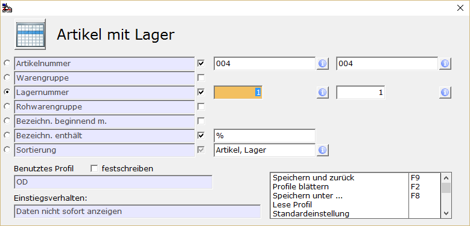

# F2-Bereichsauswahl

<!-- source: https://amic.de/hilfe/_profilebereichef2.htm -->

Die vorhandenen Profile werden in der linken Oben im Menü-Band der Auswahlliste angezeigt. Bei Profilen handelt es sich um fest eingestellte Bereichseingrenzungen des Datenmaterials, die in Verbindung mit einer Variante ausgewertet werden sollen. Für unterschiedliche immer wiederkehrende Anfragen an das System kann man einmal vorgenommene Bereichseingrenzungen unter einem Namen speichern. Um Eingrenzungen vorzunehmen und Profile zu bearbeiten, steht in Auswahllisten die Funktion ***Bereichsauswahl*** **F2** zur Verfügung. Wenn man diese Funktion betätig öffnet sich ein Dialog, in dem die möglichen Eingrenzungen des Datenmaterials abgefragt werden.

Am linken Rand kann man das Schnellauswahlkriterium markieren. Im Beispiel oben ist es die Lagernummer, die dann in der Auswahlliste direkt abgefragt werden kann. Dazu muss man als Einstiegsverhalten „Daten nicht sofort Anzeigen“ eingetragen haben, oder mit **Strg+Y** die Schnellabfrage aktivieren.

Rechts von der Bezeichnung können Auswahlbedingungen ein oder ausgeblendet werden. Ausgeblendete Auswahlbedingungen werden auch nicht im F2-Bereich der Auswahlliste angezeigt.

Der Haken bei „Benutztes Profil festschreiben“ sorgt lediglich dafür, dass die gemachten Einstellungen erst einmal nicht änderbar sind, wenn man die F2-Bereichsauswahl aufruft. Nimmt man den Haken wieder heraus, so sind die Felder wieder freigeschaltet.

| | Funktion | Beschreibung |
| --- | --- | --- |
| F9 | Speichern und Zurück | Mit **F9** wird das Profil gespeichert und man gelangt wieder in die Auswahlliste zurück.  
 |
| F8 | Speichern unter… | Für dieses Profil wird dann ein Name abgefragt (z.B. „Lager 15 „) unter dem es immer wieder abgerufen werden kann. Dieses findet man in der Auswahlliste unten links wieder. Es kann mit der Maus oder durch Angabe des vorangestellten Buchstabens gefolgt von einem Punkt aktiviert werden.  
 |
| F7 | Löschen von Profilen | Das angezeigte Profil wird gelöscht. Anschließend wird das nächste vorhandene Profil angezeigt. Sind keine weiteren Profile vorhanden, so wir das Standardprofil verwendet.  
 |
| | Lese Profil | Hiermit werden die für die aktive Variante gespeicherten Profile in einer F3-Auswahl angezeigt und können von dort ausgewählt werden.  
 |
| F2 | Profile blättern | Beim Blättern wird einfach das nächste vorhandene Profil aufgerufen.  
 |
| | Standardeinstellung | Die A.eins Standardeinstellung wird aktiviert.  
    
 |
| F6 | Einstiegsverhalten ändern | Hier wird festgelegt, was geschehen soll, wenn man eine Auswahlliste betritt. Das Einstiegsverhalten kann an mehreren Stellen festgelegt werden und zieht in folgender Reihenfolge.  
1. Die Festlegung pro Anwender im Bedienerstamm (Direktsprung **[BD]**).  
2. Sie wird vom hier festgelegten Einstiegsverhalten auf Profilebene überschrieben.  
3. Das unter „Zentrales einstiegsverhalten festlegen“ eingestellte Verhalten übersteuert alle anderen Einstellungen und gilt für alle Anwender.  
Hier wird das Einstiegsverhalten pro Profil festgelegt.  
• Daten mit dieser Auswahl sofort anzeigen. Alle Daten werden so angezeigt, wie es im Profil voreingestellt war.  
• Erst Eingrenzung abfragen und Daten anschließend anzeigen. Es öffnet sich die Bereichsauswahl und man kann die Eingrenzung vornehmen, bevor das erste Mal Daten geladen werden.  
• Daten nicht sofort Anzeigen. Es wird das Feld zur Eingabe des Schnellabfragekriteriums eingeblendet und man kann dort die Eingrenzung vornehmen. Nach Bestätigung mit der Eingabetaste werden die Daten angezeigt.  
Bei komplexen Auswahlen oder bei großem Datenmaterial sollte das Einstiegverhalten so gewählt werden, dass erst eine Eingrenzung abgefragt wird.  
 |
| Shift+F6 | Zentrales Einstiegsverhalten festlegen | Hier kann das Einstiegsverhalten für alle Anwender festgelegt werden. Es übersteuert alle von Benutzern festgelegten Einstiegsverhalten und gilt für die gesamte Variante. Ist ein zentrales Einstiegsverhalten festgelegt worden, so ändert sich die Überschrift von „Einstiegsverhalten“ auf „zentrales Einstiegsverhalten“, die Funktion „Einstiegsverhalten ändern“ wird nicht mehr angeboten und es steht zusätzlich eine Funktion „zentrales Einstiegsverhalten entfernen“ zur Verfügung.  
Diese Funktion sollte nur Administratoren zur Verfügung gestellt werden. Dies lässt sich über das A.eins-Schutzsystem bewerkstelligen.  
 |
| F10 | Schnellabfrage | Mit dieser Funktion kann das Kriterium der Schnellabfrage von z.B. Kundennummer in Kundenname geändert werden. Hierzu ist hinter in das Feld, das für die Schnellabfrage maßgeblich sein soll, zu verzweigen und dann durch Anklicken der Funktion mit der Maus oder der Taste **F10** dieses Feld als Schnellabfragefeld zu bestätigen.  
 |

Siehe auch:

- [Einrichtung der Bereichsauswahl](./einrichtung_der_bereichsauswahl.md)
- [Suchfunktionalität der Bereichsauswahl](./suchfunktionalitaet_der_bereichsauswahl.md)
- [Bereichsauswahl über JPP Vorbelegen](./bereichsauswahl_ueber_jpp_vorbelegen.md)
