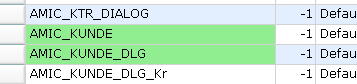
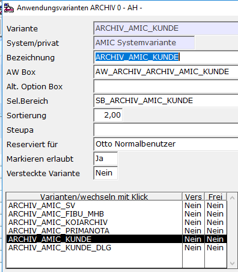

# Archiv mit der Auswahlliste 2.0

<!-- source: https://amic.de/hilfe/archivmitderauswahlliste20.htm -->

Wenn man die Auswahlliste 2.0 im [Bedienerstamm](./aktivierung_des_neuen_auswahllisten_designs.md) aktiviert hat, so werden auch die Archiv-Anwendungen mit der Auswahlliste 2.0 dargestellt. Auf der rechten Seite erscheint ein Bereich, der das Archiv-Dokument darstellt. Dieser kann genau wie vorher in der Dokumentenverwaltung ein und ausgeblendet werden. Ob die Auswahlliste diesen Bereich darstellt hängt lediglich davon ab, ob die Felder FA_ID und FA_MNDNR in der Variante existieren.

Zusätzlich entfallen für die neuen Archivanwendungen die Funktionen „Druck/Quickreport“ und „Favoriten“.

| Funktion | Beschreibung |
| --- | --- |
|   
Archiv anzeigen | Öffnet den für den Mime-Typen vom Windows-System vorgesehenen Viewer.  
Das kann für PDF-Dateien z.B. der Adobe Acrobat-Reader sein, für Mails z.B. Outlook.  
Eine detaillierte Aufstellung welche Mimetypen für die Vorschau vorgesehen bzw. implementiert sind findet sich unter [Mimetypen in A.eins](../../dokumentenverwaltung/technisches_zum_formulararchiv/mimetypen_in_a_eins.md) |
|   
Anlagen | Listet die zugehörigen Anlagen zu einem Dokument in einer eigenen Auswahlliste auf. |
|   
Senden an | Ruft den Dialog „Archiv Mail Versand“ auf.  
Im Kundenstamm gibt es diese Funktion ebenfalls als „Email senden“.  
[Archiv Mail Versand](../../dokumentenverwaltung/archiv_manager/archiv_mail_versand/index.md) |
|   
Speichern unter | Speichert die selektierten Dokumente in einen vorgebbaren Ordner. Die Dokumente erhalten die Standard-Namen bei Archiv-Export – außer es ist ein Dateiname in den Stammdaten vorgegeben.  
Bei erfolgreichem Export der Dokumente wird sich das Export-Verzeichnis sitzungsübergreifend gemerkt.  
 |
|   
Signierung  
PDF | Signieren eines PDF-Dokumentes.  
Unterstützt PDF-Signierung durch Signotec-System.  
Siehe [Signature Pad einrichten](../../dokumentenverwaltung/archiv_manager/signature_pad_einrichten/index.md) |
|   
Volltext-Menü | Bietet Schnellzugriffsmöglichkeiten auf Volltext-Funktionalitäten.  
[Archiv-Volltext](../../dokumentenverwaltung/archiv_administration/anwendung_formulararchiv/archiv_aendern_ansehen.md#ueb_archivvolltext)  
Das Feature „Volltext“ ist in A.eins Lizenz-geschützt, mit diesen Funktionen lassen sich aber die Funktion bis maximal 10 Einträge „ausprobieren“.  
Siehe Suchbereich „Volltext“, eine Aktualisierung des Datenbank-Volltext-Indexes kann manuell über [VTRU] durchgeführt werden. |
|   
Archiv-PDF-Druck | PDF-Dokument drucken  
Übergibt die selektierten Dokumente zum [PDF-Drucken](../../dokumentenverwaltung/dokumentenverwaltung_archiv_anzeigen/dokumentenverwaltung_multifunktionsleiste/pdf_drucken.md) |
| Hinzufügen | Ist in Stammdatenpfleger-Funktion übergegangen.  
[Dokumente hinzufügen](../../dokumentenverwaltung/archiv_dokumente_hinzufuegen.md) |
|   
Belegfluss | Die Belegfluss-Integration ist archivseitig angebunden. |
| Normales Druck-Icon der Auswahlliste, aber mit Archiv-Druckfunktionalität.  
Archiv-Druck | Formulararchiv drucken  
Übergibt das Dokument an Windows zum Drucken. So wird beispielsweise für PDF-Dokumente der Adobe-Reader aufgerufen der wiederum das Dokument an den Windows-Standarddrucker delegiert.  
Für PDF-Dokumente gibt es die Alternative auf der PDF-Vorschau via Kontext-Menü (rechte Maustaste) und der Funktion „Print“ das PDF an einen auswählbaren Drucker zu übergeben.  
***Hinweis: Das Drucken von PDF-Dokumenten wird mit dieser Funktion nicht mehr unterstützt da Windows die Art und Weise nicht mehr unterstützt.***  
***Für PDF-Dokumente ist daher z.B. die Funktion „Archiv-PDF-Druck“ zu verwenden.*** |

Folgende Funktionen sind noch nicht implementiert:

| Funktion | Noch nicht implementiert |
| --- | --- |
|   
Barcode zuweisen | Barcode zuweisen  
[Archiv-Barcode](../../dokumentenverwaltung/archiv_barcode.md) |

Die Umstellung der Dokumentenverwaltung in die Auswahlliste erfolgt über [Archiv-Ansichten ff.](../../dokumentenverwaltung/archiv_ansehen/archiv_ansicht_definition/index.md) [**FAA**]. Dort erkennt man an der grünen Markierung, ob schon entsprechende System-Varianten integriert sind.

Den umgestellten Archiv-Ansichten sind in der A.eins-Anwendung „Archiv“ entsprechende Varianten zugewiesen. Die Namen der Varianten entsprechen den Archiv-Ansichten-Namen mit vorgestelltem AMIC_.

Beispiel:

Für die Parameter-Einstellungen gilt das von Archiv-Ansichten gewohnte Verfahren aus [FAA].

Die Details der Archiv-Ansichten spielen bei umgestellten Archiv-Ansichten keine Rolle mehr, das wird alles über zugehörige A.eins-Variante geleistet.

Allerdings werden folgende Features im Archiv der Auswahlliste nicht mehr direkt unterstützt:

**Zusatz**

**Durchstart**

Im Rahmen der Auswahlliste machen die Einstellungen

Einsatz, Grundlage, Variante, Anwendung, Vorlage, Dialog und Vorschau keinen Sinn mehr.

Hinweis für eine technische Spezialität im Rahmen von privaten Scripten:

Mit dem Controlstring „^jpl fa_view_direkt_per_key {fa_id} {fa_mndnr}“ ist es möglich das Archiv 2.0 programmatisch (z.B. in einem Makro) mit dann anzugebener {fa_id} und {fa_mndnr} aufzurufen.

(Dieses Verfahren ist das Pendant mit dem im Zusammenhang mit dem „alten“ Archiv verwendeten bekannten und teils in privaten Scripten verwendeten Controlstring „^jpl fa_viewer_id {fa_id} [{fa_mndnr}])
