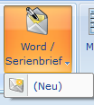
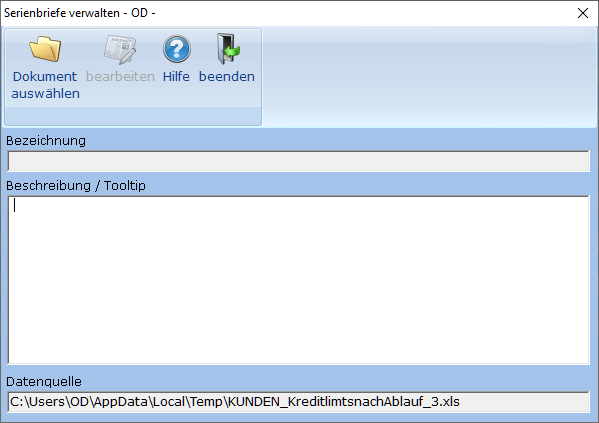
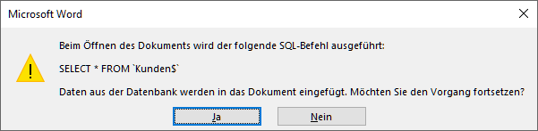
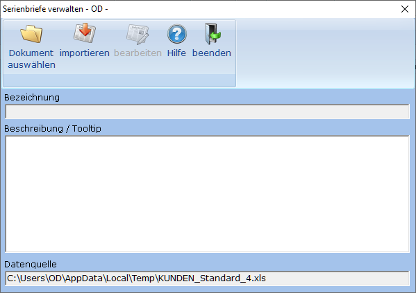

# Serienbrief neu verknüpfen

<!-- source: https://amic.de/hilfe/serienbriefneuverknpfen.htm -->

Um Serienbriefe mit einer Variante zu verknüpfen, wählt man im Menüband die Funktion „Word / Serienbrief“ auf. Ist diese Funktion deaktiviert, so liegt es entweder daran, dass keine Daten ausgewählt wurden oder daran, dass die Daten gruppiert dargestellt werden.

Es öffnet sich das Menü, bei der in der ersten Zeile die Funktion „Neu“ erscheint.

Wählt man diese Funktion aus, so öffnet sich folgender Dialog.

Schritt 1: Word Dokument auswählen. Dazu klickt man auf das Ordner-Symbol links oben oder verwendet die Funktionstaste **F3**. Es öffnet sich ein Dialog, in dem man eine existierende Datei auswählen kann oder eine neuen Dateinamen angeben kann. Wird ein nicht existierendes Document ohne Extension angegeben, so wird automatisch „docx“ verwendet. Der Name des Word-Dokumts erscheint später im Menü als Auswahlpunkt. Pro Variante muss der Name des Dokuments eindeutig sein.

**Hinweis:** Der Name des Dokuments kann später nicht mehr geändert werden.

Schritt 2: (Optional) Eine Beschreibung erfassen. Diese erscheint dann im Menü als Tiptext. Diese Beschreibung kann jederzeit geändert oder ergänzt werden. Diese Beschreibung kann mithilfe einfacher Html-Tags formatiert werden:

&lt;b>**fett**&lt;/b>

&lt;i>*kursiv*&lt;/i>

&lt;u>unterstrichen&lt;/u>

Diese Tags können auch kombiniert werden.

Schritt 3: Die Funktion ***„bearbeiten“*** im Menüband auswählen. Diese Funktion ist erst dann aktiv, wenn vorher ein Dokument augewählt wurde. Falls ein bestehendes Dokument ausgewählt wurde, wird in diesem Moment eine Kopie des Dokuments im Temp-Verzeichnis erstellt. Es wird also nicht das Original verarbeitet.

Beim öffnen des Dokuments erscheint eine Sicherheitsabfrage von Word, ob sie folgenden SQL-Befehl ausführen möchten. ‚Kunde$‘ ist dabei keine echte Datenbank-Tabelle sondern der Name des ersten Arbeitsblattes der Excel-Datei, aus der die Daten gelesen werden.

Wenn Sie auf die Seriendruckfelder zugreifen wollen, müssen sie diese Frage mit Ja beantworten. Anschließend stehen alle Spalten der bearbeiteten Variante als Seriendruckfelder zur Verfügung.

<strong>ACHTUNG:</strong> <em>Alle Änderungen werden erst gespeichert, wenn man beim Beenden des „Serienbrief verwalten“- Dialogs die Frage, ob man die Änderungen speichern will mit **Ja** bestätigt.</em>

Importieren:

Wenn man in der Vorgängerversion bereits Word-Dokumente für diese Variante erstellt hatte, so kann man diese in die neue Version übernehmen. Die Funktion „importieren“ erscheint nur in dem Fall, wenn schon Dokumente existierten.

Führt man die Funktion ***„importieren“*** – duch Ankllicken oder mit der Funktionstaste **F6** - aus , so erscheint eine F3-Auswahl, in der die Dokumente aufgelistet werden. Wählt man ein Dokument aus, so erscheint der ehemalige Titel im Feld „Word-Dokument“. Anschließend geht die bearbeitung mit [Schritt 2](../../../kasse/kassensicherungsverordnung/setup_erstinbetriebnahme_schritt_fuer_schritt_anleitung/tse_setup_schritt_2_konfiguration.md) weiter.
