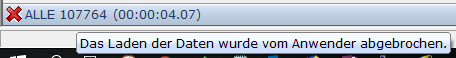
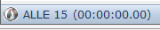
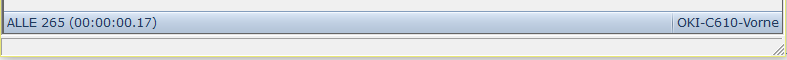

# Statuszeile

<!-- source: https://amic.de/hilfe/statuszeile.htm -->

In der Statuszeile werden folgende Informationen angezeigt:

1) Wie viele Datensätze wurden gelesen. In den Beispielen sind es 107764, 15 bzw 265.

2) Wie viele Datensätze wurden markiert. In den Beispielen unten gelten ALLE Datensätze als markiert.

3) Wurde das Laden der Daten abgebrochen? Es wird ein rotes Kreuz und zusätzlich, wenn man mit der Maus über die Anzeige geht, der Tipp-Text „Das Laden der Daten wurde vom Benutzer abgebrochen.“ angezeigt.  

4) Wie lange hat das Laden der Daten gedauert. Die Anzeige zeigt Stunden – Minuten – Sekunden und tausendstel Sekunden an. Im Beispiel ganz unten hat es 0,1700 Sekunden gedauert die Daten zu laden. Zwischen dem Laden der Daten und der Anzeige kann je nach Aufbau der Auswahlliste und der Datenmenge auch noch etwas Zeit vergehen, die hier nicht berücksichtigt wird.

5) Wenn der Steuerparameter „Auswahllisten-Refesh“ für die Anwendung aktiv ist, so erscheint nach dem ersten Refresh eine kleine Timer-Grafik, die diesen Zustand anzeigt.

6) Welcher Standarddrucker wird verwendet. Hier „OKI-C610-Vorne“

Beispiel:

