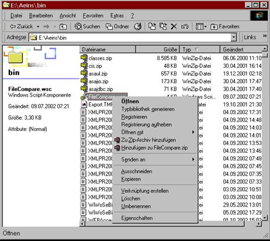

# Voraussetzungen Automation

<!-- source: https://amic.de/hilfe/voraussetzungenautomation.htm -->

Das Prozesskontrollsystem arbeitet nur im A.eins Umfeld, und es läuft nur auf einem Windows NT Rechner mit dem Betriebssystem 4.0 (SP6a) plus dem Windows Scripting Host 5.6 oder einem Windows 2000 oder Windows XP Rechner.

Zusätzlich zu dem A.eins System müssen noch zwei selbstregistrierende Objekte im System eingetragen werden, die wie folgt aktiviert werden:

Das „\\aeins\\bin\\amic.ocx“ Objekt muss mit dem Kommando

```text
regsvr32
amic.ocx
```

    
im „\\aeins\\bin“ Verzeichnis in die Registrierdatenbank eingefügt werden  
    


Weiterhin muss die Datei FileCompare.wsc aus dem Bin Verzeichnis mit dem Kontextmenü des Explorers (Rechte Maustaste auf dieser Datei) registriert werden.  

