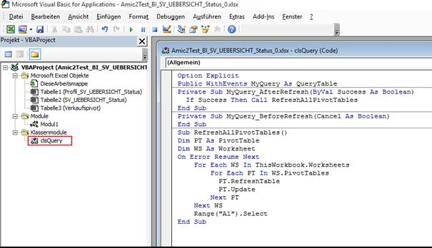
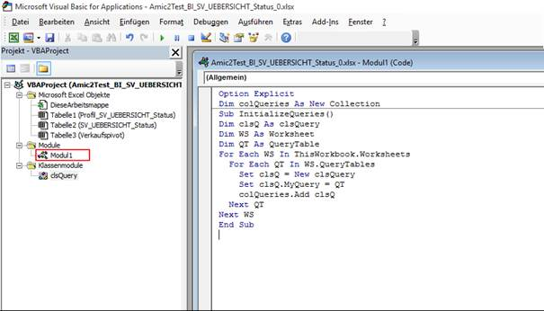
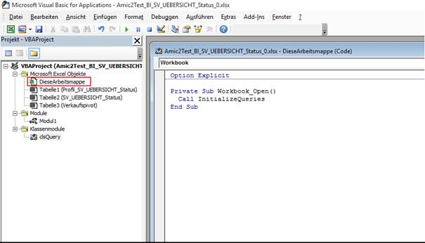

# Automatisches Refresh beim Pivotelement.

<!-- source: https://amic.de/hilfe/automatischesrefreshbeimpivote.htm -->

Das Automatische Refresh der Pivot-elemente ist keine Standardfunktion des Excel System, hierzu muss ein kleines VBA Script geschrieben werden. Dieses VBA Script wird dann an das Ereignis „AfterQueryDataRefresh“ gebunden, so dass immer nach erfolgtem Datenlesen sofort die Pivot-Tabelle auf einen richtigen Stand gebracht wird.

Hierzu ist zunächst in den Menüoptionen die Menüleiste „Entwicklertools“ einzuschalten, um dann den Bereich VBA anzuwählen.


Als nächstes ist per INSERT (Einfügen) eine neue Klasse zu bilden. Diese Klasse MUSS sofort umbenannt werden, in meinem Beispiel in clsQuery. Folgender Inhalt muss in diese Klasse eingetragen werden:



```vbnet
Option Explicit
Public WithEvents MyQuery As QueryTable
Private Sub MyQuery_AfterRefresh(ByVal Success As
Boolean)
  If Success Then Call RefreshAllPivotTables
End Sub
Private Sub MyQuery_BeforeRefresh(Cancel As
Boolean)
End Sub
Sub RefreshAllPivotTables()
Dim PT As PivotTable
Dim WS As Worksheet
On Error Resume Next
    For Each WS In
ThisWorkbook.Worksheets
        For Each PT
In WS.PivotTables
PT.RefreshTable
PT.Update
        Next PT
    Next WS
    Range("A1").Select
End Sub
```

Danach muss ein Modul mit folgendem Inhalt erzeugt werden:



```vbnet
Option Explicit
Dim colQueries As New Collection
Sub InitializeQueries()
Dim clsQ As clsQuery
Dim WS As Worksheet
Dim QT As QueryTable
For Each WS In ThisWorkbook.Worksheets
  For Each QT In WS.QueryTables
    Set clsQ = New clsQuery
    Set clsQ.MyQuery = QT
    colQueries.Add clsQ
  Next QT
Next WS
End Sub
```

Und zum Schluss muss nun dieses Modul in die Startphase der Excel Mappe eingebunden werden:



```vbnet
Option Explicit
Private Sub Workbook_Open()
  Call InitializeQueries
End Sub
```

Ist all dieses so eingerichtet und ist die [Sicherheit in dem System](../sicherheitsrelevante_einstellungen_im_excel_umfeld.md) auf „Erlaubnis der Ausführung von Makros“ erteilt, so wird nun die Excel Mappe immer nach Laden der Daten auch alle Pivot Elemente mit neuen Inhalten versehen.

<p class="siehe-auch">Siehe auch:</p>

- [Beispiel eines „erweiterten Filters“](./beispiel_eines_erweiterten_filters.md)
- [Beispiel eines Lookup Befehls](./beispiel_eines_lookup_befehls.md)
- [Beispiel einer Pie Chart Einbindung](./beispiel_einer_pie_chart_einbindung.md)
