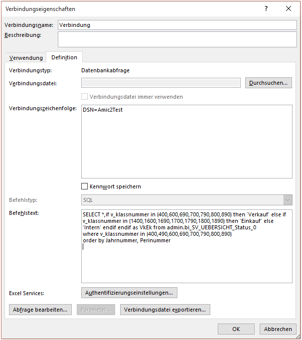

# Hinzufügen von Bedingungen auf Basis dieser BI

<!-- source: https://amic.de/hilfe/hinzufgenvonbedingungenaufbasi.htm -->

Es kann auch sinnvoll sein, innerhalb eine Mappe mehrfach auf eine BI zuzugreifen, wobei jeweils andere Filterkriterien wirken, soll z.B. einmal eine Verkaufsübersicht und gleichzeitig daneben eine Einkaufsübersicht gebaut werden, so kann per einfachem kopieren des gesamten Tabellenblattes und einfügen einer where Bedingung eine Filterung der Daten erreicht werden.

Hierzu wird einfach der Befehlstext in den Verbindungseigenschaften um die Bedingung erweitert, auch kann hier wie im Beispiel zu sehen ist eine Sortiervorgabe angegeben werden:  
    

```sql
SELECT *
from
admin.bi_SV_UEBERSICHT_Status_0
where v_klassnummer in
(400,490,600,690,700,790,800,890)
order by
Jahrnummer, Perinummer
```


