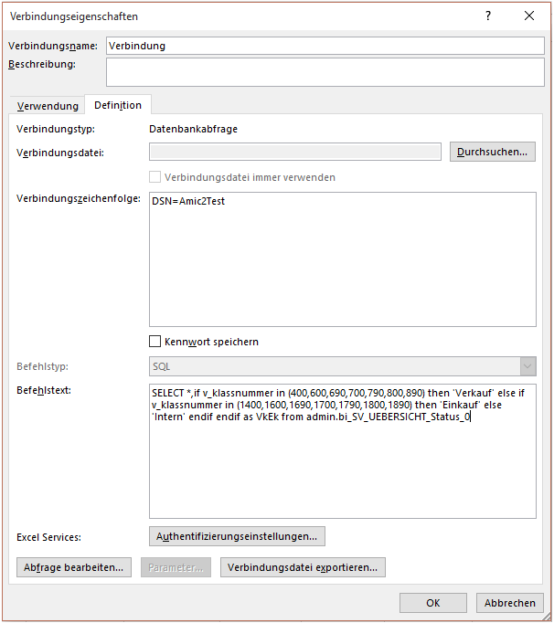

# Hinzufügen von weiteren Feldern auf Basis dieser BI

<!-- source: https://amic.de/hilfe/hinzufgenvonweiterenfeldernauf.htm -->

Es kann nun vorkommen, dass zusätzlich zu den in der Query vorhandenen Felder noch weitere definiert werden sollen, die in Auswertungen wie z.B. Pivot zur Verfügung stehen sollen. Hierbei soll es sich um Felder handeln, die als „berechnete“ Felder von vorhandenen Feldern oder Informationen arbeiten sollen.

Hierzu wird einfach der Befehlstext in den Verbindungseigenschaften um besagte Felder erweitert. In folgendem Beispiel soll alles was zur Vorgangsklasse &lt; 1000 gehört mit dem Text Verkauf und alles andere mit dem Text Einkauf versehen werden, um ein Pivot Einkauf/Verkauf zu gestalten. Dazu wird einfach der Befehlstext wie folgt angepasst:

```sql
SELECT
*,if v_klassnummer in (400,600,690,700,790,800,890) then 'Verkauf' else if
v_klassnummer in (1400,1600,1690,1700,1790,1800,1890) then 'Einkauf' else
'Intern' endif endif as VkEk
from
admin.bi_SV_UEBERSICHT_Status_0
```


