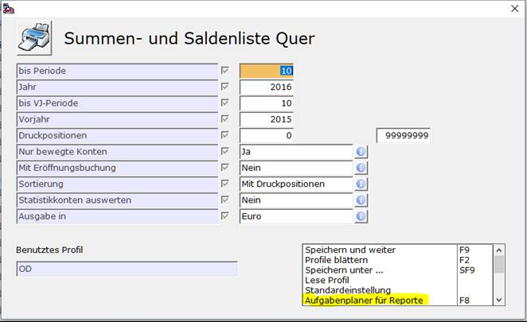
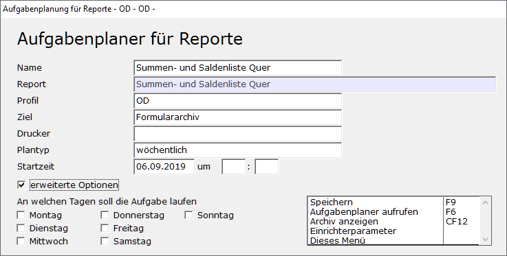
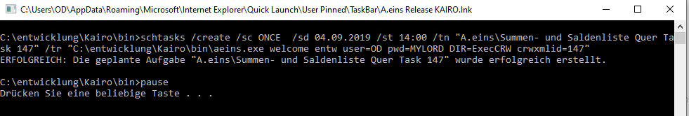
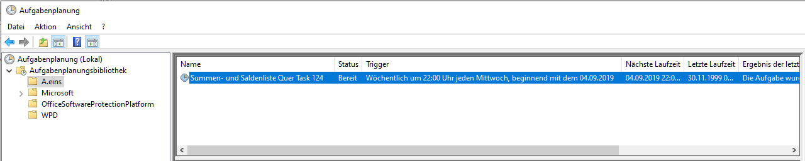

# Aufgabenplaner für Reporte

<!-- source: https://amic.de/hilfe/aufgabenplanerfrreporte.htm -->

Die Erstellung eines Reports kann einige Zeit in Anspruch nehmen. Unter Umständen ist eine Menge an Daten zu sammeln und die Last der Datensuche behindert Anwender bei der Arbeit mit A.eins. Der Aufgabenplaner erstellt für die Windows-Aufgabenplanung einen Eintrag. Voraussetzung dafür, dass der Report zu der angegebenen Zeit ausgeführt wird, ist daher, dass der eigene Rechner zu dem Zeitpunkt läuft und der Anwender angemeldet ist – der Rechner kann natürlich trotzdem gesperrt sein.

Den Aufgabenplaner erreicht man, indem man von der Bereichsauswahl des Reports - oder direkt in der Vorschau des Crystal Reports - die Funktion „***Aufgabenplaner für Reporte***“ **F8** aufruft.

Daraufhin öffnet sich ein weiterer Dialog, in dem man angibt, wann der Report erstellt werden soll.

| **Feld** | **Bedeutung** |
| --- | --- |
| Name | Der Name der Aufgabe wird mit der Bezeichnung des Reports vorbelegt. Dieser Name erscheint in Aufgabenplanung von Windows im Ordner A.eins. Damit dieser Name auf jeden Fall eindeutig ist, wird noch „Task 123“ an den Text angerhängt, wobei die Zahl jeweils weitergezählt wird. Diese Zahl entspricht der Ident des Eintrags in der Tabelle ANWENDREPORTXML. Dort werden die Einstellungen, die man im Profil vorgenommen hat, gespeichert.  |
| Report | Bezeichnung des Reports, den man gerade bearbeitet.  |
| Profil | Name des Profils – dieses Feld ist vorbelegt mit dem Namen des Profils, mit dem der Report aufgerufen wurde. Man kann hier noch ein anderes Profil angeben, welches jedoch schon existieren muss.  |
| Ziel | • Formulararchiv • Drucker • Webseite  |
| Drucker | (nur wenn Ziel Drucker) der Name der Printerqueue, auf der gedruckt werden soll  |
| Plantyp | • Einmalig • Täglich • Wöchentlich • Monatlich   |
| Startzeit | Hier wird angegeben, an welchem Tag und um wieviel Uhr diese Aufgabe ausgeführt werden soll.  |
| Erweiterte Optionen | Unter den erweiterten Optionen kann noch der Wochentag ausgewählt werden, an dem die Aufgabe laufen soll. Diese Option steht nur zur Verfügung, wenn als Plantyp „wöchentlich“ oder „monatlich“ ausgewählt wurde.  |

Wenn man dann die Aufgabe mit der Funktion „***Speichern***“ **F9** erstellt, so öffnet sich ein Fenster in dem angezeigt wird, dass die neue Aufgabe erfolgreich erstellt wurde.

Diese Aufgabe findet man jetzt in der **Aufgabenplanung** von Windows in der Planungsbibliothek A.eins. Dort kann man kontrollieren, wann die Aufgabe gelaufen ist, sie beenden, löschen usw.

Zusatzfunktionen

***Aufgabenplaner aufrufen* F6:** Diese Funktion steht dann zur Verfügung, wenn der Anwender eigene Aufgaben aus A.eins heraus erstellt hat.

***Archiv anzeigen*** **Strg+F12**: Sobald für den Anwender Archiveinträge zu diesem Report existieren, die aus dem Aufgabenplaner heraus erstellt wurden, gelangt man von hier in die Archiv-Ansicht.
