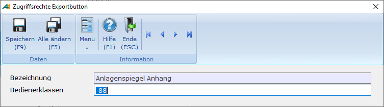

# Basisdaten

<!-- source: https://amic.de/hilfe/basisdaten.htm -->

Hauptmenü > Administration > Werkzeuge > Anwendung Reports > Register Allgemein

Direktsprung **[ANWR]**.

Auf dem Register **Allgemein** befinden sich folgen Eingabefelder

| Feld | Bedeutung |
| --- | --- |
| Auswahlbereich | Hier wird die Bezeichnung des Auswahlbereichs, der dann mit **F6** bearbeitet werden kann, eingetragen.  
 |
| Vorlauf-OptBox | Hier kann man eine zusätzliche Optionbox angeben. Sie wird dann zusätzlich zu den Standardfunktionen angezeigt. Diese kann z.B. einen speziellen Hilfe-Aufruf oder Funktionen zum Aufruf von Stammdatenpflegern enthalten.  
 |
| Vorlauf-Funktion | JPL-Funktion (\*.j), mit deren Hilfe Daten aufgesammelt oder Tests durchgeführt werden können. Wird von der [Funktion](../spezielle_vorlauf_funktion.md) ein Wert ungleich 0 (S_OK) zurückgeliefert, wird der Report nicht gestartet.  
 |
| Formatierte Eingabe | Hiermit wird festgelegt, welcher Art die Vorlauffunktion ist. Es existieren die Ausprägungen “Ohne Vorlauf“ und „jpl Aufruf maskenlos“.  
 |
| Nachlauf-Funktion | Ist hier eine JPL-Funktion (\*.j) eingetragen, so wird diese nach Beendigung des Reports aufgerufen.  
 |
| Reportviews | Die Daten eines Reports sollen über Views zusammengesucht werden. In diesen Views können dann auch die Eingrenzungen vorgenommen werden.  
 |
| Status | Entwicklungsstatus  
 |
| Export-Verzeichnis | Hier kann ein Verzeichnis angegeben werden, auf dem der Export dieses Reports geschrieben werden soll. Dieses Feld wird nicht ausgeliefert und auch nicht beim Kunden überschrieben. Ist kein Verzeichnis angegeben, werden die Dateien in das Verzeichnis „Crystalexport“ geschrieben.  
 |
| Zugriffsschutz für Exportbutton | Hier kann über die in A.eins üblichen Schutzmechanismen der Exportbutton, der sich links oben im Anzeigebereich des Reports befindet, weggeschützt werden. Für den Crystal Report Version 13.0.2000.0 besteht zusätzlich die Möglichkeit für alle Reporte den Exportbutton dadurch zu schützen, dass man die Funktion „Export“ im Rechte-Maustaste-Menü schützt.  
 |

Hauptmenü > Administration > Firmenkonstanten > Zugriffsrechte Reporte

Direktsprung **[ZUGR]**.

Der Schutz des Exportbuttons kann in dieser Anwendung pro Report geändert werden.

