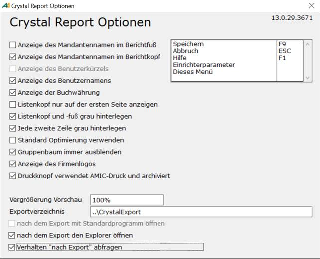
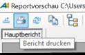

# Crystal Report Optionen

<!-- source: https://amic.de/hilfe/crystalreportoptionen.htm -->

Hauptmenü > Administration > Werkzeuge > Anwendung Reports > Funktion ***CRW-Optionen F10***

Direktsprung **[ANWR]**.

Die Darstellung der Reporte kann bis zu einem bestimmten Grad vom Kunden angepasst werden. Dazu dienen die Crystal Report Optionen die man im Vorschaumodus des Reports in der Optionbox unter ***CRW-Optionen Shift-F11*** findet:

Die hier gemachten Einstellungen gelten für den gesamten Mandanten.

| | Bedeutung |
| --- | --- |
| Anzeige des Mandantennamen im Berichtskopf/ Berichtsfuß | Die Bezeichnung des Mandanten, die im Mandantenstamm eingetragen ist, kann sowohl im Kopfbereich als auch in der Fußzeile ausgegeben werden.  
 |
| Anzeige des Benutzerkürzels/des Benutzernamens | Man kann auswählen, ob das Benutzerkürzel, mit dem man sich anmeldet oder der Name ausgegeben wird.  
 |
| Anzeige der Buchwährung | im Berichtskopf eine Zeile mit „Buchwährung …“ steht, in der die aktuelle Buchwährung ausgegeben wird.  
 |
| Listenkopf nur auf der ersten Seite anzeigen | Der Listenkopf kann neben der Bezeichnung auch noch diverse andere Informationen enthalten und somit viel Platz einnehmen. Daher kann es wünschenswert sein, diesen nur auf der ersten Seite anzuzeigen und nicht auf jeder Seite zu wiederholen.  
 |
| Listenkopf und –fuß grau einfärben | Der Listenkopf und Fuß kann optisch durch Einfärbung vom Rest des Berichts abgehoben werden. Sollte es auf dem verwendeten Drucker dadurch unleserlich werden, so kann man auf die Einfärbung hier verzichten.  
 |
| Jede zweite Zeile grau hinterlegen | Bei langen Listen oder bei Listen, bei denen die Informationen über mehrere Zeilen geht, kann die Übersichtlichkeit durch einfärben jeder zweiten Zeile erhöht werden  
 |
| Standardoptimierung verwenden | Die SQL-Abfragen werden im A.eins-Standard daraufhin optimiert, dass der erste Datensatz möglichst schnell zur Verfügung steht. Wird das Häkchen entfernt, dann ist das Ziel alle Datensätze möglichst schnell zu erhalten  
 |
| Gruppenbaum immer ausblenden | Wenn ein Report gruppiert ist, wird an der linken Seite ein Gruppenbaum angezeigt. Soll dieser nicht sichtbar sein, so muss man hier den Haken setzen.  
 |
| Druckknopf verwendet AMIC-Druck und archiviert | Reporte können nur archiviert werden, wenn die Druckfunktion von AMIC verwendet wird.  
Im Vorschaufenster befindet sich oben links ein Druckersymbol; dieses wird hier als Druckknopf bezeichnet.  
  
Für diesen Knopf lässt sich mit dieser Option einstellen, ob der AMIC-Druck verwendet wird oder der Crystal-Druck. Mit der Mechanik von Crystal lässt sich der Druck auf den ausgewählten Bereich beschränken (Stichwort Unterbericht), jedoch nicht archivieren.  
Der Druck über die Funktion ***Drucken* F4** verwendet immer den AMIC-Druck und archiviert den Report laut Einstellung.  
 |
| Anzeige des Firmenlogos | Ist der Haken gesetzt, wird in den dafür vorgesehenen Reporten das im Mandantenstamm hinterlegte Firmenlogo angezeigt!  
 |
| Vergrößerung Vorschau | Die Vorschau startet immer mit der hier vorgenommenen Einstellung, kann jedoch nach wie vor im Menü des Vorschaufensters geändert werden.  
 |
| Exportverzeichnis | Wird hier nichts anderes eingestellt, so ist das Verzeichnis ..\\Crystalexport. Wenn dieses Verzeichnis geändert wird, so gilt es für alle Anwender und es ist sicher zu stellen, dass alle Anwender Zugriff auf dieses Verzeichnis haben. Zusätzlich existiert die Möglichkeit für jeden Report ein eigenes [Exportverzeichnis](./crystal_report_definieren/basisdaten.md) anzugeben. Diese Möglichkeit übersteuert die hier gemachte Einstellung.  
 |

Die folgenden vier Einstellungsmöglichkeiten existieren nur für die Crystal-Report ab Version 13.0.2000.0

| | Bedeutung |
| --- | --- |
| Nach dem Export mit Standardprogramm öffnen | In der Bereichsauswahl, die sich öffnet, bevor die Vorschau startet, existieren diverse Funktionen um die Daten direkt – ohne Umweg über die Vorschau – zu exportieren. Hier kann eingestellt werden, was nach dem Export geschehen soll. Diese Optionen gilt - wie alle anderen Optionen - für alle A.eins-Anwender. Wurde jedoch bei „Verhalten nach Report abfragen“ ein Haken gesetzt, so gilt die vom Anwender in der Abfragemaske gemachte Einstellung nur für ihn.  
 |
| Nach dem Export den Explorer öffnen |
| Verhalten "nach Export" abfragen |
