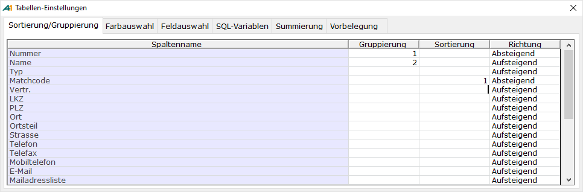

# Sortierung der Auswahlliste

<!-- source: https://amic.de/hilfe/sortierungderauswahlliste.htm -->

A.eins bietet die Möglichkeit Auswahlliste oder F3-Auswahl nach mehreren Spalten in beliebiger Reihenfolge auf- oder absteigend zu sortieren. Eine Sortierung für Auswahllisten oder F3-Auswahl, deren Select-Statement aus einer Vereinigung (UNION) besteht, ist nicht möglich.

In der Auswahlliste 2.0 wird diese Maske über das Darstellungsregister aufgerufen. Sortierungen in der F3-Auswahl 2.0 werden direkt durch Klicken in die Titelzeile angegeben. Die Gruppierung wird nur in der Auswahlliste 2.0 ausgewertet.

Um eine Auswahlliste oder eine F3-Auswahl im alten Design zu sortieren, kann über einen Mausklick auf eine Spaltenüberschrift die Sortierungsmaske aufgerufen und dort die Sortierung festgelegt werden. Hier wird die angewählte Spalte automatisch der Sortierung/Gruppierung in aufsteigender Richtung mit dem maximalen Index +1 hinzugefügt.

Folgende Felder werden in der Sortierungsmaske angezeigt:

| | **Bedeutung** |
| --- | --- |
| Spaltenname | Titel der Spalte in der Auswahlliste  
 |
| Gruppierung | Die hier ausgewählten Spalten werden automatisch in die Gruppierung-Zeile der Auswahlliste 2.0 in Reihenfolge des Aufsteigenden Indexes übernommen. Der Index für eine Gruppierung muss eine positive Zahl größer 0 sein und kann für eine Sortierung nur einmal verwendet werden. Zur Gruppierung kann auch eine Richtung angegeben werden.  
Die alte Auswahlliste ignoriert die hier angegebenen Werte.  
 |
| Sortierung | Index für das Feld bei der Sortierung. Felder, die bereits in der Gruppierung verwendet werden, werden für die Sortierung ignoriert. Die Auswahlliste oder F3-Auswahl wird nach den Feldern in der Reihenfolge des aufsteigenden Index sortiert. Felder ohne Index werden bei der Sortierung nicht berücksichtigt. Der Index für eine Sortierung muss eine positive Zahl größer 0 sein und kann für eine Sortierung nur einmal verwendet werden.  
 |
| Richtung | Richtung der Sortierung und Gruppierung für die Spalte.  
 |

Sortierung/Gruppierung löschen

Im Dialog kann die Sortierung für die darunter liegende Anwendungsvariante gelöscht (Funktion „Sortierung Löschen“ F7) werden.
