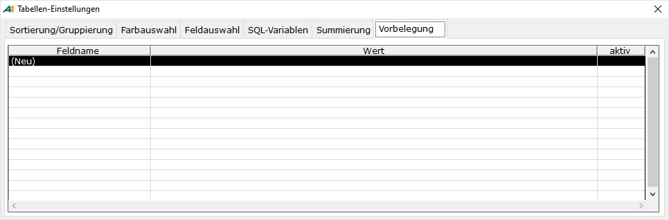
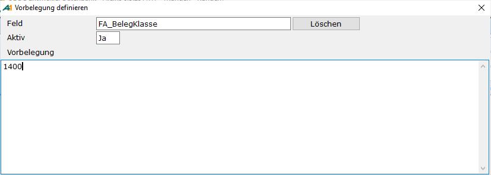
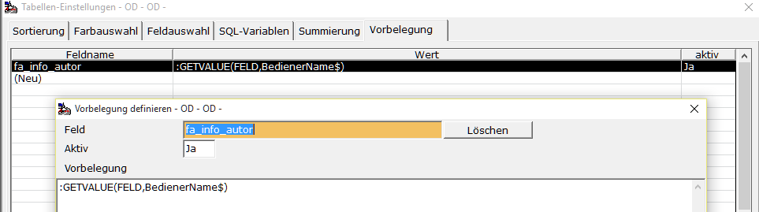
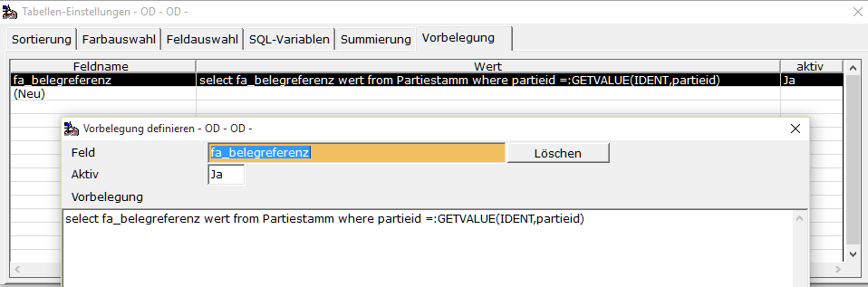
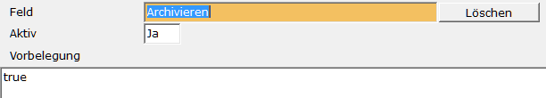

# Vorbelegung im Gestaltungsdialog

<!-- source: https://amic.de/hilfe/vorbelegungimgestaltungsdialog.htm -->

Für Archivanwendungen steht die Funktion „Vorbelegung“ zur Verfügung. Wählt man diese an, so öffnet sich der Gestaltungsdialog und man steht sofort auf dem Reiter „Vorbelegung“:

Dort werden die selbst definierten Vorbelegungen angezeigt. Diese Vorbelegungen überschreiben ggf. die von AMIC vorgegebenen Werte. Um eine Vorbelegung zu ändern, klickt man in die Zeile, um eine neue Vorbelegung anzulegen, klickt man auf „(Neu)“. In dem sich dort öffnenden Dialog kann man folgende Werte eingeben:

| | **Bedeutung** |
| --- | --- |
| Feld | Name des Feldes, welches vorbelegt werden kann. Eine Auswahl ist mit F3 möglich.  
 |
| Aktiv | Wenn ein Feld momentan nicht verwendet werden soll, aber die Arbeit, die in die Formulierung gesteckt wurde, nicht über den Haufen geworfen werden soll, so kann man hier die Vorbelegung für das Feld einfach deaktivieren. Sie wird dann komplett ignoriert.  
 |
| Vorbelegung | Hier steht der Wert, der auf der Erfassungsmaske bei Neuerfassung dem Feld zugewiesen werden soll. Dies kann sein:  
1. Eine Konstante:  
ein Beispiel wäre, dass man die Belegklasse vorgibt:  
  
2. Der neue Befehl GETVALUE. Vor dem Schlüsselwort muss ein Doppelpunkt stehen:  
• GETVALUE (**IDENT**,fibuv_id) : Holt aus der Auswahlliste, aus der das Archiv aufgerufen wurde, den unter IDENT angegebenen Wert. In diesem Beispiel wäre es die Fibuv_id.  
• GETVALUE (**RETURN**,kundnummer): Holt sich den Wert eines Feldes aus der Auswahlliste, aus dem das Archiv aufgerufen wurde. Er muss nicht unbedingt mit „RETURN“ definiert sein, aber dann als Spalte – diese kann auch versteckt (FIELD,,,,HIDDEN) sein - in der Auswahl existieren. Ist das Feld in der RETURN-Liste angegeben, braucht man keine verstecke Spalte.  
• GETVALUE (**FELD**,k.KontoNummer$): Wird das Archiv aus einer Erfassungsmaske heraus aufgerufen, so kann man auf die Felder dieser Maske zugreifen. Beim Namen des Feldes ist Groß- und Kleinschreibung zu beachten.  
• GETVALUE (**SVMAIN**,ID_FA_BELEGREFERENZ) bzw.  
GETVALUE (**CEMAIN**,ID_KUNDNUMMER): Holt sich die Werte aus dem Warenwirtschaftskontext.  
  
   
3. Ein vollständiges SQL-Statement. Dabei kann natürlich mit GETVALUE auf Werte zugegriffen werden.  
 |

In diesem Auswahldialog werden neben den Feldern für das Archiv auch zusätzliche Information für den Report angeboten.

• Archivieren: Man kann für die Variante festlegen, ob beim Neuerstellen eines Auswahllisten-Reports der Haken für das Archivieren gesetzt ist.  
  
    

• ReportFinished: Wenn ein Report gedruckt wird, wird im Anschluss daran die hier eingetragene Datenbankfunktion aufgerufen.

• ReportInfo: [Individuelle zusätzliche Information](../../auswahlliste_2_0/reporte_bearbeiten.md#IndividuelleInformation) für den Reportdruck.
