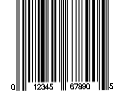
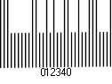
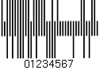
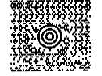

# Einfügen

<!-- source: https://amic.de/hilfe/_dokumenthilfe_einf.htm -->

Seiten:

| Funktion | Beschreibung |
| --- | --- |
| Leere Seite | Fügt eine Leere Seite ein |
| Seitenumbruch | Setzt einen Seitenumbruch an die gewünschte Zeile |

Tabellen:

| Funktion | Beschreibung |
| --- | --- |
| Tabelle | Fügt eine Tabelle mit der gewünschten Dimension ein |

Illustrationen:

<table class="AMIC-Tabelle" style="WIDTH: 100%; BORDER-COLLAPSE: collapse" cellspacing="0" cellpadding="0" width="100%" border="0"><tbody><tr><td style="WIDTH: 141.75pt; BACKGROUND: #005d5b; PADDING-BOTTOM: 0pt; PADDING-TOP: 0pt; PADDING-LEFT: 5.4pt; PADDING-RIGHT: 5.4pt" width="189">
Funktion
</td><td style="WIDTH: 978pt; BACKGROUND: #005d5b; PADDING-BOTTOM: 0pt; PADDING-TOP: 0pt; PADDING-LEFT: 5.4pt; PADDING-RIGHT: 5.4pt" width="1304">
Beschreibung
</td></tr><tr><td style="BORDER-TOP: medium none; BORDER-RIGHT: white 1.5pt solid; WIDTH: 141.75pt; BACKGROUND: #bad9d9; BORDER-BOTTOM: medium none; PADDING-BOTTOM: 0pt; PADDING-TOP: 0pt; PADDING-LEFT: 5.4pt; BORDER-LEFT: medium none; PADDING-RIGHT: 5.4pt" valign="top" width="189">
Bild
</td><td style="BORDER-TOP: medium none; BORDER-RIGHT: medium none; WIDTH: 978pt; BACKGROUND: #bad9d9; BORDER-BOTTOM: medium none; PADDING-BOTTOM: 0pt; PADDING-TOP: 0pt; PADDING-LEFT: 5.4pt; BORDER-LEFT: medium none; PADDING-RIGHT: 5.4pt" valign="top" width="1304">
Öffnet einen Dialog zum auswählen eines Bildes

Setzt einen Paltzhalter, welcher später über A.eins gefüllt warden kann
</td></tr><tr><td style="BORDER-TOP: medium none; BORDER-RIGHT: white 1.5pt solid; WIDTH: 141.75pt; BACKGROUND: #eff7f7; BORDER-BOTTOM: medium none; PADDING-BOTTOM: 0pt; PADDING-TOP: 0pt; PADDING-LEFT: 5.4pt; BORDER-LEFT: medium none; PADDING-RIGHT: 5.4pt" valign="top" width="189">
Diagram
</td><td style="BORDER-TOP: medium none; BORDER-RIGHT: medium none; WIDTH: 978pt; BACKGROUND: #eff7f7; BORDER-BOTTOM: medium none; PADDING-BOTTOM: 0pt; PADDING-TOP: 0pt; PADDING-LEFT: 5.4pt; BORDER-LEFT: medium none; PADDING-RIGHT: 5.4pt" valign="top" width="1304">
Spalte

Linie

Kreis

Balken

Fläche

Punkt

Kurs

Netz
</td></tr><tr><td style="BORDER-TOP: medium none; BORDER-RIGHT: white 1.5pt solid; WIDTH: 141.75pt; BACKGROUND: #bad9d9; BORDER-BOTTOM: medium none; PADDING-BOTTOM: 0pt; PADDING-TOP: 0pt; PADDING-LEFT: 5.4pt; BORDER-LEFT: medium none; PADDING-RIGHT: 5.4pt" valign="top" width="189">
Form
</td><td style="BORDER-TOP: medium none; BORDER-RIGHT: medium none; WIDTH: 978pt; BACKGROUND: #bad9d9; BORDER-BOTTOM: medium none; PADDING-BOTTOM: 0pt; PADDING-TOP: 0pt; PADDING-LEFT: 5.4pt; BORDER-LEFT: medium none; PADDING-RIGHT: 5.4pt" valign="top" width="1304">
Linien

Rechtecke

Standardformen

Blockpfeile

Formelform

Flussdiagramm

Sterne und Banner

Legenden

Bereich erstellen

Bereiche ein/ausblenden
</td></tr><tr><td style="BORDER-TOP: medium none; BORDER-RIGHT: white 1.5pt solid; WIDTH: 141.75pt; BACKGROUND: #eff7f7; BORDER-BOTTOM: medium none; PADDING-BOTTOM: 0pt; PADDING-TOP: 0pt; PADDING-LEFT: 5.4pt; BORDER-LEFT: medium none; PADDING-RIGHT: 5.4pt" valign="top" width="189">
Strichcode
</td><td style="BORDER-TOP: medium none; BORDER-RIGHT: medium none; WIDTH: 978pt; BACKGROUND: #eff7f7; BORDER-BOTTOM: medium none; PADDING-BOTTOM: 0pt; PADDING-TOP: 0pt; PADDING-LEFT: 5.4pt; BORDER-LEFT: medium none; PADDING-RIGHT: 5.4pt" valign="top" width="1304">
<a class="topic-link" href="./qr_code_beispiele_zum_dynamischen_laden.md">Anleitung zum Dynamischen laden eines QR-Codes in A.eins</a>
<table class="AMICOlavsTabelle" style="WIDTH: 100%; BORDER-COLLAPSE: collapse" cellspacing="0" cellpadding="0" width="100%" border="0"><tbody><tr><td style="WIDTH: 146.65pt; PADDING-BOTTOM: 0pt; PADDING-TOP: 0pt; PADDING-LEFT: 5.4pt; PADDING-RIGHT: 5.4pt" valign="top" width="196">QRCode</td><td style="WIDTH: 99.2pt; PADDING-BOTTOM: 0pt; PADDING-TOP: 0pt; PADDING-LEFT: 5.4pt; PADDING-RIGHT: 5.4pt" valign="top" width="132"></td><td style="WIDTH: 512.9pt; PADDING-BOTTOM: 0pt; PADDING-TOP: 0pt; PADDING-LEFT: 5.4pt; PADDING-RIGHT: 5.4pt" valign="top" width="684">Bis zu 1270 ASCII-Werte oder 1850 alphanumerische Werte</td></tr><tr><td style="WIDTH: 146.65pt; PADDING-BOTTOM: 0pt; PADDING-TOP: 0pt; PADDING-LEFT: 5.4pt; PADDING-RIGHT: 5.4pt" valign="top" width="196">Code128</td><td style="WIDTH: 99.2pt; PADDING-BOTTOM: 0pt; PADDING-TOP: 0pt; PADDING-LEFT: 5.4pt; PADDING-RIGHT: 5.4pt" valign="top" width="132"></td><td style="WIDTH: 512.9pt; PADDING-BOTTOM: 0pt; PADDING-TOP: 0pt; PADDING-LEFT: 5.4pt; PADDING-RIGHT: 5.4pt" valign="top" width="684"></td></tr><tr><td style="WIDTH: 146.65pt; PADDING-BOTTOM: 0pt; PADDING-TOP: 0pt; PADDING-LEFT: 5.4pt; PADDING-RIGHT: 5.4pt" valign="top" width="196">EAN13</td><td style="WIDTH: 99.2pt; PADDING-BOTTOM: 0pt; PADDING-TOP: 0pt; PADDING-LEFT: 5.4pt; PADDING-RIGHT: 5.4pt" valign="top" width="132"></td><td style="WIDTH: 512.9pt; PADDING-BOTTOM: 0pt; PADDING-TOP: 0pt; PADDING-LEFT: 5.4pt; PADDING-RIGHT: 5.4pt" valign="top" width="684">13 Ziffern</td></tr><tr><td style="WIDTH: 146.65pt; PADDING-BOTTOM: 0pt; PADDING-TOP: 0pt; PADDING-LEFT: 5.4pt; PADDING-RIGHT: 5.4pt" valign="top" width="196">UPCA</td><td style="WIDTH: 99.2pt; PADDING-BOTTOM: 0pt; PADDING-TOP: 0pt; PADDING-LEFT: 5.4pt; PADDING-RIGHT: 5.4pt" valign="top" width="132"></td><td style="WIDTH: 512.9pt; PADDING-BOTTOM: 0pt; PADDING-TOP: 0pt; PADDING-LEFT: 5.4pt; PADDING-RIGHT: 5.4pt" valign="top" width="684">12 Ziffern</td></tr><tr><td style="WIDTH: 146.65pt; PADDING-BOTTOM: 0pt; PADDING-TOP: 0pt; PADDING-LEFT: 5.4pt; PADDING-RIGHT: 5.4pt" valign="top" width="196">EAN8</td><td style="WIDTH: 99.2pt; PADDING-BOTTOM: 0pt; PADDING-TOP: 0pt; PADDING-LEFT: 5.4pt; PADDING-RIGHT: 5.4pt" valign="top" width="132"></td><td style="WIDTH: 512.9pt; PADDING-BOTTOM: 0pt; PADDING-TOP: 0pt; PADDING-LEFT: 5.4pt; PADDING-RIGHT: 5.4pt" valign="top" width="684">8 Ziffern</td></tr><tr><td style="WIDTH: 146.65pt; PADDING-BOTTOM: 0pt; PADDING-TOP: 0pt; PADDING-LEFT: 5.4pt; PADDING-RIGHT: 5.4pt" valign="top" width="196">Interleaved2of5</td><td style="WIDTH: 99.2pt; PADDING-BOTTOM: 0pt; PADDING-TOP: 0pt; PADDING-LEFT: 5.4pt; PADDING-RIGHT: 5.4pt" valign="top" width="132"></td><td style="WIDTH: 512.9pt; PADDING-BOTTOM: 0pt; PADDING-TOP: 0pt; PADDING-LEFT: 5.4pt; PADDING-RIGHT: 5.4pt" valign="top" width="684">nur Ziffern</td></tr><tr><td style="WIDTH: 146.65pt; PADDING-BOTTOM: 0pt; PADDING-TOP: 0pt; PADDING-LEFT: 5.4pt; PADDING-RIGHT: 5.4pt" valign="top" width="196">Postnet</td><td style="WIDTH: 99.2pt; PADDING-BOTTOM: 0pt; PADDING-TOP: 0pt; PADDING-LEFT: 5.4pt; PADDING-RIGHT: 5.4pt" valign="top" width="132"></td><td style="WIDTH: 512.9pt; PADDING-BOTTOM: 0pt; PADDING-TOP: 0pt; PADDING-LEFT: 5.4pt; PADDING-RIGHT: 5.4pt" valign="top" width="684">Postleitzahlen</td></tr><tr><td style="WIDTH: 146.65pt; PADDING-BOTTOM: 0pt; PADDING-TOP: 0pt; PADDING-LEFT: 5.4pt; PADDING-RIGHT: 5.4pt" valign="top" width="196">Code39</td><td style="WIDTH: 99.2pt; PADDING-BOTTOM: 0pt; PADDING-TOP: 0pt; PADDING-LEFT: 5.4pt; PADDING-RIGHT: 5.4pt" valign="top" width="132"></td><td style="WIDTH: 512.9pt; PADDING-BOTTOM: 0pt; PADDING-TOP: 0pt; PADDING-LEFT: 5.4pt; PADDING-RIGHT: 5.4pt" valign="top" width="684">Alphanumerische Werte</td></tr><tr><td style="WIDTH: 146.65pt; PADDING-BOTTOM: 0pt; PADDING-TOP: 0pt; PADDING-LEFT: 5.4pt; PADDING-RIGHT: 5.4pt" valign="top" width="196">AztecCode</td><td style="WIDTH: 99.2pt; PADDING-BOTTOM: 0pt; PADDING-TOP: 0pt; PADDING-LEFT: 5.4pt; PADDING-RIGHT: 5.4pt" valign="top" width="132"></td><td style="WIDTH: 512.9pt; PADDING-BOTTOM: 0pt; PADDING-TOP: 0pt; PADDING-LEFT: 5.4pt; PADDING-RIGHT: 5.4pt" valign="top" width="684">bis zu 1300 ASCII-Zeichen</td></tr><tr><td style="WIDTH: 146.65pt; PADDING-BOTTOM: 0pt; PADDING-TOP: 0pt; PADDING-LEFT: 5.4pt; PADDING-RIGHT: 5.4pt" valign="top" width="196">IntelligentMail</td><td style="WIDTH: 99.2pt; PADDING-BOTTOM: 0pt; PADDING-TOP: 0pt; PADDING-LEFT: 5.4pt; PADDING-RIGHT: 5.4pt" valign="top" width="132"></td><td style="WIDTH: 512.9pt; PADDING-BOTTOM: 0pt; PADDING-TOP: 0pt; PADDING-LEFT: 5.4pt; PADDING-RIGHT: 5.4pt" valign="top" width="684">Postleitzahlen (Nachfolger von Postnet)</td></tr><tr><td style="WIDTH: 146.65pt; PADDING-BOTTOM: 0pt; PADDING-TOP: 0pt; PADDING-LEFT: 5.4pt; PADDING-RIGHT: 5.4pt" valign="top" width="196">Datamatrix</td><td style="WIDTH: 99.2pt; PADDING-BOTTOM: 0pt; PADDING-TOP: 0pt; PADDING-LEFT: 5.4pt; PADDING-RIGHT: 5.4pt" valign="top" width="132"></td><td style="WIDTH: 512.9pt; PADDING-BOTTOM: 0pt; PADDING-TOP: 0pt; PADDING-LEFT: 5.4pt; PADDING-RIGHT: 5.4pt" valign="top" width="684">Bis zu 1301 ASCII-Zeichen</td></tr><tr><td style="WIDTH: 146.65pt; PADDING-BOTTOM: 0pt; PADDING-TOP: 0pt; PADDING-LEFT: 5.4pt; PADDING-RIGHT: 5.4pt" valign="top" width="196">PDF417</td><td style="WIDTH: 99.2pt; PADDING-BOTTOM: 0pt; PADDING-TOP: 0pt; PADDING-LEFT: 5.4pt; PADDING-RIGHT: 5.4pt" valign="top" width="132"></td><td style="WIDTH: 512.9pt; PADDING-BOTTOM: 0pt; PADDING-TOP: 0pt; PADDING-LEFT: 5.4pt; PADDING-RIGHT: 5.4pt" valign="top" width="684">Bis zu 1500 ASCII-Zeichen</td></tr><tr><td style="WIDTH: 146.65pt; PADDING-BOTTOM: 0pt; PADDING-TOP: 0pt; PADDING-LEFT: 5.4pt; PADDING-RIGHT: 5.4pt" valign="top" width="196">MicroPDF</td><td style="WIDTH: 99.2pt; PADDING-BOTTOM: 0pt; PADDING-TOP: 0pt; PADDING-LEFT: 5.4pt; PADDING-RIGHT: 5.4pt" valign="top" width="132"></td><td style="WIDTH: 512.9pt; PADDING-BOTTOM: 0pt; PADDING-TOP: 0pt; PADDING-LEFT: 5.4pt; PADDING-RIGHT: 5.4pt" valign="top" width="684">Bis zu 250 ASCII-Zeichen</td></tr><tr><td style="WIDTH: 146.65pt; PADDING-BOTTOM: 0pt; PADDING-TOP: 0pt; PADDING-LEFT: 5.4pt; PADDING-RIGHT: 5.4pt" valign="top" width="196">Codabar</td><td style="WIDTH: 99.2pt; PADDING-BOTTOM: 0pt; PADDING-TOP: 0pt; PADDING-LEFT: 5.4pt; PADDING-RIGHT: 5.4pt" valign="top" width="132"></td><td style="WIDTH: 512.9pt; PADDING-BOTTOM: 0pt; PADDING-TOP: 0pt; PADDING-LEFT: 5.4pt; PADDING-RIGHT: 5.4pt" valign="top" width="684">Ziffern und die Zeichen <b>-</b>, <b>$</b>, <b>:</b>, <b>/</b>, <b>.</b> und <b>+</b></td></tr><tr><td style="WIDTH: 146.65pt; PADDING-BOTTOM: 0pt; PADDING-TOP: 0pt; PADDING-LEFT: 5.4pt; PADDING-RIGHT: 5.4pt" valign="top" width="196">Fourstate</td><td style="WIDTH: 99.2pt; PADDING-BOTTOM: 0pt; PADDING-TOP: 0pt; PADDING-LEFT: 5.4pt; PADDING-RIGHT: 5.4pt" valign="top" width="132"></td><td style="WIDTH: 512.9pt; PADDING-BOTTOM: 0pt; PADDING-TOP: 0pt; PADDING-LEFT: 5.4pt; PADDING-RIGHT: 5.4pt" valign="top" width="684">8 Zeichen</td></tr><tr><td style="WIDTH: 146.65pt; PADDING-BOTTOM: 0pt; PADDING-TOP: 0pt; PADDING-LEFT: 5.4pt; PADDING-RIGHT: 5.4pt" valign="top" width="196">Code11</td><td style="WIDTH: 99.2pt; PADDING-BOTTOM: 0pt; PADDING-TOP: 0pt; PADDING-LEFT: 5.4pt; PADDING-RIGHT: 5.4pt" valign="top" width="132"></td><td style="WIDTH: 512.9pt; PADDING-BOTTOM: 0pt; PADDING-TOP: 0pt; PADDING-LEFT: 5.4pt; PADDING-RIGHT: 5.4pt" valign="top" width="684">Bis zu 50 Ziffern</td></tr><tr><td style="WIDTH: 146.65pt; PADDING-BOTTOM: 0pt; PADDING-TOP: 0pt; PADDING-LEFT: 5.4pt; PADDING-RIGHT: 5.4pt" valign="top" width="196">Code93</td><td style="WIDTH: 99.2pt; PADDING-BOTTOM: 0pt; PADDING-TOP: 0pt; PADDING-LEFT: 5.4pt; PADDING-RIGHT: 5.4pt" valign="top" width="132"></td><td style="WIDTH: 512.9pt; PADDING-BOTTOM: 0pt; PADDING-TOP: 0pt; PADDING-LEFT: 5.4pt; PADDING-RIGHT: 5.4pt" valign="top" width="684">Alphanumerische Werte und die Zeichen <b>-</b>, <b>$</b>, <b>:</b>, <b>/</b>, <b>.</b> und <b>+</b></td></tr><tr><td style="WIDTH: 146.65pt; PADDING-BOTTOM: 0pt; PADDING-TOP: 0pt; PADDING-LEFT: 5.4pt; PADDING-RIGHT: 5.4pt" valign="top" width="196">PLANET</td><td style="WIDTH: 99.2pt; PADDING-BOTTOM: 0pt; PADDING-TOP: 0pt; PADDING-LEFT: 5.4pt; PADDING-RIGHT: 5.4pt" valign="top" width="132"></td><td style="WIDTH: 512.9pt; PADDING-BOTTOM: 0pt; PADDING-TOP: 0pt; PADDING-LEFT: 5.4pt; PADDING-RIGHT: 5.4pt" valign="top" width="684">Ziffern</td></tr><tr><td style="WIDTH: 146.65pt; PADDING-BOTTOM: 0pt; PADDING-TOP: 0pt; PADDING-LEFT: 5.4pt; PADDING-RIGHT: 5.4pt" valign="top" width="196">RoyalMail</td><td style="WIDTH: 99.2pt; PADDING-BOTTOM: 0pt; PADDING-TOP: 0pt; PADDING-LEFT: 5.4pt; PADDING-RIGHT: 5.4pt" valign="top" width="132"></td><td style="WIDTH: 512.9pt; PADDING-BOTTOM: 0pt; PADDING-TOP: 0pt; PADDING-LEFT: 5.4pt; PADDING-RIGHT: 5.4pt" valign="top" width="684">Alphanumerische Werte und die Zeichen <b>(</b> und <b>)</b></td></tr><tr><td style="WIDTH: 146.65pt; PADDING-BOTTOM: 0pt; PADDING-TOP: 0pt; PADDING-LEFT: 5.4pt; PADDING-RIGHT: 5.4pt" valign="top" width="196">Maxicode</td><td style="WIDTH: 99.2pt; PADDING-BOTTOM: 0pt; PADDING-TOP: 0pt; PADDING-LEFT: 5.4pt; PADDING-RIGHT: 5.4pt" valign="top" width="132"></td><td style="WIDTH: 512.9pt; PADDING-BOTTOM: 0pt; PADDING-TOP: 0pt; PADDING-LEFT: 5.4pt; PADDING-RIGHT: 5.4pt" valign="top" width="684">Zeichenfolgen (wird vom United Parcel Service verwendet)</td></tr></tbody></table></td></tr></tbody></table>

Hyperlinks:

| Funktion | Beschreibung |
| --- | --- |
| Hyperlink | Fügt einen Hyperlink ein. |
| Textmarke | Einfügen  
Bearbeiten  
Löschen  
Anzeigen |

Kopf- und Fußzeilen:

| Funktion | Beschreibung |
| --- | --- |
| Kopfzeile | Lässt die Kopfzeile bearbeiten |
| Fußzeile | Lässt die Fußzeile bearbeiten |
| Seitezahl | Kann im Bearbeitungsmodus der Fußzeile hinzugefügt warden |

Text:

| Funktion | Beschreibung |
| --- | --- |
| Textrahmen | Erstellt einen Textrahmen |
| Datei | Öffnet die angegebene Datei und fügt den enthaltenen Text ein |

Symbol:

Fügt das gewünschte Symbol ein.

Siehe auch:

- [QR-Code Beispiele zum dynamischen Laden](./qr_code_beispiele_zum_dynamischen_laden.md)
