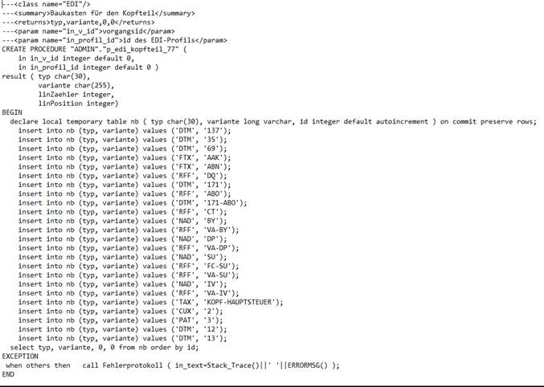
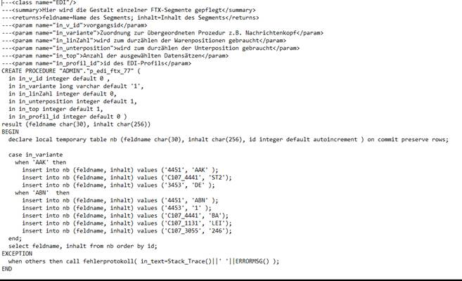

# Aufbau der Prozeduren

<!-- source: https://amic.de/hilfe/aufbauderprozeduren.htm -->

Abschnitt-Prozeduren

Die Prozeduren für einen Abschnitt sind als Bausatz zu verstehen. Hier wird angegeben, welche Segmente in einer Nachricht erscheinen sollen. Übergabeparameter sind immer die entsprechende Id (in_v_Id, in_wabewid oder in_datei_id) und die Profil_Id (in_profil_id). Der Rückgabewert sind immer vier Parameter:

Parameter 1 enthält den Namen des Segmentes. Hierbei handelt es sich immer um drei Großbuchstaben.

Parameter 2 enthält die Variante des Segmentes. Diese sind individuell gestaltbar, müssen aber dann in der entsprechenden Prozedur des Segmentes hinterlegt werden.

Parameter 3 enthält einen Positionszähler. Dieser wird nur in Verbindung mit den LIN-Segmenten auf Positionsebene gebraucht. Ansonsten sollte konstant „0“ zurückgegeben werden.

Parameter 4 enthält eine Unterposition. Diese wird benötigt, wenn auf Abschnittsebene eine Schleife genutzt wird, um der Segmentprozedur darunter mitzuteilen, in welchem Durchlauf sie ist. Auch hier sollte „0“ zurückgegeben werden, wenn keine Schleife vorhanden ist.

Segment-Prozeduren

Die Prozeduren für einen Abschnitt sind die Ausgestaltung der einzelnen Zeilen in einer EDI-Nachricht. Die Eingangsparameter sind:

| Parameter | Bedingung |
| --- | --- |
| in_v_id | Falls Segment in Kopfteil, Kopfteil-Rabatt, Fußteil oder Fußteilsteuer genutzt wird. |
| in_wabewid | Falls Segment in Positionsteil, Positionsteil-Rabatt oder Gebinde/Display genutzt wird. |
| in_datei_id | Falls Segment in Rechnungsliste oder Rechnungsliste-Steuer genutzt wird. |
| in_linZahl | Nur im LIN-Segement benötigt. (Parameter 3 vom Abschnitt) |
| in_unterposition | Parameter 4 vom Abschnitt. |
| in_variante | Parameter 2 vom Abschnitt. |
| in_top | Kann genutzt werden, um bei einem „Select zum Testen der Prozedur“ per OSQL mehr Datensätze zu sehen. Sollte sonst immer 1 sein. |
| in_profil_id | Wird benötigt, um auf die View zuzugreifen und um die Testroutine auf dem Profil auszuführen. |

Die Rückgabeparameter bestehen aus dem Feldname (in welches Feld soll geschrieben werden?) und dem Inhalt (was soll in das Feld hineingeschrieben werden?). Für den Feldnamen gilt immer die vorgegebene Kodierung. Sollte ein Feld mehrmals auftreten, kann dies mit „_1“ angesteuert werden. Als Referenz kann auch der Name des Datenbankfeldes dienen. Das „C“ im Feldnamen ist groß zu schreiben.
