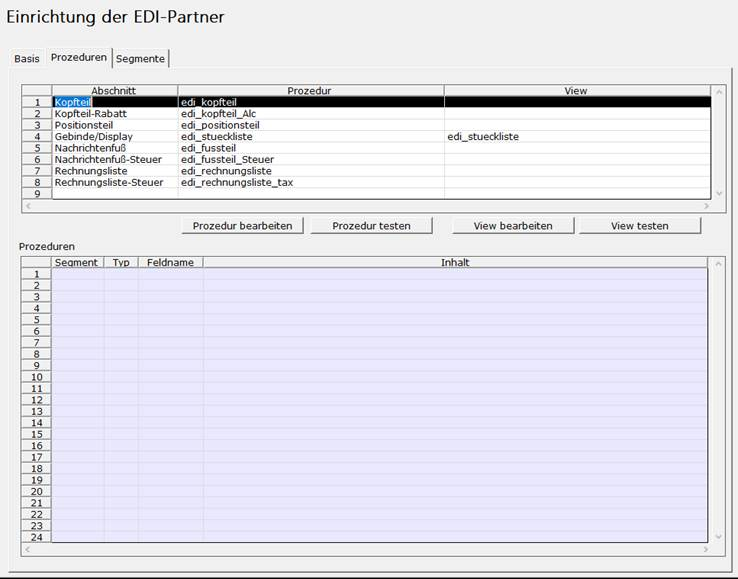
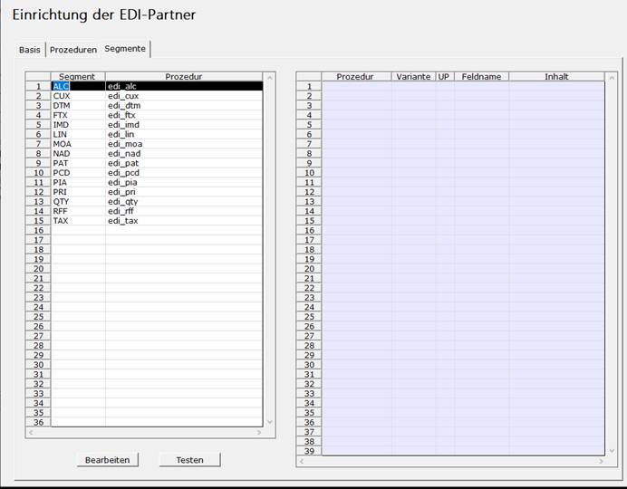

# Erstellung des Rosi-Profils (ausgehend)

<!-- source: https://amic.de/hilfe/erstellungdesrosiprofilsausgeh.htm -->

Profil für EDI-Partner anlegen

In dem Profil EDI-Partner werden die Teilnehmer-ILN, das Kommunikationsprofil, der EDI-Nachrichtentyp und die Nummernkreise hinterlegt.

1. Die Anwendung „Rosi Einrichtung“ mit dem Direktsprung [ROSIE] aufrufen.

2. Die Variante „Rosi Einrichtung“ auswählen.

3. Mit der Taste „F8“ die Maske zum Anlegen eines neuen EDI-Partners aufrufen.  
\=> Die Maske zum Anlagen des EDI-Partners wird geöffnet.

4. Die Zahl im Feld „ID“ wird vom Programm automatisch vergeben.

5. Im Feld „Teilnehmer“ den Teilnehmer mit „F3“ auswählen. Sollte der Partner noch nicht in der Liste stehen kann er im Anwenderformat „af_RosiTeiln“ eingepflegt werden.

a. Die Funktion „Itembox/Daten pflegen“ (oder Tastenkürzel „Shift + F2“) auswählen.  
\=> Der Pfleger für den EDI-Partner wird geöffnet.

b. Im Feld „Nr.“ eine Zahl eintragen.

c. Im Feld „Textersetzung“ die Bezeichnung „Rosi INVOICE Test“ eingeben.

d. Im Feld „Kommentar, Schnipsel“ muss nichts mehr eingetragen werden. Dies geschieht automatisiert.

e. Im Feld „Aktiv“ die Taste „F3“ betätigen und den Eintrag „aktiv“ auswählen.

f. Die Eingaben mit der Taste „F9“ speichern. Die Eingabemaske wird geschlossen.

g. Die Funktion „Liste aktualisieren“ (oder Taste „F2“) auswählen. Die Auswahl wird aktualisiert.

6. Im Feld „Teilnehmer ILN“ die ILN des Kunden eintragen. Diese Angabe steht im Feld „GLN-Nr.“ im Kundenstamm für den betreffenden Kunden.

7. Die Funktion „Nachrichtenprofil“ (Optionbox) ermöglicht es nun ein neues Nachrichtenprofil anzulegen oder ein bereits bestehendes zu editieren (Hängt davon ab ob im Feld „Nachrichten Profil ID“ ein Profil ausgewählt wurde). Wir legen ein neues Nachrichtenprofil an.

a. Die Zahl im Feld „ID“ wird vom Programm automatisch vergeben.

b. Im Feld „Bezeichnung“ die Bezeichnung „Rosi INVOIC Test“ eingeben.

c. Im Feld „feste Implemenntation“ die Taste „F3“ drücken und „Invoic D01B“ auswählen.

d. Die Eingaben mit der Taste „F9“ speichern. Anschließend die Maske mit der Taste „ESC“ schließen.

8. Im Feld „Nachrichten Profil ID“ sollte nun das eben erstellte EDI-Nachrichtenprofil eingetragen sein. 

9. Die Funktion „Batchprofil“ (Optionbox) ermöglicht es nun ein neues Batchprofil anzulegen oder ein bereits bestehendes zu editieren (Hängt davon ab ob im Feld „ID des Kommunikationsprofils“ ein Batch-Profil ausgewählt wurde). Wir legen ein neues Batchprofil an. (Analog würde auch mit einem FTPS-Profil verfahren.)

a. Die Zahl im Feld „ID“ wird vom Programm automatisch vergeben.

b. Im Feld „Bezeichnung“ die Bezeichnung „Rosi Komm. Batch Test“ eingeben.

c. Im Feld „Ordner Lokal“ den Pfad „..\\Export\\Rosi-Test“ eingeben.

d. Im Feld „Richtung“ die Taste „F3“ drücken und die Richtung „ausgehend“ auswählen.

e. Die Felder „Programm“ und „Programm-Parameter“ bleiben leer.

f. Die Eingaben mit der Taste „F9“ speichern. Anschließend die Maske mit der Taste „ESC“ schließen.

10. Im Feld „ID des Kommunikationsprofils“ sollte nun das eben erstellte Batchprofil eingetragen sein.

11. Im Feld „Prefix“ den String „INVOIC_Test_“ eingeben.

12. Im Feld „Nachricht direkt versenden“ die Taste „F3“ drücken und den Eintrag „Ja“ auswählen

13. In die Felder „Nummernkreis“ die Taste „F3“ drücken und den Eintrag „Rosi NK“ auswählen.

14. Die eingetragene Prüfprozedur für den Monitor beibehalten („EDIMonitorPruef“). Diese kann bei Bedarf individualisiert werden

15. Die Eingaben mit der Taste „F9“ speichern. Anschließend die Maske mit der Taste „ESC“ schließen.

Abschnitt-Prozeduren im EDI-Profil eintragen

Auf dem zweiten Tabreiter („Prozeduren“) des EDI-Profils sind nun die Prozeduren zum Aufbau einer EDI-Nachricht einzutragen. Eine Invoic-Nachricht ist hierbei in neun Abschnitte unterteilt. Es steht für jeden Abschnitt eine Beispielprozedur zur Verfügung, welche dann passend für den Partner individualisiert werden kann. Die Tabellenspalte View kann genutzt werden, falls ein umfangreicherer SQL-Befehl benötigt wird, um die Daten zusammenzusammeln.

| Abschnitt | Prozedur | Bemerkung | Übergabeparameter |
| --- | --- | --- | --- |
| Kopfteil | edi_kopfteil | | V_id |
| Kopfteil-Rabatt | edi_kopfteil_ALC | Hier wird per Schleife jeder Rabattsatz angegeben. Hinzu kommt der Skonto. | V_id |
| Positionsteil | edi_positionsteil | Hier wird keine Schleife benötigt, da die Prozedur für jede Position erneut aufgerufen wird. | Wabew_Id |
| Positionsteil-Rabatt | | | Wabew_Id |
| Gebinde/Display | edi_stueckliste | Hier wurde beispielhaft die View verwendet. Diese ist hier hilfreich, da man auf der Abschnittsebene bereits wissen muss, wie viele Unterpositionen existieren. | Wabew_Id |
| Nachrichtenfuß | edi_fussteil | | V_id |
| Nachrichtenfuß-Steuer | edi_fussteil_Steuer | Hier wird per Schleife jeder Steuersatz angegeben. | V_id |
| Rechnungsliste | edi_rechnungsliste | Im Profil muss Rechnungsliste unterdrücken auf „Nein“ gesetzt sein. | Datei_Id |
| Rechnungsliste-Steuer | edi_rechnungsliste_tax | Hier wird per Schleife jeder Steuersatz angegeben. | Datei_Id |

Funktionalität der Maske

| Funktion | Ansteuerung | Funktionalität |
| --- | --- | --- |
| Prozedur bearbeiten | Button (ausgewählte Zeile) Doppelklick auf Prozedur | Sollte eine private Prozedur hinterlegt sein, so wird diese zum bearbeiten geöffnet. Sollte eine AMIC-Prozedur ausgewählt sein, kann (nach Abfrage) automatisch eine Kopie zum bearbeiten angelegt werden. Diese Kopie wird nach dem Speichern automatisch auf der Maske eingetragen. |
| Prozedur testen | Button (ausgewählte Zeile) | Im unteren Grid werden die Daten angezeigt, welche auch in der EDI-Nachricht erscheinen sollten (dies ersetzt keine Testnachrichten). Als Parameter dient die passende eingetragene Test-Id. Nicht eingetragene Segmente werden automatisch mit der Standardprozedur vorbelegt. |
| View bearbeiten | Button (ausgewählte Zeile) Doppelklick auf View | Analog zu „Prozedur bearbeiten“. |
| View testen | Button (ausgewählte Zeile) | Im unteren Grid werden die Daten angezeigt, welche die View zurück gibt. Als Parameter dient die jeweils eingetragene Test-Id. |

Segment-Prozeduren im EDI-Profil eintragen

Auf dem Tabreiter „Segmente“ können die Prozeduren hinterlegt werden, welche die Gestaltung der Einzelzeilen einer EDI-Nachricht steuern. Diese werden beim Testen der Abschnittprozeduren mit einer Standardprozedur vorbelegt, falls noch keine Prozedur hinterlegt ist.

Funktionalität der Maske

| Funktion | Ansteuerung | Funktionalität |
| --- | --- | --- |
| Prozedur bearbeiten | Button (ausgewählte Zeile) Doppelklick auf Prozedur | Sollte eine private Prozedur hinterlegt sein, so wird diese zum bearbeiten geöffnet. Sollte eine AMIC-Prozedur ausgewählt sein, kann (nach Abfrage) automatisch eine Kopie zum bearbeiten angelegt werden. Diese Kopie wird nach dem Speichern automatisch auf der Maske eingetragen. |
| Prozedur testen | Button (ausgewählte Zeile) Doppelklick auf Segment | Im rechten Grid werden die Daten angezeigt, welche auch in der EDI-Nachricht erscheinen. Der in-Parameter in_variante,in_unterposition und die passende Id holt sich das System aus allen eingetragenen Abschnitts-Prozeduren. |
