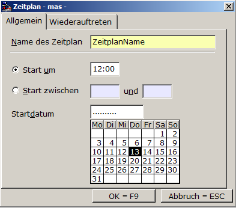
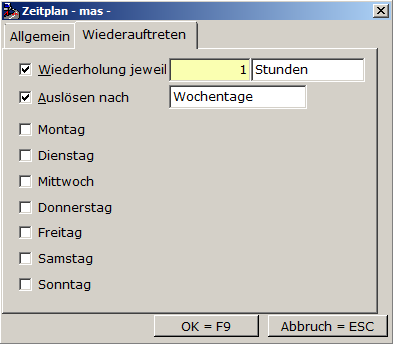

# Einrichten / Bearbeiten eines Events

<!-- source: https://amic.de/hilfe/einrichtenbearbeiteneinesevent.htm -->

Folgende Tasten stehen zur Verarbeitung zur Verfügung.

| Buttons | |
| --- | --- |
| Anzeige=F6 | Mit dieser Funktion zeigen Sie in einem Editor den SQL-Befehl an, der zum Anlegen des Events generiert wird. |
| OK=F9 | Mit dieser Funktion speichern Sie den Event |
| Abbruch=ESC | Mit dieser Funktion brechen Sie die Neuerstellung bzw. die Bearbeitung ab. |

Die Einrichtungsmaske enthält folgende Registerkarten:

[Allgemein](./einrichten_bearbeiten_eines_events.md#amic_ueb_rk_allgemein)

[Sonstiges](./einrichten_bearbeiten_eines_events.md#amic_ueb_rk_sonstiges)

[Bedingungen](./einrichten_bearbeiten_eines_events.md#amic_ueb_rk_bedingungen)

[Verarbeitungsroutine](./einrichten_bearbeiten_eines_events.md#amic_ueb_rk_verarbeitungsroutine)

[Vorlagen](./einrichten_bearbeiten_eines_events.md#amic_ueb_rk_vorlagen)

<p class="just-emphasize">Registerkarte Allgemein</p>

| Felder | |
| --- | --- |
| **Name** | Geben Sie ganz oben den Namen Ihres Events ein. Bei der Bearbeitung eines Events steht hier der Eventname. |
| **Typ** | Legen Sie hier den Typ des Events fest. |
| **Ersteller** | Hier wird vom System automatisch der Username des Erstellers eingetragen und angezeigt. |
| **Kommentar** | Schreiben Sie hier eine kurze Information, zu welchem Zweck das Event dient. So können Sie Informationen hinterlegen, die später sonst in Vergessenheit geraten. |

<p class="just-emphasize">Registerkarte Sonstiges</p>

| Felder und Auswahlboxen |
| --- |
| Ereignis aktiviert | Mit diesem Haken setzen Sie, ob das Ereignis nur eingetragen oder sogar zum vereinbarten Zeitpunkt ausgeführt werden soll. Deaktivierte Ereignisse werden nicht ausgeführt. |
| Prozedur gestoppt | Wenn ein Event einen unerwartet langen Lauf hat, so dass gleich nach Beendigung das nächste Event startet, dann kann dies zu großer Last auf der Datenbank führen. Unglücklicherweise lassen sich laufende Events nicht deaktivieren.<br>Deshalb gibt es eine Sollbruch-Stelle. In Eventprozeduren wird zu Beginn eine Abfrage eingebaut, die bestätigt, ob die Prozedur überhaupt ausgeführt werden soll. So kann sichergestellt werden, daß der nächste Lauf des Events nur kurz ist und eine Abbruchmöglichkeit vorliegt.<br>Mit dem Aktivieren dieser Funktion bestätigen Sie, dass die Prozedur ihren Auftrag nicht ausführen soll.<br>Diese Funktion steht nur Event-Prozeduren zur Verfügung. Deshalb ist sie bei anderen Events deaktiviert. Eventprozeduren sind an dem Namenspräfix „AMIC_EVT_“ oder bei privaten Prozeduren „P_EVT_“ zu erkennen. |
| Ausführungsbeschränkung | Wenn Sie über mehrere replizierende Datenbanken verfügen, so können Sie an dieser Stelle entscheiden, ob das Event an allen Standorten, nur in der konsolidierten Datenbank oder nur in der entfernten Datenbank ausgeführt werden soll. |

<p class="just-emphasize">Registerkarte Bedingungen</p>

Hier legen Sie fest, wann oder unter welchen Umständen der Event ausgelöst werden soll.

**Manuell**

Bei der Neueinrichtung des Events können Sie nur „Manuell wählen“ Einen Zeitplan können Sie nur bereits bestehenden Events zuweisen.

**Nach folgendem Zeitplan**

Einem bestehenden Event können Sie einen Zeitplan hinzufügen, bzw. diesen ändern



Geben Sie dem Zeitplan einen Namen und eine Startzeit. Diese kann entweder fest sein oder in einem Zeitraum variieren.

Ein Event, das regelmäßig auftreten soll können Sie genauer auf der zweiten registerkarte definieren.



Wählen Sie ggf. die Zeit der Wiederholung, wenn der Event zum Beispiel stündlich ausgeführt werden soll.

Wählen Sie Auslösen Nach, wenn das Event an bestimmten Wochentagen oder bestimmten Tagen des Monats (zum Beispiel an jedem 1. Des Monats) ausgeführt werden soll.

<p class="just-emphasize">Registerkarte Verarbeitungsroutine</p>

```text
Begin
--Verarbeitungsroutine
End
```

Hier schreiben Sie zwischen „Begin“ und „End“ Ihre Verarbeitungsroutine, also das, was abgearbeitet werden soll. Wir empfehlen dringend, hier Eventprozeduren zu verwenden, also Prozeduren, die sich ggf. abrechen lassen.

<p class="just-emphasize">Registerkarte Vorlagen</p>

Wenn Sie ein Mandantenserver- bzw. ein Wareo-Event anlegen wollen, so können Sie durch Auswahl von „JA“ in dem jeweiligen Feld ein Template benutzen, das Ihnen einen solchen Event konstruiert.
