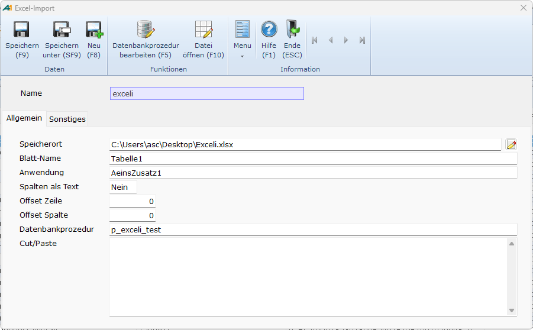
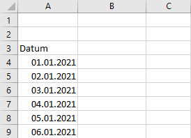
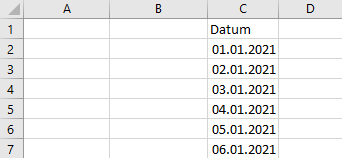

# Excel-Import: Pfleger

<!-- source: https://amic.de/hilfe/excelimportpfleger.htm -->

Stammdatenpflege > Stammdatenpfleger > Excel-Import

oder Direktsprung [**EXCELI**]

| **Feld** | |
| --- | --- |
| Name | Die eindeutige Bezeichnung des Excelimportes. Der Name dient gleichzeitig als Beschriftung der privaten Variante.  
 |

**Register „Allgemein“**

<table class="AMIC-Tabelle" style="WIDTH: 100%; BORDER-COLLAPSE: collapse" cellspacing="0" cellpadding="0" width="100%" border="0"><tbody><tr><td style="WIDTH: 23.56%; BACKGROUND: #005d5b; PADDING-BOTTOM: 0pt; PADDING-TOP: 0pt; PADDING-LEFT: 5.4pt; PADDING-RIGHT: 5.4pt" width="23%">
<b>Feld</b>
</td><td style="WIDTH: 76.44%; BACKGROUND: #005d5b; PADDING-BOTTOM: 0pt; PADDING-TOP: 0pt; PADDING-LEFT: 5.4pt; PADDING-RIGHT: 5.4pt" width="76%"></td></tr><tr><td style="BORDER-TOP: medium none; BORDER-RIGHT: white 1.5pt solid; WIDTH: 23.56%; BACKGROUND: #bad9d9; BORDER-BOTTOM: medium none; PADDING-BOTTOM: 0pt; PADDING-TOP: 0pt; PADDING-LEFT: 5.4pt; BORDER-LEFT: medium none; PADDING-RIGHT: 5.4pt" valign="top" width="23%">
<a name="Speicherort" id="Speicherort">Speicherort</a>
</td><td style="BORDER-TOP: medium none; BORDER-RIGHT: medium none; WIDTH: 76.44%; BACKGROUND: #bad9d9; BORDER-BOTTOM: medium none; PADDING-BOTTOM: 0pt; PADDING-TOP: 0pt; PADDING-LEFT: 5.4pt; BORDER-LEFT: medium none; PADDING-RIGHT: 5.4pt" valign="top" width="76%">
Der Pfad der Excel-Datei. Mit der <strong>F3</strong>-Taste öffnet sich der Datei-Explorer.
</td></tr><tr><td style="BORDER-TOP: medium none; BORDER-RIGHT: white 1.5pt solid; WIDTH: 23.56%; BACKGROUND: #eff7f7; BORDER-BOTTOM: medium none; PADDING-BOTTOM: 0pt; PADDING-TOP: 0pt; PADDING-LEFT: 5.4pt; BORDER-LEFT: medium none; PADDING-RIGHT: 5.4pt" valign="top" width="23%">
<a name="Blatt_Name" id="Blatt_Name">Blatt-Name</a>
</td><td style="BORDER-TOP: medium none; BORDER-RIGHT: medium none; WIDTH: 76.44%; BACKGROUND: #eff7f7; BORDER-BOTTOM: medium none; PADDING-BOTTOM: 0pt; PADDING-TOP: 0pt; PADDING-LEFT: 5.4pt; BORDER-LEFT: medium none; PADDING-RIGHT: 5.4pt" valign="top" width="76%">
Der Name des Excel-Arbeitsblattes, das nach A.eins importiert werden soll. Der Blatt-Name wird mit „Tabelle1“ vorbelegt.
</td></tr><tr><td style="BORDER-TOP: medium none; BORDER-RIGHT: white 1.5pt solid; WIDTH: 23.56%; BACKGROUND: #bad9d9; BORDER-BOTTOM: medium none; PADDING-BOTTOM: 0pt; PADDING-TOP: 0pt; PADDING-LEFT: 5.4pt; BORDER-LEFT: medium none; PADDING-RIGHT: 5.4pt" valign="top" width="23%">
<a name="Anwendung" id="Anwendung">Anwendung</a>
</td><td style="BORDER-TOP: medium none; BORDER-RIGHT: medium none; WIDTH: 76.44%; BACKGROUND: #bad9d9; BORDER-BOTTOM: medium none; PADDING-BOTTOM: 0pt; PADDING-TOP: 0pt; PADDING-LEFT: 5.4pt; BORDER-LEFT: medium none; PADDING-RIGHT: 5.4pt" valign="top" width="76%">
Hier wird der Name der Anwendung angegeben, unter der sich die zu erstellende Variante befinden soll. Mithilfe der <strong>F3</strong>-Taste kann eine Anwendung ausgewählt werden.
</td></tr><tr><td style="BORDER-TOP: medium none; BORDER-RIGHT: white 1.5pt solid; WIDTH: 23.56%; BACKGROUND: #eff7f7; BORDER-BOTTOM: medium none; PADDING-BOTTOM: 0pt; PADDING-TOP: 0pt; PADDING-LEFT: 5.4pt; BORDER-LEFT: medium none; PADDING-RIGHT: 5.4pt" valign="top" width="23%">
<a name="Offset_Zeile" id="Offset_Zeile">Offset Zeile</a>
</td><td style="BORDER-TOP: medium none; BORDER-RIGHT: medium none; WIDTH: 76.44%; BACKGROUND: #eff7f7; BORDER-BOTTOM: medium none; PADDING-BOTTOM: 0pt; PADDING-TOP: 0pt; PADDING-LEFT: 5.4pt; BORDER-LEFT: medium none; PADDING-RIGHT: 5.4pt" valign="top" width="76%">
Mit dem „Offset Zeile“ wird die Anzahl an Zeilen angegeben, die beim Import übersprungen werden. Befinden sich die Überschriften in dem Excel-Blatt nicht in der ersten Zeile, so kann hier ein alternativer Wert eingetragen werden. Handelt es sich bei der ersten Zeile des Arbeitsblattes um die Überschriftenzeile, so ist hier eine „0“ einzutragen.

Der Standardwert ist „0“.

Beispiel:

Befinden sich die Spaltenüberschriften in Zeile „3“, so ist hier ein Offset von „2“ einzutragen. Die ersten zwei Zeilen werden übersprungen.

</td></tr><tr><td style="BORDER-TOP: medium none; BORDER-RIGHT: white 1.5pt solid; WIDTH: 23.56%; BACKGROUND: #bad9d9; BORDER-BOTTOM: medium none; PADDING-BOTTOM: 0pt; PADDING-TOP: 0pt; PADDING-LEFT: 5.4pt; BORDER-LEFT: medium none; PADDING-RIGHT: 5.4pt" valign="top" width="23%">
<a name="Offset_Spalte" id="Offset_Spalte">Offset Spalte</a>
</td><td style="BORDER-TOP: medium none; BORDER-RIGHT: medium none; WIDTH: 76.44%; BACKGROUND: #bad9d9; BORDER-BOTTOM: medium none; PADDING-BOTTOM: 0pt; PADDING-TOP: 0pt; PADDING-LEFT: 5.4pt; BORDER-LEFT: medium none; PADDING-RIGHT: 5.4pt" valign="top" width="76%">
Mit dem „Offset Spalte“ wird die Anzahl an Spalten angegeben, die beim Import übersprungen werden. Soll der Import nicht ab der ersten Spalte erfolgen, so kann hier ein Wert ungleich „0“ eingetragen werden. Ein Wert von „0“ bedeutet, dass der Import ab der ersten Spalte erfolgen soll.

Der Standardwert ist „0“.

Beispiel:

Beginnen die Daten in Spalte „3“ („C“), so ist hier ein Offset von „2“ anzugeben. Damit werden die ersten beiden Spalten übersprungen.

</td></tr><tr><td style="BORDER-TOP: medium none; BORDER-RIGHT: white 1.5pt solid; WIDTH: 23.56%; BACKGROUND: #eff7f7; BORDER-BOTTOM: medium none; PADDING-BOTTOM: 0pt; PADDING-TOP: 0pt; PADDING-LEFT: 5.4pt; BORDER-LEFT: medium none; PADDING-RIGHT: 5.4pt" valign="top" width="23%">
<a name="Spalten_als_Text" id="Spalten_als_Text">Spalten als Text</a>
</td><td style="BORDER-TOP: medium none; BORDER-RIGHT: medium none; WIDTH: 76.44%; BACKGROUND: #eff7f7; BORDER-BOTTOM: medium none; PADDING-BOTTOM: 0pt; PADDING-TOP: 0pt; PADDING-LEFT: 5.4pt; BORDER-LEFT: medium none; PADDING-RIGHT: 5.4pt" valign="top" width="76%">
Standardmäßig hängt der Datentyp der Datenbankfelder von dem Format der Excel-Spalten ab (siehe <a class="topic-link" href="./uebernahme_eines_excel_arbeitsblattes_in_eine_private_varian/umschluesselungen_excel_zu_aeins.md">Umschlüsselungen Excel zu Aeins</a>). Dieses Verhalten lässt sich abschalten, indem das Feld „Spalten als Text“ auf „Ja“ gestellt wird. Dann werden beim Excelimport alle Datenbankfelder als „long varchar“ angelegt.
</td></tr><tr><td style="BORDER-TOP: medium none; BORDER-RIGHT: white 1.5pt solid; WIDTH: 23.56%; BACKGROUND: #bad9d9; BORDER-BOTTOM: medium none; PADDING-BOTTOM: 0pt; PADDING-TOP: 0pt; PADDING-LEFT: 5.4pt; BORDER-LEFT: medium none; PADDING-RIGHT: 5.4pt" valign="top" width="23%">
Datenbankprozedur
</td><td style="BORDER-TOP: medium none; BORDER-RIGHT: medium none; WIDTH: 76.44%; BACKGROUND: #bad9d9; BORDER-BOTTOM: medium none; PADDING-BOTTOM: 0pt; PADDING-TOP: 0pt; PADDING-LEFT: 5.4pt; BORDER-LEFT: medium none; PADDING-RIGHT: 5.4pt" valign="top" width="76%">
Hier kann eine private Datenbankprozedur angegeben werden. Über diese Prozedur kann zeilenweise ein Datensatz aus der beim Excelimport angelegten Tabelle ausgelesen und weiterverarbeitet werden. Wird hier eine Prozedur eingetragen, so wird diese beim Excelimport immer nach dem Einfügen eines Datensatzes in diese Tabelle ausgeführt.

Die Prozedur muss über folgende Parameter verfügen:
<table class="AMIC-Tabelle" style="BORDER-COLLAPSE: collapse" cellspacing="0" cellpadding="0" border="0"><tbody><tr><th style="WIDTH: 134.75pt; BACKGROUND: #005d5b; PADDING-BOTTOM: 0pt; PADDING-TOP: 0pt; PADDING-LEFT: 5.4pt; PADDING-RIGHT: 5.4pt" width="180">Name</th><th style="WIDTH: 99.25pt; BACKGROUND: #005d5b; PADDING-BOTTOM: 0pt; PADDING-TOP: 0pt; PADDING-LEFT: 5.4pt; PADDING-RIGHT: 5.4pt" width="132">Datentyp</th><th style="WIDTH: 610.65pt; BACKGROUND: #005d5b; PADDING-BOTTOM: 0pt; PADDING-TOP: 0pt; PADDING-LEFT: 5.4pt; PADDING-RIGHT: 5.4pt" width="814">&nbsp;</th></tr><tr><td style="BORDER-TOP: medium none; BORDER-RIGHT: white 1.5pt solid; WIDTH: 134.75pt; BACKGROUND: #bad9d9; BORDER-BOTTOM: medium none; PADDING-BOTTOM: 0pt; PADDING-TOP: 0pt; PADDING-LEFT: 5.4pt; BORDER-LEFT: medium none; PADDING-RIGHT: 5.4pt" valign="top" width="180">in_xlsident</td><td style="BORDER-TOP: medium none; BORDER-RIGHT: white 1.5pt solid; WIDTH: 99.25pt; BACKGROUND: #bad9d9; BORDER-BOTTOM: medium none; PADDING-BOTTOM: 0pt; PADDING-TOP: 0pt; PADDING-LEFT: 5.4pt; BORDER-LEFT: medium none; PADDING-RIGHT: 5.4pt" valign="top" width="132">integer</td><td style="BORDER-TOP: medium none; BORDER-RIGHT: medium none; WIDTH: 610.65pt; BACKGROUND: #bad9d9; BORDER-BOTTOM: medium none; PADDING-BOTTOM: 0pt; PADDING-TOP: 0pt; PADDING-LEFT: 5.4pt; BORDER-LEFT: medium none; PADDING-RIGHT: 5.4pt" valign="top" width="814">Wert des Feldes „xlsident“ (Primärschlüssel) &nbsp;</td></tr><tr><td style="BORDER-TOP: medium none; BORDER-RIGHT: white 1.5pt solid; WIDTH: 134.75pt; BACKGROUND: #eff7f7; BORDER-BOTTOM: medium none; PADDING-BOTTOM: 0pt; PADDING-TOP: 0pt; PADDING-LEFT: 5.4pt; BORDER-LEFT: medium none; PADDING-RIGHT: 5.4pt" valign="top" width="180">in_tablename</td><td style="BORDER-TOP: medium none; BORDER-RIGHT: white 1.5pt solid; WIDTH: 99.25pt; BACKGROUND: #eff7f7; BORDER-BOTTOM: medium none; PADDING-BOTTOM: 0pt; PADDING-TOP: 0pt; PADDING-LEFT: 5.4pt; BORDER-LEFT: medium none; PADDING-RIGHT: 5.4pt" valign="top" width="132">char(128)</td><td style="BORDER-TOP: medium none; BORDER-RIGHT: medium none; WIDTH: 610.65pt; BACKGROUND: #eff7f7; BORDER-BOTTOM: medium none; PADDING-BOTTOM: 0pt; PADDING-TOP: 0pt; PADDING-LEFT: 5.4pt; BORDER-LEFT: medium none; PADDING-RIGHT: 5.4pt" valign="top" width="814">Name der angelegten Tabelle &nbsp;</td></tr></tbody></table>
In dem Feld „Datenbankprozedur“ kann mithilfe von <strong>F3 </strong>eine bereits bestehende Prozedur ausgewählt werden oder es kann ein neuer Name eingetragen werden. Diese neue Prozedur wird sofort zur Bearbeitung geöffnet und hat folgenden Aufbau:

CREATE PROCEDURE p_exceli_test (in in_xlsident integer, in in_tablename char(128))

&nbsp;BEGIN

&nbsp;--todo: Aktion(en)

EXCEPTION

&nbsp;&nbsp; when others then

&nbsp;&nbsp;&nbsp;&nbsp; call amic_exception( ERRORMSG() || CHAR(10) || CHAR(13) || TRACEBACK(), SQLCODE , SQLSTATE , 'p_exceli_test' , -1 );

&nbsp;END

</td></tr></tbody></table>

.

**Register „Sonstiges“**

Unter dem Register „Sonstiges“ werden technische Informationen zu der Variante und ihren Objekten angezeigt.

| **Feld** | |
| --- | --- |
| Tabelle | Name der Relation, in der die Daten des Excel-Arbeitsblattes gespeichert werden.  
 |
| Variante | Identifikation der Variante.  
 |
| Besitzer | Besitzer der Variante. Der Besitzer ist immer „Privat“.  
 |
| Variantentext | Identifikation des „SQL-Textes“ der Variante.  
 |
| Bereich/Profil | Identifikation der Bereichsauswahl der Variante.  
 |
| Optionbox | Identifikation des Funktionsmenüs der Variante.  
 |

| **Funktionen** | |
| --- | --- |
| Speichern **[F9]** | Beim Speichern wird – sofern nicht schon geschehen – eine private Variante erstellt. Hierbei wird noch kein Excelimport durchgeführt, sondern es wird eine „[Standardvariante](./uebernahme_eines_excel_arbeitsblattes_in_eine_private_varian/private_variante.md)“ angelegt.  
 |
| Datei öffnen | Mithilfe dieser Funktion kann die Exceldatei von hier aus direkt bearbeitet werden.  
 |
| Datenbankprozedur bearbeiten  
 | Über diese Funktion kann die private Datenbankprozedur bearbeitet werden. |
