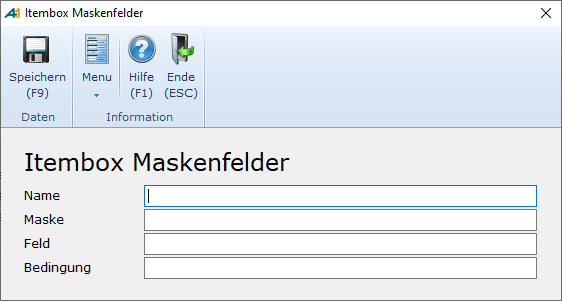
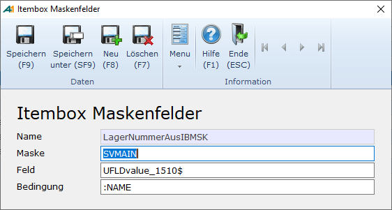

# IB Maskenbedingungen

<!-- source: https://amic.de/hilfe/_ibmaskenbedingung.htm -->

Hauptmenü > Administration > Werkzeuge > IB-Maskenbedingung

oder Direktsprung [IBMSK]

Wenn eine F3-Auswahl privatisiert wird und man auf ein Feld zugreifen möchte, welches auf der aufrufenden Maske vorhanden ist, kann man dies mit der Anwendung „IB-Maskenbedingung“ bewerkstelligen.:



| | **Beschreibung** |
| --- | --- |
| Name | Hier trägt man eine eindeutige Bezeichnung ein, mit der man später auf diese Einrichtung zugreift. In dem SQL-Text der zugehörigen F3-Auswahl muss man dann **:∼** dem Namen voranstellen.  
 |
| Maske | Name der Maske, auf dem das Feld zu finden ist. Den Namen der Maske erhält man, indem man auf dieser Maske die Tastenkombination Umschalt-Strg-F5 drückt.  
 |
| Feld | Dies ist der Name des Feldes, dessen Inhalt man haben möchte. Hier ist es wichtig, dass Groß- und Kleinschreibung dabei beachtet wird. Den Namen des Feldes erhält man entweder über die Tastenkombination Umschalt-Strg-F5 oder über Umschalt-F3.  
 |
| Bedingung | Hier kann eine komplette Bedingung unter Verwendung irgend eines Namens mit vorangestelltem Doppelpunkt stehen  
   
oder einfach nur der Name mit vorangestelltem Doppelpunkt.  
    
Für **:Name** wir vom Programm der Inhalt des angesprochenen Feldes eingetragen. Existiert die Maske oder das Feld nicht, dann wird ein leerer Wert geliefert. Es erscheint keine Fehlermeldung  
 |

Beispiel:



Der SQL-Text der dazugehörigen F3-Auswahk kann dann folgendermaßen aussehen:

```sql
TITLE Versandarten
INFO alle Versandarten

IB_LABEL Nummer ab

MASK ITEM60
FIELD   Nummer,VersArtId,I4,8
FIELD Bezeichnung,VersArtBezeich,char,40
FIELD Lagernumemr(SVMAIN),Wert,char,20
RETURN VersArtId, VersArtBezeich
SQL select :FIELDS,
  ':~LagerNummerAusIBMSK' as Wert
  from amic_v_VersandArt
  where (VersArtId >=':ITEMWAHL')
:LOOKUP
  order by VersArtId
LOOKUP and (VersArtId = ':ITEMWAHL')
OPTIONBOX OB_IB_VERSANDART
```

Der Wert aus IBMSK ':~LagerNummerAusIBMSK' steht hier in Hochkomma, damit es keine Syntaxfehler gibt, wenn ein leerer Wert geliefert wird.
