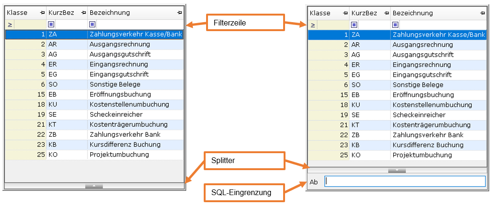
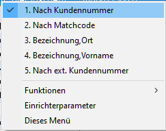

# F3-Auswahl 2.0 (Itembox)

<!-- source: https://amic.de/hilfe/f3auswahl.htm -->

Das Design und der Funktionsumfang der F3-Auswahl wurden für die 64Bit-Version von A.eins überarbeitet. Dazu wurde die bereits von der Auswahlliste 2.0 bekannte Datentabelle mit Filterzeile, die das Suchen in allen Spalten ermöglicht, verwendet. Um diese Funktionalität zu erhalten, muss im Bedienerstamm im Feld „Version F3-Auswahl“ der Wert „Feste Fensterposition, neues Design“ eingetragen werden.



Aufruf:

1) Bei F3-Auswahlen auf Stammdaten:  
In den Feldern, bei denen der Informationstext „Eine Auswahlliste kann mit F3 aufgerufen werden“, kann man die Auswahl direkt mit F3 starten. Man kann jedoch auch vorher eine Eingrenzung eingeben, die dann in der F3-Auswahl sofort angewendet wird. Stellt man der Auswahl eine Zahl gefolgt von einem Punkt (Z.B. „**2.**Meyer“) vorweg, wird sofort die entsprechende Variante aufgerufen und der zusätzliche Wert wird sofort verwendet.

Es gibt zwei Möglichkeiten die Daten einzugrenzen. Einmal über die Filterzeile, dabei wird in den eingelesenen Daten gesucht. Oder über die SQL-Eingrenzung (öffnen mit F2 oder Strg+Y oder Mausklick auf den Splitter) . Dabei werden nur die Daten eingelesen, die diesem Kriterium entsprechen. Bei großen Datenmengen ist die SQL-Eingrenzung schneller, da nur ein Teil der Daten in die Anzeige übernommen wird. Die Filterzeile sucht dann auch nur in diesen Daten.

Wir im SQL-Text das Schlüsselwort [MUSTENTER](../private_varianten_und_sql_texte/schluesselwoerter_im_sql_text.md#Mustenter) verwendet, so ist die SQL-Eingrenzung gleich beim Öffnen der F3-Auswahl aktiv und man muss erst einen Wert eingeben, mit dem die eingelesenen Daten eingeschränkt werden.

Bei Verwendung von [OPTIONS NOITEMWAHL](../private_varianten_und_sql_texte/schluesselwoerter_im_sql_text.md#Options) wird der Splitter und damit die SQL-Eingrenzung komplett ausgeblendet.  
    
Der Label „Ab“ vor der SQL-Eingrenzung sollte mit dem Schlüsselwort [IB_LABEL](../private_varianten_und_sql_texte/schluesselwoerter_im_sql_text.md#IB_LABEL) genauer angegeben werden. Z.B.:

```text
IB_LABEL Klasse ab
```

2) Bei F3-Auswahlen auf FS-Formate:  
Bei FS-Formaten werden immer alle Daten geladen und angezeigt, unabhängig davon, was man im Feld vorher angegeben hat. Die aktive Zeile ist die Zeile mit dem Wert, der in dem Feld steht, aus dem man kommt. Splitter und F2 oder Strg-Y stehen nicht zu Verfügung.

Filter:

Die Filterzeile direkt unter der Überschrift dient dazu, schnell bestimmte Datensätze zu finden. Es wird bei dieser Methode nicht erneut auf die Datenbank zugegriffen, sondern nur in den Daten der Datentabelle gesucht.

Die gelb eingefärbte Spalte ist die aktive Spalte. Mit den Tasten Tab und Shift-Tab kann man zwischen den Spalten wechseln. Sobald man eine Taste drückt, die ein sichtbares Zeichen darstellt, springt sie Schreibmarke sofort in die Filterzeile, stellt dieses Zeichen dar und grenzt die Auswahl entsprechend ein. Man kann auch jederzeit mit der Maus in die Filterzeile klicken oder mit der Tastenkombination Strg-F in die Filterzeile gelangen.

In der Filterzeile können Werte angegeben werden oder es kann aus den in den Drop-Down-Liste angebotenen Werten ausgewählt werden.

Das Symbol  dient zum zurücksetzen der Filter.

Das Symbol links unter der Überschrift bestimmt, wie gesucht wird, wobei hier zwischen numerischen und alphanumerischen Daten unterschieden wird. Wie dabei gesucht wird – größer als, kleiner, … - wird versucht anhand der WHERE Bedingung im SQL zu bestimmen. Möchte man hier eine andere Suchstrategie vorgeben, kann dies über das Schlüsselwort [FILTERCOMPARISION](../private_varianten_und_sql_texte/schluesselwoerter_im_sql_text.md#FILTERCOMPARISION) festgelegt werden.

Varianten:

Die zur Verfügung stehenden Varianten erhält man über das rechte Maustastenmenü oder die Menü-Taste auf der Tastatur.



Wenn das Menü geöffnet ist, kann man entweder mit der Maus oder durch Drücken der Zahl die Variante auswählen. Hat man die Nummern der Varianten im Kopf, so kann man mit **Strg+Zahl** die Varianten Umschalten. In der SQL-Eingrenzung kann man durch Voranstellen der Zahl gefolgt von einem Punkt auch direkt in eine andere Variante springen.

Beenden:

Die F3-Auswahl kann mit Escape oder durch Klicken mit der Maus auf eine Position außerhalb des Fensters geschlossen werden. Dann wird kein Wert übernommen. Ein Wert kann durch Drücken der Enter-Taste oder mit einem einfachen Klick auf die entsprechende Zeile ausgewählt werden.

Funktionen:

| | **Beschreibung** |
| --- | --- |
| Liste aktualisieren | Lädt die Daten erneut.  
 |
| CSV-Export | Export der geladenen Daten in eine CSV-Datei. Diese Datei wird anschließend gleich mit dem verbundenen Programm geöffnet,  
 |
| PDF-Export | Export in ein PDF-Dokument, welches sofort geöffnet wird.  
 |
| Einstiegsvariante  
 | Beim Aufruf einer F3-Auswahl wird mit der vom Entwickler vorgegebenen Variante gestartet. Mit dieser Funktion wird die Einstiegsvariante auf die gerade aktive Variante gesetzt. |
| Zeige SQL  
 | Zeigt das aufbereitete SQL-Statement inclusive des Datenbank Zugriffsplans an. |
| Private Variante  
 | Erstellen einer privaten Ableitung dieser F3-Auswahl oder bearbeiten einer bereits privaten Ableitung. |
| SQL-text pflegen | Bearbeiten des SQL-Textes dieser Variante.  
 |
| Originaleinstellung | Breite und Positionen der Spalten können geändert werden. Mit dieser Funktion wird die Originaleinstellung wiederhergestellt.  
 |
| Über diese F3-Auswahl | Zeigt zusätzliche Informationen an.  
 |

<p class="siehe-auch">Siehe auch:</p>

- [IB Maskenbedingungen](./ib_maskenbedingungen.md)
