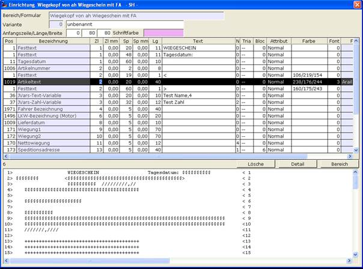
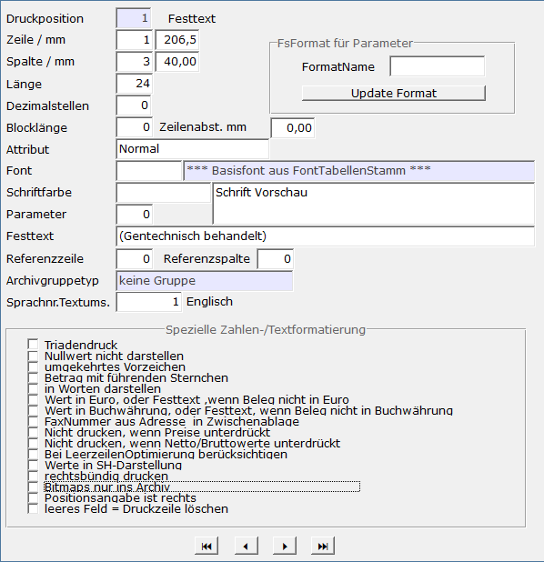
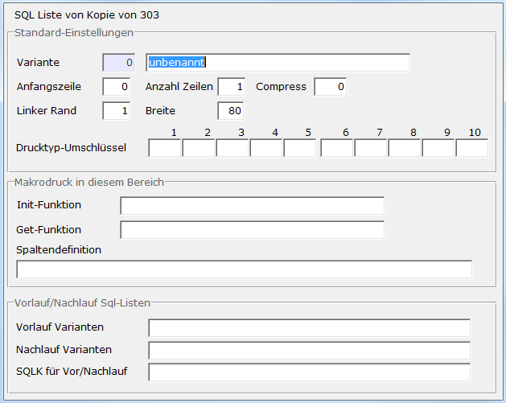

# Einrichtung F6

<!-- source: https://amic.de/hilfe/einrichtungf6.htm -->

Der Aufruf dieser Funktion öffnet die Einrichtung für den Bereich plus Variante, der aktuell auf der Maske ausgewählt wurde. In der Einrichtung gibt man Position für Position an was man genau andrucken lassen möchte. Ein Doppelklick auf eine betretbare Zelle der Zeile des gewünschten Bereiches startet ebenfalls den Einrichter.

Spalte Pos: Formulardruckposition

Hier wählt man mit F3 die für den Bereich vorhandenen Druckpositionen aus.  
Mit deren Hilfe kann man z.B. Festtexte drucken (Pos 1), Werte fest bestimmter Druckpositionen wie Kundennummer (106) oder Daten die ein privater SQL-Text zurückliefert (7). Diese Beispiele wurden in der Grafik oben verwendet.

Sie auch [Formulardruckpositionen](../formular_importe/formulardruckpositionen.md)

Spalte Zeile mm / Spalte mm

Die Werte in diesen Spalten haben – abhängig vom Bereich – verschiedene Bedeutungen:

Bei gedruckten Formularen kann man die Positionen der Felder millimetergenau ausrichten

Bei Bildschirminformationen können diese Werte auf 0 gelassen werden, dann werden die Felder in einem Textblock dargestellt. Wenn aber kein Feld existiert, bei dem beide Werte 0 sind, werden die Felder durch einzelne Textfelder (ähnlich den Userfeldern) dargestellt.

Um die Einrichtung der Position der Bildschirminfofelder zu vereinfachen, gibt es die Funktion ***Spalte mm / Zeile mm generieren***. Hier können die Position der linken, oberen Ecke und der Zeilenabstand eingegeben werden. Aus diesen Werten und den Spalten- und Zeilenangaben der Felder wird dann die ungefähre Millimeter-Position berechnet.

Spalte Text

F3-Auswahl Unterstützung für Tabellenfelder. Aktiv ist diese F3-Auswahl im Feld ‚Text’, wenn es sich um die folgenden Bereiche, Idnummern und Tabellen handelt:

| Bereich | Idnummer | Tabelle |
| --- | --- | --- |
| 105 | 443 | PartieStamm |
| 105 | 333 | PartieAddon |
| 105 | 445 | PartieMaskeDaten |
| 1000 | 453 | OWaage |
| 1000 | 454 | OwaageAddon |
| 47 | 425 | WarenbewegungAddon |
| 101 | 425 | WarenbewegungAddon |
| 902 | 425 | WarenbewegungAddon |
| 906 | 425 | WarenbewegungAddon |

Bei der Idnummer 22 („Bitmap aus Datei/Archiv“) wird eine Archiv-Ansicht geöffnet die möglichen Kandidaten für die Auswahl einer Bitmap aus dem Archiv anzeigt).

Spalte Farbe

Hier kann man mit F3 den Dialog für die Farbauswahl öffnen.  
Die RGB Werte der ausgewählten Farbe werden in die Spalte Farbe übernommen.  
Oben auf der Maske im Feld Schriftfarbe wird angezeigt welche Farbe die Schrift der aktuell markierten Druckposition beim Drucken bekommt.

Ist in der Spalte Farbe nichts angegeben, dann wird die Standardschriftfarbe schwarz verwendet.

Spalte Font

Hier kann man mit F3 den Dialog für die Schriftarten öffnen.  
Man wählt die gewünschte Schriftart aus. In das Feld Font wird die entsprechende Fontnummer und in das Feld FontBezeichnung die Bezeichnung des Fonts übernommen.  
    

Ist für das Formular eine Font Tabelle hinterlegt, dann wird geprüft ob die ausgewählte Schriftart schon in dieser Font Tabelle existiert.  
Wenn ja, dann wird die entsprechende Fontnummer verwendet.  
Wenn nein, dann wird in dieser Fonttabelle eine neue Schriftart angelegt. Es wir die neue Fontnummer in das Feld Font übernommen.

Wenn für das Formular keine Font Tabelle hinterlegt wurde, dann wird nach Auswahl der Schriftart zunächst geprüft, ob überhaupt eine Font Tabelle im System eingerichtet ist.  
Wenn ja, dann wird die erste Fonttabelle die die ausgewählte Schriftart enthält verwendet. Enthält keine Font Tabelle diese Schriftart, dann wird die erste Font Tabelle genommen, die gefunden wird.  
Wenn die ausgewählte Schriftart schon vorkommt, dann wird die entsprechende Fontnummer verwendet, ansonsten wird in der ersten gefundenen Font Tabelle eine neue Schriftart angelegt.  
Ist im System keine Font Tabelle eingerichtet, dann wird eine mit Nummer 1, der Bezeichnung ‚allgemeine Fonts’ und dem Basisfont ‚Arial – 10’ angelegt. In diese Font Tabelle wird dann die neue Schriftart eingetragen und die Fontnummer entsprechend in die Maske übernommen.  
Die verwendete Font Tabelle wird im Formular eingetragen, so dass bei der nächsten Auswahl eine Font Tabelle im Formular hinterlegt ist.

Mit F4 auf einer Zeile ruft man die Funktion ‚**Fontauswahl der Fonttabelle**’ auf. Es öffnet sich eine Itembox mit allen Fonts der zum Formular gehörigen Font Tabelle. Wählt man einen Font aus wird dieser in die aktuelle Zeile eingetragen.

Knopf Lösche

Löscht die markierte Position aus dem Formular

Knopf Detail

Hier kann man weitere Einstellungen zur aktuell markierten Druckposition vornehmen

| Einstellung Details einer Druckposition |
| --- |
| Feld | Beschreibung |
| Zeile / mm und Spalte /mm | Hier wird die Position innerhalb eines Druckbereichs festgelegt. Die Angaben für Zeile und Spalte erfolgt in logischen Koordinaten. Das Raster dieser Koordinaten wird im ASCII-Druck aus der Darstellungsbreite eines Zeichens des Druckers ermittelt. Im Windowsdruck wird das Raster aus dem im Formular hinterlegten Basisfont ermittelt. Nur beim Windowsdruck kann die Platzierung der Druckposition optional in Millimeter spezifiziert werden. Diese Angabe übersteuert die logischen Koordinaten, wenn sie beide von Null verschieden sind. |
| Länge | Wie lang erstreckt sich der Druck dieser Position, in logischen Einheiten |
| Dezimalstellen | Diese Einstellung legt bei numerischen Angaben die Anzahl der Nachkommastellen fest. |
| Blocklänge und Zeilenabstand mm | Für mehrzeilige Druckaufbereitungen (z.B. Adressen, Textblöcke etc.) wird hier die Zeilenanzahl festgelegt. Optional kann für den Druck im Windowsformat der Zeilenabstand in mm hinterlegt werden. |
| Attribut | Der Schriftstil wird durch folgende Attribute verändert: Normal: Standardeinstellung der Schrift Compress: die Schrift wird kleiner und enger ausgegeben Fett: die Zeichen werden fetter/kräftiger dargestellt Unterstrichen: Alle Zeichen werden unterstrichen Sperr: der Zeichenabstand wird deutlich erhöht |
| Schriftfarbe | Nur bei Windowsdruck: die Farbe der Schrift wird in RGB (Rot / Grün/ Blau) Notation eingestellt. Per F3 –Taste kann der Farbton ermittelt werden |
| Parameter | Viele Druckpositionen erfordern einen zusätzlichen numerischen Parameter zu Identifizierung des Inhalts. Häufig handelt es sich hierbei um mehrfach auftretende Informationen, wie etwa mehrere Steuersätze oder mehrere Gebindeinformationen. |
| Festtext | Häufig werden Druckpositionen durch eine Textangabe parametrisiert, die hier eingegeben wird. |
| Referenzzeile und Referenzspalte | Hier kann man optional die Koordinaten einer verknüpften Druckposition hinterlegen. Wird in der verknüpften Position kein signifikanter Wert gedruckt, so unterbleibt auch der eigene Druck. Beispiel: Die verknüpfte Druckposition weist die Menge eines Artikels aus. Die eigene Druckposition ist die Beschriftung ‘Gelieferte Menge‘. Ist die Menge 0 wird auch der Text ‚Gelieferte Menge‘ nicht gedruckt. |
| Archivgruppetest | Eine nicht allgemein gültige Spezialität! |
| Sprachnr.Textums | Wenn ungleich 0 wird der Text in die hier hinterlegte Sprache umgesetzt |

Spezielle Zahlen-/Textformatierung

**Triadendruck  
**Druckpositionen, die als Wert Zahlen mit Nachkommastellen beinhalten können, werden bei aktiviertem Kennzeichen in Triadenform dargestellt.

**Nullwert nicht darstellen  
**Druckpositionen, die als Wert Zahlen beinhalten, werden bei aktiviertem Kennzeichen nicht gedruckt, wenn der Zahlenwert=0 ist.

**umgekehrtes Vorzeichen  
**Druckpositionen, die als Wert Zahlen beinhalten, werden bei aktiviertem Kennzeichen mit umgekehrtem Vorzeichen dargestellt.

**Betrag mit führenden Sternchen  
**Druckpositionen, die als Wert Zahlen mit Nachkommastellen beinhalten können, werden bei aktiviertem Kennzeichen entsprechend der eingerichteten Läge mit führenden Sternchen dargestellt.

**in Worten darstellen  
**Druckpositionen, die als Wert Zahlen mit Nachkommastellen beinhalten können, werden bei aktiviertem Kennzeichen in Textform mit Auflösung der einzelnen Ziffern in Worte dargestellt.

**Wert in Euro, oder Festtext, wenn Beleg nicht in Euro  
**Ist dieses Kennzeichen aktiviert und die Belegwährung des zu druckenden Vorgangs eine andere Währung als Euro, so wird ein der Druckposition zugewiesener Zahl-Wert als in Belegwährung vorliegend interpretiert und vor der Ausgabe in die Währung Euro umgerechnet. Ist der der Druckposition zugewiesene Wert ein Text, so wird dieser im Falle einer von Euro abweichenden Belegwährung unverändert ausgegeben.  
Ist die Belegwährung jedoch Euro, so wird die Druckposition unterdrückt.

**Wert in Buchwährung, oder Festtext, wenn Beleg nicht in Buchwährung  
**Ist dieses Kennzeichen aktiviert und die Belegwährung des zu druckenden Vorgangs eine andere Währung als die A.eins-Buchwährung, so wird ein der Druckposition zugewiesener Zahl-Wert als in Belegwährung vorliegend interpretiert und vor der Ausgabe in die Buchwährung umgerechnet. Ist der der Druckposition zugewiesene Wert ein Text, so wird dieser im Falle einer von der Buchwährung abweichenden Belegwährung unverändert ausgegeben.  
Ist die Belegwährung jedoch die A.eins-Buchwährung, so wird die Druckposition unterdrückt.

**FaxNummer aus Adresse in Zwischenablage  
**Ist dieses Kennzeichen aktiviert und die Druckposition repräsentiert einen Adress-Block, so wird die in der Adresse (Anschrift) eingetragene Fax-Nummer in die Zwischenablage kopiert.  
Dieses ist zum Beispiel dann notwendig, wenn der Druck als Fax mittels angeschlossener Fax-Software ausgeführt wird.

**Nicht drucken, wenn Preise unterdrückt  
**Ist dieses Kennzeichen aktiviert, so wird die Ausgabe der Druckposition unterdrückt, wenn in der zum aktuellen Formularbereich aktiven Positionszeile des Vorgangs das Preis-Unterdrückungskennzeichen gesetzt ist. Dieses kann zum Beispiel im Formularbereich 101 (Warenposition) der Fall sein, wenn es sich um eine Komponentenposition einer Handelsstückliste handelt, für die in der zugehörigen Rezeptur die Option ‚Preis-Unterdrückungskennzeichen setzen‘ gewählt wurde.

**Nicht drucken, wenn Netto/Bruttowerte unterdrückt  
**Ist dieses Kennzeichen aktiviert, so wird die Ausgabe der Druckposition unterdrückt, wenn in der zum aktuellen Formularbereich aktiven Positionszeile des Vorgangs das Netto-/Bruttowert-Unterdrückungskennzeichen gesetzt ist. Dieses kann zum Beispiel im Formularbereich 101 (Warenposition) der Fall sein, wenn es sich um eine Komponentenposition einer Handelsstückliste handelt, für die in der zugehörigen Rezeptur die Option ‚Netto-/Bruttowert-Unterdrückungskennzeichen setzen‘ gewählt wurde.

**Bei LeerzeilenOptimierung berücksichtigen  
**Ist dieses Kennzeichen aktiviert, so gilt die Druckposition dann als ‚leer‘, wenn der zugewiesene Wert, den dem datentypspezifischen Initialisierungswert entspricht, zum Beispiel ‚0‘ für Zahlentypen, Leerzeichen für Texte, ‚01.01.1901‘ für den Datumstyp.

**Werte in SH-Darstellung  
**Ist dieses Kennzeichen aktiviert, so wird eine der Druckposition zugewiesene Zahl in Soll/Haben-Darstellung ausgegeben.

**rechtsbündig drucken  
**Ist dieses Kennzeichen aktiviert, so wird der der Druckposition zugeordnete Wert im eingerichteten Bereich rechtsbündig ausgegeben.

**Druckposition nur ins Archiv  
**Ist dieses Kennzeichen bei einer Druckposition aktiviert, so wird die Druckposition zwar mit archiviert, jedoch nicht physikalisch gedruckt.

**Positionsangabe ist rechts  
**Ist dieses Kennzeichen aktiviert, so gibt die Spaltenangabe der Druckposition die letzte (am weitesten rechtsstehende) Spalte der Druckposition an. 

**leeres Feld = Druckzeile löschen  
**Ist dieses Kennzeichen aktiviert, so führt ein ‚leerer‘ Wert (siehe oben: **Bei LeerzeilenOptimierung berücksichtigen)** für die Druckposition dazu, dass die komplette Zeile nicht gedruckt wird. Diese Einstellung ist nur bei Druckbereichen wirksam, die im Positionsteil geduckt werden. Druckzeilen aus Kopf- oder Abschlussbereichen können nicht entfernt werden.

HTML-Formatierung anwenden

Zur Behandlung von Sonderzeichen im HTML-Bereich kann hier eine Textersetzung stattfinden. Hierfür dient das Anwenderformat „af_HTML“ als Codierungsvorgabe.

Knopf Bereich

Hier kann man Einstellungen für den Bereich vornehmen, der aktuell bearbeitet wird.

